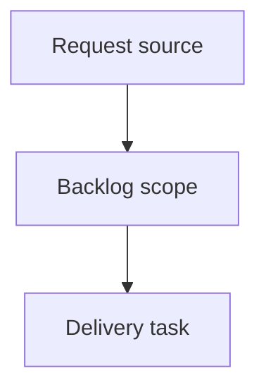

## item_625_connector_rear_backshell_helper_node_segment_sheath_metadata_and_mounting_labels - Connector Rear Backshell Helper Node, Segment Sheath Metadata, and Mounting Labels
> From version: 1.15.0
> Schema version: 1.0
> Status: Done
> Understanding: 90%
> Confidence: 85%
> Progress: 100%
> Complexity: High
> Theme: Operator workflow and runtime integration
> Reminder: Update status/understanding/confidence/progress and linked request/task references when you edit this doc.

# Problem
Add an optional connector rear-backshell helper node driven by connector catalog data, with possible per-connector override.
Ensure connectors using that option force incoming segment topology and wire routing to traverse the helper node before the connector node.
Allow each segment to carry sheath-related business metadata and display it in a compact on-plan segment callout.
Add mounting-label objects that are attached to a segment as physical plan objects used to differentiate connectors during assembly.

# Scope
- In:
  - one coherent delivery slice from the source request
- Out:
  - unrelated sibling slices that should stay in separate backlog items instead of widening this doc

# Acceptance criteria
- AC1: A connector catalog item can enable rear-backshell helper-node behavior and define the connector-to-helper nominal length.
- AC2: A connector instance can override the effective rear-backshell behavior relative to the catalog default, including both enabled/disabled state and connector-specific backshell length.
- AC3: Creating a connector with effective rear-backshell behavior enabled automatically creates the connector node, the helper node, and the dedicated helper-to-connector segment.
- AC4: Existing connectors linked to a catalog item that gains rear-backshell behavior are migrated so the helper node and dedicated helper segment exist.
- AC5: For backshell-enabled connectors, direct external segment attachment to the connector node is forbidden; the system auto-corrects deterministic cases and surfaces explicit feedback for unresolved cases.
- AC6: Automatic and locked wire routes for backshell-enabled connectors traverse the helper node before the connector node.
- AC7: Each segment can store free-text sheath metadata including sheath type, insulation, line style, and internal part reference.
- AC8: A compact segment callout can display endpoint technical-ID route text, insulation, line style, internal part reference, and quantity derived from segment length.
- AC9: Mounting labels exist as explicit physical plan objects attached to segments, with editable text and configurable position.
- AC10: Segment mini callouts and mounting labels appear in the network summary and are included in exports derived from that rendering.
- AC11: New data survives persistence, import/export, and migration from legacy projects without breaking existing networks.

# AC Traceability
- request-AC1 -> This backlog slice. Proof: AC1: A connector catalog item can enable rear-backshell helper-node behavior and define the connector-to-helper nominal length.
- request-AC2 -> This backlog slice. Proof: AC2: A connector instance can override the effective rear-backshell behavior relative to the catalog default, including both enabled/disabled state and connector-specific backshell length.
- request-AC3 -> This backlog slice. Proof: AC3: Creating a connector with effective rear-backshell behavior enabled automatically creates the connector node, the helper node, and the dedicated helper-to-connector segment.
- request-AC4 -> This backlog slice. Proof: AC4: Existing connectors linked to a catalog item that gains rear-backshell behavior are migrated so the helper node and dedicated helper segment exist.
- request-AC5 -> This backlog slice. Proof: AC5: For backshell-enabled connectors, direct external segment attachment to the connector node is forbidden; the system auto-corrects deterministic cases and surfaces explicit feedback for unresolved cases.
- request-AC6 -> This backlog slice. Proof: AC6: Automatic and locked wire routes for backshell-enabled connectors traverse the helper node before the connector node.
- request-AC7 -> This backlog slice. Proof: AC7: Each segment can store free-text sheath metadata including sheath type, insulation, line style, and internal part reference.
- request-AC8 -> This backlog slice. Proof: AC8: A compact segment callout can display endpoint technical-ID route text, insulation, line style, internal part reference, and quantity derived from segment length.
- request-AC9 -> This backlog slice. Proof: AC9: Mounting labels exist as explicit physical plan objects attached to segments, with editable text and configurable position.
- request-AC10 -> This backlog slice. Proof: AC10: Segment mini callouts and mounting labels appear in the network summary and are included in exports derived from that rendering.
- request-AC11 -> This backlog slice. Proof: AC11: New data survives persistence, import/export, and migration from legacy projects without breaking existing networks.

# Decision framing
- Product framing: Not needed
- Product signals: (none detected)
- Product follow-up: No product brief follow-up is expected based on current signals.
- Architecture framing: Not needed
- Architecture signals: (none detected)
- Architecture follow-up: No architecture decision follow-up is expected based on current signals.

# Links
- Product brief(s): (none yet)
- Architecture decision(s): (none yet)
- Request: `req_140_connector_rear_backshell_helper_node_segment_sheath_metadata_and_mounting_labels`
- Primary task(s): `task_135_connector_rear_backshell_helper_node_segment_sheath_metadata_and_mounting_labels`

# AI Context
- Summary: Connector Rear Backshell Helper Node, Segment Sheath Metadata, and Mounting Labels
- Keywords: backlog-groom, request, connector rear backshell helper node, segment sheath metadata, and mounting labels, bounded slice
- Use when: Use when implementing or reviewing the delivery slice for Connector Rear Backshell Helper Node, Segment Sheath Metadata, and Mounting Labels.
- Skip when: Skip when the change is unrelated to this delivery slice or its linked request.

# Priority
- Impact:
- Urgency:

# Notes
- Hybrid rationale: Derived from request `req_140_connector_rear_backshell_helper_node_segment_sheath_metadata_and_mounting_labels` and kept bounded to one coherent delivery slice.
- Source file: `logics/request/req_140_connector_rear_backshell_helper_node_segment_sheath_metadata_and_mounting_labels.md`.
- Generated locally by logics-manager.
- Task `task_135_connector_rear_backshell_helper_node_segment_sheath_metadata_and_mounting_labels` was finished via `logics-manager flow finish task` on 2026-06-08.

# Tasks
- `task_135_connector_rear_backshell_helper_node_segment_sheath_metadata_and_mounting_labels`
