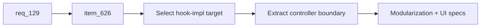

## item_626_appcontroller_hook_impl_decomposition_followup - AppController hook-impl decomposition follow-up
> From version: 1.15.0
> Schema version: 1.0
> Status: Ready
> Understanding: 94%
> Confidence: 88%
> Progress: 0%
> Complexity: High
> Theme: Architecture

# Problem
The first AppController shell-runtime decomposition wave shipped, but the largest implementation bodies under `src/app/hook-impl/controller/` remain concentrated and still carry the main ADR-009 maintainability risk.

# Scope
- In:
  - Re-scope and deliver the next decomposition wave for at least one large `hook-impl/controller` body.
  - Prefer `useAppControllerModelingAnalysisScreenDomains.tsx`, `useAppControllerScreenContentSlices.tsx`, or `useAppControllerNetworkSummaryPanelDomain.tsx` based on current coupling and validation blast radius.
  - Add or extend a controller-boundary spec for the extracted surface.
  - Keep `quality:hooks-modularization`, `quality:ui-modularization`, and affected `app.ui.*` specs green.
- Out:
  - Reducer shape changes.
  - Persistence schema changes.
  - Lowering the AppController locked budget before a later wave has enough measured headroom.

# Acceptance criteria
- AC1: The selected `hook-impl/controller` body is re-scoped with measured line count and coupling notes before edits.
- AC2: At least one large implementation body is materially shrunk or split into a focused controller boundary.
- AC3: Controller-boundary coverage is added or extended for the extracted surface.
- AC4: `quality:hooks-modularization`, `quality:ui-modularization`, and affected UI specs pass.
- AC5: `req_129_app_controller_decomposition_plan` is updated with delivered wave evidence and remaining work.

# Links
- Request: `logics/request/req_129_app_controller_decomposition_plan.md`
- Preceded by: `task_111_appcontroller_decomposition_plan`

# Delivery Status
- Ready follow-up created on 2026-06-09 after the shell-runtime wave delivered `useAppControllerWorkspaceRuntime`.
- Remaining target evidence: `src/app/hook-impl/controller/useAppControllerModelingAnalysisScreenDomains.tsx`, `src/app/hook-impl/controller/useAppControllerScreenContentSlices.tsx`, and `src/app/hook-impl/controller/useAppControllerNetworkSummaryPanelDomain.tsx` remain large implementation bodies.

# AI Context
- Summary: Follow-up AppController decomposition backlog for remaining large hook-impl controller bodies.
- Keywords: AppController, hook-impl, decomposition, controller boundary, modularization
- Use when: Continuing ADR-009 AppController decomposition after the shell-runtime extraction.
- Skip when: Work is only about product UI changes or reducer persistence behavior.

# Priority
- Impact: Medium
- Urgency: Medium

# Tasks
- `task_136_appcontroller_hook_impl_decomposition_follow_up`
