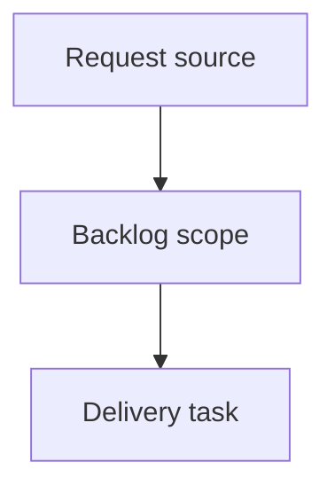

## item_627_segment_callout_layering_product_brief_migration_and_connector_material_default_sync - Segment Callout Layering, Product Brief Migration, and Connector Material Default Sync
> From version: 1.15.2
> Schema version: 1.0
> Status: Done
> Understanding: 100%
> Confidence: 100%
> Progress: 100%
> Complexity: High
> Theme: Operator workflow and runtime integration
> Reminder: Update status/understanding/confidence/progress and linked request/task references when you edit this doc.

# Problem
Align segment callout visual hierarchy and leader-line behavior with node callouts so moved segment callouts remain visible, readable, and export-safe.
Convert the existing product-facing content under `docs/` into managed Logics Product Briefs, then remove the legacy `docs/` folder.
Fix the Connector material defaults catalog synchronization path so changing only the Rear backshell helper still updates the corresponding Edit catalog item defaults.
Investigate whether faded segment callouts and segment callout position reset behavior are intentional; if either is a bug, include the fix in this delivery scope.

# Scope
- In:
  - Segment callout rendering parity with node callouts for Z-depth, hierarchy, dotted leader visibility, and dotted leader styling.
  - Investigation and fix-or-document decisions for faded segment callouts and moved segment callout position resets.
  - Migration of existing `docs/` content into managed Product Briefs under `logics/product`, with updated references and removal of `docs/`.
  - Connector material defaults synchronization when only Rear backshell helper changes.
- Out:
  - Full network-summary annotation placement redesign beyond segment/node callout parity.
  - Broad catalog editor redesign beyond the Rear backshell helper-only sync defect.
  - New product narratives unrelated to the existing `docs/` files being migrated.
  - Release packaging or deployment work.

# Acceptance criteria
- AC1: Segment callouts use the same Z-depth and hierarchy logic as node callouts, and no longer render behind other plan elements in a way that hides them incorrectly.
- AC2: Segment callout dotted leader lines remain visible when they cross other callouts, objects, overlays, segments, nodes, or annotations.
- AC3: Segment callout dotted leader lines match node callout dotted leader line styling across normal and theme-specific rendering.
- AC4: Every relevant file currently under `docs/` is migrated into an individual managed Product Brief under `logics/product`.
- AC5: References from workflow docs, backlog items, tasks, or requests that pointed to `docs/...` are updated to the migrated Product Brief refs or paths.
- AC6: The legacy `docs/` folder is removed after Product Brief migration.
- AC7: Changing only Rear backshell helper in Connector material defaults synchronizes the corresponding Connector material defaults option in Edit catalog item.
- AC8: The Rear backshell helper-only catalog sync path is covered by regression tests.
- AC9: The faded or semi-transparent segment callout behavior is investigated and classified as intentional or a bug.
- AC10: If faded segment callouts are a bug, their opacity behavior is fixed to match node callout expectations; if intentional, the expected trigger and product reason are documented.
- AC11: The segment callout position reset behavior is investigated and classified as intentional or a bug.
- AC12: If segment callout position reset is a bug, moved segment callout positions remain stable across rerenders, relevant state updates, persistence, and export workflows; if intentional, the expected trigger and product reason are documented.

# AC Traceability
- request-AC1 -> This backlog slice. Proof: AC1: Segment callouts use the same Z-depth and hierarchy logic as node callouts, and no longer render behind other plan elements in a way that hides them incorrectly.
- request-AC2 -> This backlog slice. Proof: AC2: Segment callout dotted leader lines remain visible when they cross other callouts, objects, overlays, segments, nodes, or annotations.
- request-AC3 -> This backlog slice. Proof: AC3: Segment callout dotted leader lines match node callout dotted leader line styling across normal and theme-specific rendering.
- request-AC4 -> This backlog slice. Proof: AC4: Every relevant file currently under `docs/` is migrated into an individual managed Product Brief under `logics/product`.
- request-AC5 -> This backlog slice. Proof: AC5: References from workflow docs, backlog items, tasks, or requests that pointed to `docs/...` are updated to the migrated Product Brief refs or paths.
- request-AC6 -> This backlog slice. Proof: AC6: The legacy `docs/` folder is removed after Product Brief migration.
- request-AC7 -> This backlog slice. Proof: AC7: Changing only Rear backshell helper in Connector material defaults synchronizes the corresponding Connector material defaults option in Edit catalog item.
- request-AC8 -> This backlog slice. Proof: AC8: The Rear backshell helper-only catalog sync path is covered by regression tests.
- request-AC9 -> This backlog slice. Proof: AC9: The faded or semi-transparent segment callout behavior is investigated and classified as intentional or a bug.
- request-AC10 -> This backlog slice. Proof: AC10: If faded segment callouts are a bug, their opacity behavior is fixed to match node callout expectations; if intentional, the expected trigger and product reason are documented.
- request-AC11 -> This backlog slice. Proof: AC11: The segment callout position reset behavior is investigated and classified as intentional or a bug.
- request-AC12 -> This backlog slice. Proof: AC12: If segment callout position reset is a bug, moved segment callout positions remain stable across rerenders, relevant state updates, persistence, and export workflows; if intentional, the expected trigger and product reason are documented.

# Decision framing
- Product framing: Required
- Product signals: This slice migrates existing product-facing docs into managed Product Briefs and changes operator-visible annotation behavior.
- Product follow-up: Create or migrate Product Brief docs under `logics/product` and update this backlog item with their refs before closure.
- Architecture framing: Recommended
- Architecture signals: Segment and node callouts may need a shared layering/leader-line rendering contract to prevent future divergence.
- Architecture follow-up: Add an ADR or explicit architecture note if implementation changes shared callout layering, masking, persistence-key, or export-rendering contracts.

# Links
- Product brief(s): `logics/product/prod_007_segment_callout_parity_and_product_brief_migration.md`, `logics/product/prod_008_fuse_box_functional_schematic.md`, `logics/product/prod_009_network_import_conflict_resolution.md`, `logics/product/prod_010_network_statistics_dashboard.md`, `logics/product/prod_011_pin_level_current_dimensioning.md`
- Architecture decision(s): not added; the delivered implementation reused the existing node callout visual contract instead of introducing a new shared architecture contract.
- Request: `req_141_segment_callout_layering_docs_product_brief_migration_and_connector_material_default_sync`
- Primary task(s): `task_137_segment_callout_layering_product_brief_migration_and_connector_material_default_sync`

# AI Context
- Summary: Segment Callout Layering, Product Brief Migration, and Connector Material Default Sync
- Keywords: backlog-groom, request, segment callout layering, product brief migration, and connector material default sync, bounded slice
- Use when: Use when implementing or reviewing the delivery slice for Segment Callout Layering, Product Brief Migration, and Connector Material Default Sync.
- Skip when: Skip when the change is unrelated to this delivery slice or its linked request.

# Priority
- Impact: High - affects visible plan annotation reliability, operator trust in moved callouts, managed product-document traceability, and catalog default correctness.
- Urgency: High - follow-up is tied directly to behavior delivered in `1.15.2` and should be ready for the next development slice.

# Notes
- Hybrid rationale: Derived from request `req_141_segment_callout_layering_docs_product_brief_migration_and_connector_material_default_sync` and kept bounded to one coherent delivery slice.
- Source file: `logics/request/req_141_segment_callout_layering_docs_product_brief_migration_and_connector_material_default_sync.md`.
- Generated locally by logics-manager.
- Suggested implementation split:
  - Wave 1: Segment callout layering and dotted leader parity with node callouts.
  - Wave 2: Segment callout faded-state and position-reset investigations, with fixes when classified as bugs.
  - Wave 3: Connector material defaults Rear backshell helper-only sync fix and regression coverage.
  - Wave 4: Migrate `docs/` files into `logics/product`, update references, remove `docs/`, and run Logics validation.
- Companion Product Brief: `prod_007_segment_callout_parity_and_product_brief_migration`.

# Delivery status
- Done.
- Segment callouts now render in a dedicated top-level segment callout layer after graph nodes, so their hierarchy matches node callouts instead of inheriting segment group depth.
- Segment callout dotted leaders no longer clip themselves at callout obstacles and now reuse node callout leader/frame styling classes while keeping segment-specific hooks.
- Faded segment callouts were classified as a bug caused by inherited entity-group deemphasis opacity and fixed by moving segment callouts out of entity groups.
- Position reset was classified as a bug risk and covered with a drag/rerender regression that verifies moved segment callout transforms remain stable.
- Rear backshell helper-only material default edits now count as Connector material defaults and are covered by a regression for both store state and Edit catalog item form state.
- Legacy `docs/` content was migrated into Product Briefs `prod_008` through `prod_011`, references were updated, and the `docs/` folder was removed.

# AC proof
- AC1: `NetworkSummaryGraphLayers` renders segment callouts in `network-graph-layer-segment-callouts` after node layers.
- AC2: Segment leader obstacle clipping was removed, so the dotted leader is no longer shortened or hidden when crossing other rendered elements.
- AC3: Segment leaders and frames now include shared node callout classes such as `network-callout-leader-line` and `network-callout-frame`.
- AC4: The four legacy docs became `prod_008_fuse_box_functional_schematic`, `prod_009_network_import_conflict_resolution`, `prod_010_network_statistics_dashboard`, and `prod_011_pin_level_current_dimensioning`.
- AC5: Repository references were updated from legacy `docs/...` paths to managed Product Brief refs or paths.
- AC6: The legacy `docs/` directory was removed.
- AC7: `rearBackshell` is now included in Connector material defaults detection.
- AC8: `app.ui.catalog-rear-backshell-defaults.spec.tsx` covers Rear backshell helper-only sync.
- AC9: Faded segment callouts were investigated and classified as a bug.
- AC10: The opacity bug was fixed by keeping segment callouts outside deemphasized entity groups.
- AC11: Segment callout reset behavior was investigated and classified as a bug risk requiring persistence regression coverage.
- AC12: `app.ui.network-summary-callouts-viewport.spec.tsx` verifies a dragged segment callout remains stable across a view switch and rerender path.

# Tasks
- `task_137_segment_callout_layering_product_brief_migration_and_connector_material_default_sync`
