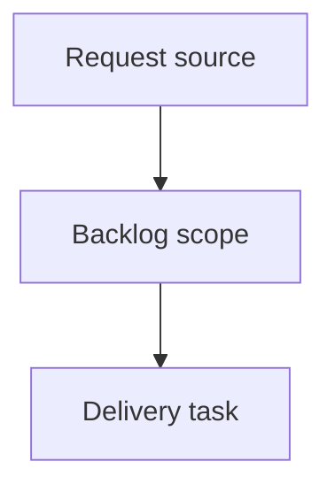

## item_628_debounced_persistence_loses_unsaved_edits_on_tab_close_or_unmount - Debounced persistence loses unsaved edits on tab close or unmount
> From version: 1.15.3
> Schema version: 1.0
> Status: Done
> Understanding: 100%
> Confidence: 95%
> Progress: 100%
> Complexity: Medium
> Theme: Local-first persistence durability
> Reminder: Update status/understanding/confidence/progress and linked request/task references when you edit this doc.

# Problem
Restore durable local-first persistence so edits made shortly before a tab close, reload, navigation, or app unmount are not silently lost after the `1.15.0` debounce change.
Add an explicit flush path so any pending debounced save is written before the page is hidden or the persistence subscription is detached.
Provide a synchronous save path that completes the localStorage write inside an unload handler, because the current `saveState` awaits storage estimation before writing.

# Scope
- In:
  - Flush a pending debounced save when the page is hidden/unloaded (`visibilitychange` hidden / `pagehide`).
  - Flush a pending save on detach before clearing the timer and unsubscribing.
  - A synchronous localStorage write path that runs `setItem` before any awaited storage-pressure estimation.
  - Listener wiring inside `attachPersistenceSync` (`src/app/store.ts`) and a synchronous save variant in the persistence adapter (`src/adapters/persistence/localStorage.ts`).
  - Regression coverage for dispatch-then-unload durability, detach flush, the `debounceMs: 0` no-op case, and synchronous-write ordering.
- Out:
  - Changing the 200 ms debounce default or the in-session debounce strategy.
  - Reducer/action `nowIso` timestamp behavior introduced in `1.15.0`.
  - Multi-tab `storage` event synchronization.
  - Migrating persistence away from localStorage.

# Acceptance criteria
- AC1: A pending debounced save is flushed to localStorage when the page is hidden/unloaded, so edits made within the debounce window before close/reload/navigation are persisted.
- AC2: The flush uses a synchronous write that completes `setItem` before any awaited storage-pressure estimation, so the write survives page teardown.
- AC3: The detach handle flushes any pending save before clearing the timer and unsubscribing.
- AC4: Detach with `debounceMs: 0` performs no additional save (no behavior change for synchronous mode), preserving existing save-count assertions.
- AC5: Normal in-session editing still coalesces bursts of dispatches into a single trailing debounced write.
- AC6: Recovery, quota-exceeded, storage-near-quota, and write-failure feedback paths remain functional.
- AC7: Any lifecycle event listeners added by `attachPersistenceSync` are removed on detach with no listener leak.
- AC8: Regression tests cover dispatch-then-unload persistence, detach flush, and synchronous-write ordering.

# AC Traceability
- request-AC1 -> This backlog slice. Proof: AC1: A pending debounced save is flushed to localStorage when the page is hidden/unloaded, so edits made within the debounce window before close/reload/navigation are persisted.
- request-AC2 -> This backlog slice. Proof: AC2: The flush uses a synchronous write that completes `setItem` before any awaited storage-pressure estimation, so the write survives page teardown.
- request-AC3 -> This backlog slice. Proof: AC3: The detach handle flushes any pending save before clearing the timer and unsubscribing.
- request-AC4 -> This backlog slice. Proof: AC4: Detach with `debounceMs: 0` performs no additional save (no behavior change for synchronous mode), preserving existing save-count assertions.
- request-AC5 -> This backlog slice. Proof: AC5: Normal in-session editing still coalesces bursts of dispatches into a single trailing debounced write.
- request-AC6 -> This backlog slice. Proof: AC6: Recovery, quota-exceeded, storage-near-quota, and write-failure feedback paths remain functional.
- request-AC7 -> This backlog slice. Proof: AC7: Any lifecycle event listeners added by `attachPersistenceSync` are removed on detach with no listener leak.
- request-AC8 -> This backlog slice. Proof: AC8: Regression tests cover dispatch-then-unload persistence, detach flush, and synchronous-write ordering.

# Decision framing
- Product framing: Not needed
- Product signals: (none detected)
- Product follow-up: No product brief follow-up is expected; this restores an existing local-first persistence guarantee rather than adding a user-facing capability.
- Architecture framing: Warranted
- Architecture signals: Defines a persistence durability contract (flush on page-hide/detach plus a synchronous localStorage write path), which is a persistence/runtime boundary decision per the required-links rule.
- Architecture follow-up: Add an ADR capturing the durability contract (lifecycle flush strategy and synchronous-write ordering) and link it before the delivery task is closed.

# Links
- Product brief(s): (none yet)
- Architecture decision(s): `adr_011_local_first_persistence_durability_lifecycle_flush_and_synchronous_write`
- Request: `logics/request/req_142_debounced_persistence_durability_flush_on_unload.md`
- Primary task(s): `task_138_debounced_persistence_loses_unsaved_edits_on_tab_close_or_unmount`

# AI Context
- Summary: Debounced persistence loses unsaved edits on tab close or unmount
- Keywords: backlog-groom, request, debounced persistence loses unsaved edits on tab close or unmount, bounded slice
- Use when: Use when implementing or reviewing the delivery slice for Debounced persistence loses unsaved edits on tab close or unmount.
- Skip when: Skip when the change is unrelated to this delivery slice or its linked request.

# Priority
- Impact: High - silent loss of an operator's most recent edits violates the local-first persistence guarantee.
- Urgency: High - regression shipped in the `1.15.0` -> `1.15.3` window and affects every close/reload within the debounce window.

# Notes
- Hybrid rationale: Derived from request `req_142_debounced_persistence_durability_flush_on_unload` and kept bounded to one coherent delivery slice.
- Source file: `logics/request/req_142_debounced_persistence_durability_flush_on_unload.md`.
- Generated locally by logics-manager.

# Tasks
- `task_138_debounced_persistence_loses_unsaved_edits_on_tab_close_or_unmount`
