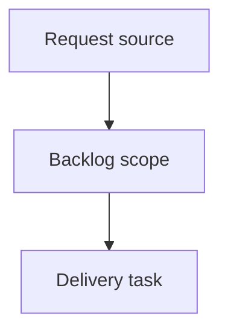

## item_629_network_summary_backshell_nodes_must_display_node_reference_instead_of_connector_technical_id_suffix - Network summary backshell nodes must display node reference instead of connector technical ID suffix
> From version: 1.15.3
> Schema version: 1.0
> Status: Done
> Understanding: 100%
> Confidence: 100%
> Progress: 100%
> Complexity: Low
> Theme: Operator workflow and runtime integration
> Reminder: Update status/understanding/confidence/progress and linked request/task references when you edit this doc.

# Problem
Make `Network summary` display rear-backshell helper nodes using the node business reference (`label`, then `id` fallback) instead of reconstructing a synthetic `connector technicalId + "-BS"` string.
Preserve AMIPI-aligned or user-curated node references such as `AR-N21`, `AV-N42`, or `LAT-N10.1` when a backshell helper node is used to model a real named routing point.
Keep connector nodes and splice nodes on their current business-reference behavior while correcting only the backshell helper labeling contract.

# Scope
- In:
  - one coherent delivery slice from the source request
- Out:
  - unrelated sibling slices that should stay in separate backlog items instead of widening this doc

# Acceptance criteria
- AC1: `Network summary` renders a backshell helper node with a non-empty `label` using that `label` as its visible node text.
- AC2: If a backshell helper node has no `label` but has an `id`, `Network summary` uses the node `id` rather than forcing `${connector technicalId}-BS`.
- AC3: The synthetic `${connector technicalId}-BS` text is used only as a final fallback when no explicit node-facing reference is available.
- AC4: Tooltip/title and accessibility text for backshell helper nodes follow the same display-reference rule as the visible node label.
- AC5: Connector-node and splice-node display behavior does not regress.

# AC Traceability
- request-AC1 -> This backlog slice. Proof: AC1: `Network summary` renders a backshell helper node with a non-empty `label` using that `label` as its visible node text.
- request-AC2 -> This backlog slice. Proof: AC2: If a backshell helper node has no `label` but has an `id`, `Network summary` uses the node `id` rather than forcing `${connector technicalId}-BS`.
- request-AC3 -> This backlog slice. Proof: AC3: The synthetic `${connector technicalId}-BS` text is used only as a final fallback when no explicit node-facing reference is available.
- request-AC4 -> This backlog slice. Proof: AC4: Tooltip/title and accessibility text for backshell helper nodes follow the same display-reference rule as the visible node label.
- request-AC5 -> This backlog slice. Proof: AC5: Connector-node and splice-node display behavior does not regress.

# Decision framing
- Product framing: Not needed
- Product signals: (none detected)
- Product follow-up: No product brief follow-up is expected based on current signals.
- Architecture framing: Not needed
- Architecture signals: (none detected)
- Architecture follow-up: No architecture decision follow-up is expected based on current signals.

# Links
- Product brief(s): (none yet)
- Architecture decision(s): (none yet)
- Request: `logics/request/req_143_network_summary_backshell_nodes_must_display_node_reference_not_connector_suffix.md`
- Primary task(s): (none yet)

# AI Context
- Summary: Network summary backshell nodes must display node reference instead of connector technical ID suffix
- Keywords: backlog-groom, request, network summary backshell nodes must display node reference instead of connector technical id suffix, bounded slice
- Use when: Use when implementing or reviewing the delivery slice for Network summary backshell nodes must display node reference instead of connector technical ID suffix.
- Skip when: Skip when the change is unrelated to this delivery slice or its linked request.

# Priority
- Impact:
- Urgency:

# Notes
- Hybrid rationale: Derived from request `req_143_network_summary_backshell_nodes_must_display_node_reference_not_connector_suffix` and kept bounded to one coherent delivery slice.
- Source file: `logics/request/req_143_network_summary_backshell_nodes_must_display_node_reference_not_connector_suffix.md`.
- Generated locally by logics-manager.

# Delivery status
- Done.
- `Network summary` now resolves `connectorBackshellHelper` visible labels from `node.label`, then `node.id`, and only finally from the synthetic `${connector technicalId}-BS` fallback.
- `useNodeDescriptions` now uses the same backshell helper business reference in descriptive text, keeping SVG `<title>` and `aria-label` aligned with the visible node reference.
- `connectorBackshellHelper` accepts an optional persisted `label`, and node reducer normalization trims it while discarding empty values.

# AC proof
- AC1: `buildRenderedNodes` renders a backshell helper with `label: "AR-N21"` as visible node label `AR-N21`.
- AC2: `buildRenderedNodes` renders a backshell helper without `label` using node id `LAT-N10.1` instead of `AR-CT2G-BS`.
- AC3: `resolveBackshellHelperNodeReference()` keeps `${connector technicalId}-BS` only as the final fallback.
- AC4: `useNodeDescriptions` now emits `Backshell helper (AR-N21)` from the same reference resolver used by `Network summary`, so descriptive text stays aligned.
- AC5: `use-node-descriptions.spec.ts` verifies connector and splice descriptions remain `Connector 1 (C-1)` and `Splice 1 (S-1)`.
