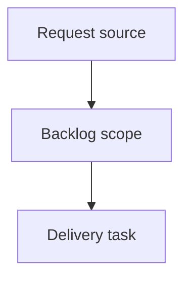

## item_630_floating_splice_placements_decoupled_from_network_topology - Floating splice placements decoupled from network topology
> From version: 1.15.6 (ADR companion linked on 2026-06-10; amended 2026-06-10 after pre-implementation review)
> Schema version: 1.0
> Status: Done
> Understanding: 100% (single coordinated implementation slice delivered through task_139)
> Confidence: 96% (AC traceability and validation evidence captured on 2026-06-16)
> Progress: 100%
> Complexity: High
> Theme: Architecture
> Reminder: Update status/understanding/confidence/progress and linked request/task references when you edit this doc.

# Problem
Represent the physical reality of the harness: an electrical splice is a contact point for several cables, not a structural routing node that defines network topology.
Decouple electrical splices from the structural routing topology so network structure remains defined by connectors, structural nodes, and segments.
Make every connectable splice placement segment-based: a splice must be located on a segment at a measured offset in millimeters from one segment endpoint before any wire can connect to it.
Automatically migrate existing workspaces that use `NetworkNode.kind === "splice"` into the new placement model at load time.
Keep floating splices visible, selectable, and callout-capable in Network Summary with the same visual style as current splice nodes.

# Scope
- In:
  - canonical segment-offset `Splice` placement model and normalization.
  - central placement resolver for routing, validation, analysis, and rendering.
  - derived routing graph with virtual splice points and partial endpoint segment lengths.
  - automatic load-time migration for legacy splice-node workspaces and network imports.
  - Network Summary floating-splice overlay with current splice visual styling, selection, activation, and callout anchoring.
  - form-based splice placement editing with host segment, reference node, and offset controls.
  - guarded host-segment deletion and segment-length feedback/clamping behavior.
  - local persistence and network file import/export schema updates.
  - targeted reducer, core, persistence, portability, and UI regression coverage.
  - load-time migration report modal and reserved `MIG-SPLICE-*` naming for constructed nodes.
  - non-blocking warning feedback channel for offset clamping and relative-position changes.
  - anti-superposition render-only offset so floating splices never hide under nodes or other splices.
  - global wire route rewriting (locked and unlocked) for fused segments during migration.
- Out:
  - canvas drag-to-place or drag-to-move behavior.
  - ratio-based placement persistence.
  - backwards compatibility for opening newly exported floating-splice files in older application versions.
  - changes to splice electrical semantics, port occupancy rules, catalog semantics, or pin-load propagation beyond resolved routing position.

# Acceptance criteria
- AC1: `Splice` supports a canonical segment placement model using `segmentId`, `fromNodeId`, and `offsetMm`; `0 mm` and `lengthMm` offsets are allowed and must be displayed explicitly.
- AC2: A central resolver can resolve splice placement from new placement metadata or migrated legacy splice nodes, and returns enough information for routing, validation, and rendering.
- AC3: Wire routing supports endpoints connected to floating splice ports by using a derived routing graph with virtual splice points and correct partial segment lengths.
- AC4: Route length calculation accounts for partial segment traversal when a wire starts or ends at a floating splice.
- AC5: `Wire.routeSegmentIds` remains the primary public route summary, with additional route detail only where a start or end endpoint lies part-way through a segment.
- AC6: Network Summary renders floating splices without requiring `NetworkNode.kind === "splice"`, including selection, focus/activation behavior, selected-state styling, and the same splice visual treatment as today.
- AC7: Splice callouts remain available for every placed splice and can anchor to resolved splice positions instead of requiring a node position.
- AC8: Legacy workspaces with splice nodes migrate automatically on load and continue to behave correctly after migration.
- AC9: Network import/export persists the new splice placement metadata and continues to accept older files that lack it; newly exported files should not emit legacy splice nodes.
- AC10: Validation and UI feedback prevent invalid connected splices: a splice must be placed before it can be connected to a wire, and unplaced splices are not visible or connectable.
- AC11: Host segment deletion is blocked while a splice is placed on that segment, with user-facing feedback that the splice must be moved or deleted first.
- AC12: Segment length edits preserve the splice `offsetMm` when possible, show user-facing warning feedback when the relative position changes, and clamp/report when the offset would become out of range.
- AC13: Segment placements cannot target `rearBackshellLink` segments.
- AC14: Directional splice L/R inference remains aligned with current behavior, including manual side locking, while adapting the physical side inference to the resolved floating placement.
- AC15: Multiple splices may share the same segment offset; no explicit ordering between same-segment splices is required.
- AC16: Degree-2 legacy splice nodes migrate by fusing adjacent segments and placing the splice on the fused segment while preserving segment IDs where possible.
- AC17: Degree-greater-than-2 legacy splice nodes migrate by replacing the splice node with a structural intermediate node and placing the splice on an adjacent segment at `0 mm` from that intermediate node where possible.
- AC18: Connector-to-floating-splice and connector-to-floating-splice-to-connector routes remain deterministic using the current segment-ID tie-break behavior.
- AC19: Analysis views and splice tables expose host segment, distance from node, and partial length information needed to understand routed wires.
- AC20: Local persisted workspaces and network export files are supported at equal priority.
- AC21: Migration rewrites `routeSegmentIds` for ALL wires affected by segment fusion (locked and unlocked), deduplicating consecutive surviving IDs; no persisted route is left referencing a removed segment ID, and unfixable routes stay loadable with diagnostics.
- AC22: Degree-2 fusion happens only under the safe-fusion predicate (distinct far endpoints, no `rearBackshellLink` involvement, identical `subNetworkTag`/`sheathType`/`insulation`/`lineStyle`/`internalPartReference`); otherwise migration falls back to a structural intermediate node with a `0 mm` placement.
- AC23: Fusion outcomes are deterministic: the surviving segment ID is the lexicographically smaller, `fromNodeId` is the surviving segment's non-junction endpoint, `offsetMm` is the surviving segment's pre-fusion length, and chains of adjacent degree-2 splice nodes are processed in lexicographic node ID order.
- AC24: Degree-1 legacy splice nodes migrate to an intermediate node with a `0 mm` placement on the single adjacent segment; degree-0 legacy splice nodes become unplaced drafts with a validation diagnostic.
- AC25: Every node created or converted by migration carries a clearly distinguishable reserved label (`MIG-SPLICE-<spliceTechnicalId>`, numeric suffix on collision) and is listed in the migration report.
- AC26: A single modal migration report with explicit dismissal is shown after any migrating load or import, on both load paths, listing created/converted nodes, fused segments, rewritten routes, clamped/unresolved placements, unplaced splices, locked-route conversion failures, metadata-divergence fallbacks, and directional L/R side changes.
- AC27: Anti-superposition rendering: a floating splice marker is never hidden under a node or another splice; coinciding resolved positions get a deterministic render-only offset with a visible anchor tick, including `0 mm` placements and same-offset splices, without altering persisted `offsetMm`.
- AC28: Zero-length routes are represented as `routeSegmentIds = [hostSegmentId]` with `0 mm` partial detail — never as an empty route — and validation accepts them as valid.
- AC29: Placement removal is blocked while wires are connected to the splice; placement moves recompute routes and are blocked when they would invalidate a locked route.
- AC30: Offset clamping and relative-position feedback use a non-blocking warning channel (action succeeds, warning surfaced) distinct from blocking errors; migration-time clamps are reported in the migration report.

# AC Traceability
- request-AC1 -> This backlog slice. Proof: AC1: `Splice` supports a canonical segment placement model using `segmentId`, `fromNodeId`, and `offsetMm`; `0 mm` and `lengthMm` offsets are allowed and must be displayed explicitly.
- request-AC2 -> This backlog slice. Proof: AC2: A central resolver can resolve splice placement from new placement metadata or migrated legacy splice nodes, and returns enough information for routing, validation, and rendering.
- request-AC3 -> This backlog slice. Proof: AC3: Wire routing supports endpoints connected to floating splice ports by using a derived routing graph with virtual splice points and correct partial segment lengths.
- request-AC4 -> This backlog slice. Proof: AC4: Route length calculation accounts for partial segment traversal when a wire starts or ends at a floating splice.
- request-AC5 -> This backlog slice. Proof: AC5: `Wire.routeSegmentIds` remains the primary public route summary, with additional route detail only where a start or end endpoint lies part-way through a segment.
- request-AC6 -> This backlog slice. Proof: AC6: Network Summary renders floating splices without requiring `NetworkNode.kind === "splice"`, including selection, focus/activation behavior, selected-state styling, and the same splice visual treatment as today.
- request-AC7 -> This backlog slice. Proof: AC7: Splice callouts remain available for every placed splice and can anchor to resolved splice positions instead of requiring a node position.
- request-AC8 -> This backlog slice. Proof: AC8: Legacy workspaces with splice nodes migrate automatically on load and continue to behave correctly after migration.
- request-AC9 -> This backlog slice. Proof: AC9: Network import/export persists the new splice placement metadata and continues to accept older files that lack it; newly exported files should not emit legacy splice nodes.
- request-AC10 -> This backlog slice. Proof: AC10: Validation and UI feedback prevent invalid connected splices: a splice must be placed before it can be connected to a wire, and unplaced splices are not visible or connectable.
- request-AC11 -> This backlog slice. Proof: AC11: Host segment deletion is blocked while a splice is placed on that segment, with user-facing feedback that the splice must be moved or deleted first.
- request-AC12 -> This backlog slice. Proof: AC12: Segment length edits preserve the splice `offsetMm` when possible, show user-facing warning feedback when the relative position changes, and clamp/report when the offset would become out of range.
- request-AC13 -> This backlog slice. Proof: AC13: Segment placements cannot target `rearBackshellLink` segments.
- request-AC14 -> This backlog slice. Proof: AC14: Directional splice L/R inference remains aligned with current behavior, including manual side locking, while adapting the physical side inference to the resolved floating placement.
- request-AC15 -> This backlog slice. Proof: AC15: Multiple splices may share the same segment offset; no explicit ordering between same-segment splices is required.
- request-AC16 -> This backlog slice. Proof: AC16: Degree-2 legacy splice nodes migrate by fusing adjacent segments and placing the splice on the fused segment while preserving segment IDs where possible.
- request-AC17 -> This backlog slice. Proof: AC17: Degree-greater-than-2 legacy splice nodes migrate by replacing the splice node with a structural intermediate node and placing the splice on an adjacent segment at `0 mm` from that intermediate node where possible.
- request-AC18 -> This backlog slice. Proof: AC18: Connector-to-floating-splice and connector-to-floating-splice-to-connector routes remain deterministic using the current segment-ID tie-break behavior.
- request-AC19 -> This backlog slice. Proof: AC19: Analysis views and splice tables expose host segment, distance from node, and partial length information needed to understand routed wires.
- request-AC20 -> This backlog slice. Proof: AC20: Local persisted workspaces and network export files are supported at equal priority.
- request-AC21 -> This backlog slice. Proof: AC21: Migration rewrites `routeSegmentIds` for ALL wires affected by segment fusion (locked and unlocked), deduplicating consecutive surviving IDs; no persisted route is left referencing a removed segment ID, and unfixable routes stay loadable with diagnostics.
- request-AC22 -> This backlog slice. Proof: AC22: Degree-2 fusion happens only under the safe-fusion predicate (distinct far endpoints, no `rearBackshellLink` involvement, identical `subNetworkTag`/`sheathType`/`insulation`/`lineStyle`/`internalPartReference`); otherwise migration falls back to a structural intermediate node with a `0 mm` placement.
- request-AC23 -> This backlog slice. Proof: AC23: Fusion outcomes are deterministic: the surviving segment ID is the lexicographically smaller, `fromNodeId` is the surviving segment's non-junction endpoint, `offsetMm` is the surviving segment's pre-fusion length, and chains of adjacent degree-2 splice nodes are processed in lexicographic node ID order.
- request-AC24 -> This backlog slice. Proof: AC24: Degree-1 legacy splice nodes migrate to an intermediate node with a `0 mm` placement on the single adjacent segment; degree-0 legacy splice nodes become unplaced drafts with a validation diagnostic.
- request-AC25 -> This backlog slice. Proof: AC25: Every node created or converted by migration carries a clearly distinguishable reserved label (`MIG-SPLICE-<spliceTechnicalId>`, numeric suffix on collision) and is listed in the migration report.
- request-AC26 -> This backlog slice. Proof: AC26: A single modal migration report with explicit dismissal is shown after any migrating load or import, on both load paths, listing created/converted nodes, fused segments, rewritten routes, clamped/unresolved placements, unplaced splices, locked-route conversion failures, metadata-divergence fallbacks, and directional L/R side changes.
- request-AC27 -> This backlog slice. Proof: AC27: Anti-superposition rendering: a floating splice marker is never hidden under a node or another splice; coinciding resolved positions get a deterministic render-only offset with a visible anchor tick, including `0 mm` placements and same-offset splices, without altering persisted `offsetMm`.
- request-AC28 -> This backlog slice. Proof: AC28: Zero-length routes are represented as `routeSegmentIds = [hostSegmentId]` with `0 mm` partial detail — never as an empty route — and validation accepts them as valid.
- request-AC29 -> This backlog slice. Proof: AC29: Placement removal is blocked while wires are connected to the splice; placement moves recompute routes and are blocked when they would invalidate a locked route.
- request-AC30 -> This backlog slice. Proof: AC30: Offset clamping and relative-position feedback use a non-blocking warning channel (action succeeds, warning surfaced) distinct from blocking errors; migration-time clamps are reported in the migration report.

# Decision framing
- Product framing: Not needed
- Product signals: (none detected)
- Product follow-up: No product brief follow-up is expected based on current signals.
- Architecture framing: Required and completed
- Architecture signals: canonical placement model, derived routing graph, versioned migration, rendering contract
- Architecture follow-up: Use `logics/architecture/adr_012_floating_splice_placement_architecture.md` as the implementation contract.

# Delivery plan
- Model and persistence: add `SplicePlacement`, normalize payloads, bump schemas when canonical payload changes, and keep old splice-node payloads importable.
- Migration: convert degree-2 splice nodes into segment-offset placements by fusing adjacent segments; convert branch splice nodes into structural intermediate nodes with adjacent `0 mm` splice placement.
- Routing: derive virtual splice points, keep `routeSegmentIds` as the public route summary, and add partial endpoint route detail for exact lengths.
- Store invariants: block host-segment deletion, preserve/clamp offsets during segment length edits, and reject wire endpoints that target unplaced or invalid splices.
- UI forms: expose segment, reference node, and offset fields on splice editing; add conversion actions for legacy/floating structural representation where useful.
- Network Summary: render floating splices through an overlay that visually matches existing splice nodes and supports selection, activation, highlighting, and callouts.
- Analysis and tables: surface host segment, reference node, distance, and partial length details where operators inspect splices and routed wires.
- Validation and feedback: add explicit diagnostics for invalid placement states and user-facing feedback for blocked deletion and offset clamping.
- Regression coverage: cover core resolver/routing, reducers, persistence migrations, network import/export, validation, and representative UI rendering.
- Migration safety: process legacy splice nodes in deterministic order, enforce the safe-fusion predicate with intermediate-node fallback, rewrite all affected wire routes (locked and unlocked), and cover degree-0/1 cases.
- Migration visibility: reserved `MIG-SPLICE-*` labels for constructed nodes, modal migration report on both load paths, and informational directional side-change reporting.
- Feedback infrastructure: add the non-blocking warning channel used by offset clamping and relative-position feedback.
- Rendering safety: deterministic anti-superposition render-only offset for coinciding splice/node and splice/splice positions.

# Links
- Product brief(s): (none yet)
- Architecture decision(s): `logics/architecture/adr_012_floating_splice_placement_architecture.md`
- Request: `req_144_floating_splice_placements_decoupled_from_network_topology`
- Primary task(s): `task_139_floating_splice_placements_decoupled_from_network_topology`

# AI Context
- Summary: Deliver floating splice placements as a single coordinated architecture slice covering segment-offset model, load-time migration, derived routing, Network Summary overlay rendering, form editing, validation, and import/export compatibility.
- Keywords: floating splice, segment offset, splice placement, derived routing graph, virtual splice point, partial route segment, Network Summary overlay, splice migration
- Use when: Implementing or reviewing the floating-splice delivery slice linked to req_144 and adr_012.
- Skip when: The change is unrelated to splice placement, legacy splice-node migration, route lengths, or Network Summary splice rendering.

# Priority
- Impact: High. This changes the core physical topology model and resolves a known mismatch between graph structure and harness reality.
- Urgency: Medium. It should precede large future work on splice optimization or physical route fidelity but can wait behind active release stabilization.

# Notes
- Hybrid rationale: Derived from request `req_144_floating_splice_placements_decoupled_from_network_topology` and kept bounded to one coherent delivery slice.
- Source file: `logics/request/req_144_floating_splice_placements_decoupled_from_network_topology.md`.
- Generated locally by logics-manager.
- Amended 2026-06-10 after pre-implementation review: migration safety/determinism contract, visibility-first rendering, migration report modal, and non-blocking warning channel added (AC21-AC30). Accepted trade-offs: migrated splices may render displaced (never hidden), and directional L/R sides are re-inferred rather than locked.
- Closed 2026-06-16: implementation, task AC traceability, and validation evidence are recorded in `task_139_floating_splice_placements_decoupled_from_network_topology`.

# Tasks
- `task_139_floating_splice_placements_decoupled_from_network_topology`
