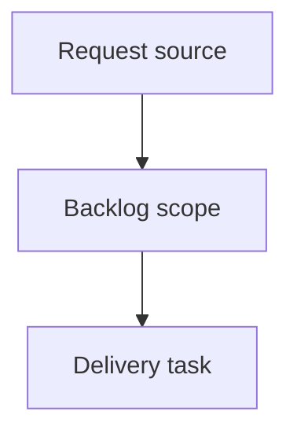

## item_631_wire_list_export_stripping_allowance_and_twisted_pair_length_coefficient - Wire list export stripping allowance and twisted-pair length coefficient
> From version: 1.16.0
> Schema version: 1.0
> Status: Ready
> Understanding: 95%
> Confidence: 92%
> Progress: 0%
> Complexity: Medium
> Theme: Export / Settings / Wire length
> Reminder: Update status/understanding/confidence/progress and linked request/task references when you edit this doc.

# Problem
Operators need the wire-by-wire export to output the cut/preparation length, not only the routed length displayed inside the application.
Add a configurable stripping/crimping allowance in Settings. The allowance is expressed in millimeters, defaults to `20 mm`, and is applied twice for every exported wire: once at each end.
Add a twisted-pair length coefficient for wires belonging to a twisted group. The coefficient defaults to `1.075` and is multiplicative.
Keep these export-only adjustments invisible in normal modeling, analysis, statistics, canvas, callouts, route computation, persistence, and validation surfaces.
Show the adjusted final length only in the wire-by-wire export output.

# Scope
- In: Settings defaults and persisted UI preference migration for export-only wire length adjustments.
- In: a shared export-length helper that applies stripping allowance and twisted-pair coefficient deterministically.
- In: grouped selected-network wire-list export and analysis/single-network wire export paths, including CSV/XLSX parity.
- In: focused automated coverage for default settings, custom settings, twist-group detection, and unchanged visible routed length.
- Out: changing route computation, segment lengths, `Wire.lengthMm`, validation severity, statistics, canvas labels, callouts, BOM pricing/quantities, or physical modeling.
- Out: per-wire stripping allowances, per-twist-group coefficients, true twist-pair entities, or any change to the existing `twistGroupLabel` model.

# Acceptance criteria
- AC1: Settings exposes a numeric wire stripping/crimping allowance in millimeters, defaulting to `20`, with clear validation for finite non-negative values.
- AC2: Settings exposes or otherwise centrally configures the twisted-pair length coefficient, defaulting to `1.075`, with clear validation for finite positive values.
- AC3: Existing saved UI preferences migrate to the new defaults without rejecting older preference payloads or resetting unrelated preferences.
- AC4: Wire-by-wire exports compute final length from existing `wire.lengthMm` without mutating `wire.lengthMm`, route data, segments, or persisted network files.
- AC5: Every exported wire receives the stripping allowance twice, once for endpoint A and once for endpoint B.
- AC6: Wires in a twisted group receive the `1.075` coefficient by default when at least two exported wires share the same non-empty normalized `twistGroupLabel`.
- AC7: Wires with no twist group, an empty twist group, or a single unmatched twist-group label in the exported sheet do not receive the twisted-pair coefficient.
- AC8: The wire-by-wire export `Length (mm)` value is the final export/cut length, using deterministic rounding.
- AC9: Normal in-app length displays remain unchanged, including modeling wire tables, analysis wire tables, Network Summary labels/callouts, statistics, validation, and route preview surfaces.
- AC10: Grouped selected-network wire-list export and single-network/analysis wire export paths use the same export-length helper so CSV/XLSX behavior is consistent.
- AC11: Automated coverage verifies the default formula with a non-twisted wire, a twisted pair, and custom settings values.
- AC12: Automated coverage verifies that app-visible `wire.lengthMm` remains unchanged after export-length calculation.

# AC Traceability
- request-AC1 -> This backlog slice. Proof: AC1: Settings exposes a numeric wire stripping/crimping allowance in millimeters, defaulting to `20`, with clear validation for finite non-negative values.
- request-AC2 -> This backlog slice. Proof: AC2: Settings exposes or otherwise centrally configures the twisted-pair length coefficient, defaulting to `1.075`, with clear validation for finite positive values.
- request-AC3 -> This backlog slice. Proof: AC3: Existing saved UI preferences migrate to the new defaults without rejecting older preference payloads or resetting unrelated preferences.
- request-AC4 -> This backlog slice. Proof: AC4: Wire-by-wire exports compute final length from existing `wire.lengthMm` without mutating `wire.lengthMm`, route data, segments, or persisted network files.
- request-AC5 -> This backlog slice. Proof: AC5: Every exported wire receives the stripping allowance twice, once for endpoint A and once for endpoint B.
- request-AC6 -> This backlog slice. Proof: AC6: Wires in a twisted group receive the `1.075` coefficient by default when at least two exported wires share the same non-empty normalized `twistGroupLabel`.
- request-AC7 -> This backlog slice. Proof: AC7: Wires with no twist group, an empty twist group, or a single unmatched twist-group label in the exported sheet do not receive the twisted-pair coefficient.
- request-AC8 -> This backlog slice. Proof: AC8: The wire-by-wire export `Length (mm)` value is the final export/cut length, using deterministic rounding.
- request-AC9 -> This backlog slice. Proof: AC9: Normal in-app length displays remain unchanged, including modeling wire tables, analysis wire tables, Network Summary labels/callouts, statistics, validation, and route preview surfaces.
- request-AC10 -> This backlog slice. Proof: AC10: Grouped selected-network wire-list export and single-network/analysis wire export paths use the same export-length helper so CSV/XLSX behavior is consistent.
- request-AC11 -> This backlog slice. Proof: AC11: Automated coverage verifies the default formula with a non-twisted wire, a twisted pair, and custom settings values.
- request-AC12 -> This backlog slice. Proof: AC12: Automated coverage verifies that app-visible `wire.lengthMm` remains unchanged after export-length calculation.

# Decision framing
- Product framing: Not needed
- Product signals: (none detected)
- Product follow-up: No product brief follow-up is expected based on current signals.
- Architecture framing: Not needed
- Architecture signals: (none detected)
- Architecture follow-up: No architecture decision follow-up is expected based on current signals.

# Implementation notes
- Add preference fields for `wireExportStrippingAllowanceMm` and `wireExportTwistedPairLengthCoefficient` or equivalent names in the existing UI preferences payload.
- Bump `UI_PREFERENCES_SCHEMA_VERSION` and add a migration that defaults legacy payloads to `20` and `1.075`.
- Surface the controls in Settings near the import/export or tabular export preferences rather than wire modeling forms, because the behavior is export-only.
- Implement a pure export helper near `src/app/lib/wireListExport.ts` so both grouped exports and analysis exports share one formula.
- Normalize twist labels by trimming whitespace; apply the coefficient only when at least two exported wires share the same non-empty normalized label in the current sheet/network.
- Keep the existing `Length (mm)` column unless implementation discovers a stronger compatibility reason to add an explicit `Cut length (mm)` column.
- Use deterministic nearest-millimeter rounding unless a later backlog decision changes the export contract.

# Validation plan
- Unit coverage for export-length calculation with default non-twisted, default twisted-pair, singleton twist label, and custom settings.
- Unit or integration coverage for UI preference migration and invalid stored preference fallback.
- Export-path coverage proving grouped wire list and analysis wire export call the same helper.
- Regression coverage proving displayed analysis/modeling lengths still use stored `wire.lengthMm`.
- Logics validation with `logics-manager lint --require-status`.

# Links
- Product brief(s): (none yet)
- Architecture decision(s): (none yet)
- Request: `req_145_wire_list_export_stripping_allowance_and_twisted_pair_length_coefficient`
- Primary task(s): `task_140_wire_list_export_stripping_allowance_and_twisted_pair_length_coefficient`

# AI Context
- Summary: Deliver export-only wire cut length calculation with persisted Settings defaults for per-end stripping allowance and twisted-pair coefficient.
- Keywords: wire list export, fil a fil, cut length, stripping allowance, crimp allowance, twisted pair, twistGroupLabel, Settings, UI preferences, CSV, XLSX
- Use when: Implementing or reviewing wire-by-wire export length semantics and the Settings preferences that drive them.
- Skip when: The work changes routing, segment length modeling, BOM quantities, statistics, canvas labels, or unrelated wire metadata.

# Priority
- Impact: Medium-high for harness manufacturing handoff because exported cut lengths become directly usable for preparation.
- Urgency: Medium; the feature is bounded and should be scheduled with other export/settings work.

# Notes
- Hybrid rationale: Derived from request `req_145_wire_list_export_stripping_allowance_and_twisted_pair_length_coefficient` and kept bounded to one coherent delivery slice.
- Source file: `logics/request/req_145_wire_list_export_stripping_allowance_and_twisted_pair_length_coefficient.md`.
- Generated locally by logics-manager.

# Tasks
- `task_140_wire_list_export_stripping_allowance_and_twisted_pair_length_coefficient`
