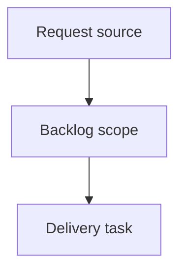

## item_632_export_uniformity_for_floating_splice_connection_references - Export uniformity for floating splice connection references
> From version: 1.16.0
> Schema version: 1.0
> Status: In progress
> Understanding: 95%
> Confidence: 90%
> Progress: 10%
> Complexity: Medium
> Theme: Export
> Reminder: Update status/understanding/confidence/progress and linked request/task references when you edit this doc.

# Problem
The wire list export (CSV / XLSX and the in-app wire export preview) prints a hardcoded `"Preden 13mm"` connection reference for every wire end that lands on a splice port, regardless of the splice's real catalog material, and it silently discards any operator-set endpoint connection reference/name on a splice end.
This breaks export uniformity for the floating-splice deliverable: the BOM (`By connector` / `Wire terminations`) reports each splice's true `manufacturerReference` from its catalog item, while the wire list reports the same magic string for all splices. The two sheets of the same export cannot be reconciled, and the value shown does not match the modeled splice.
The non-blocking warning channel introduced for floating-splice placement feedback (`withWarning`) does not clear a pre-existing blocking `lastError`, so a stale error and a new warning can surface simultaneously, against the intended "distinct channels" contract (task_139 AC30).

# Scope
- In:
  - Resolve splice-port wire-end connection material from real splice data (manual endpoint reference, then catalog `manufacturerReference`, then `splice.manufacturerReference`) in `wireListExport.ts`, threading the splice map through `resolveWireExportEndpointMaterials` and `buildWireListSheet`.
  - Update both in-app wire export preview callers (`ModelingSecondaryTables.tsx`, `AnalysisWireWorkspacePanels.tsx`) to pass the splice map so the preview matches the downloaded file.
  - Make `withWarning` clear any pre-existing blocking `lastError` so the warning and error channels stay mutually exclusive.
  - Add targeted unit/UI tests for the new resolution branches and the channel exclusivity.
- Out:
  - `portCount` serialization parity between save formats, plan-export unresolved-splice diagnostics, and segment re-point warning surfacing (recorded as deferred follow-ups in the source request).
  - Any change to splice placement geometry, routing math, migration, or the BOM resolver.

# Acceptance criteria
- AC1: For a wire end connected to a splice port, the wire list connection reference column resolves, in priority order: (1) the operator-set endpoint connection reference/name, then (2) the splice catalog item's `manufacturerReference` (and name) via `splice.catalogItemId`, then (3) `splice.manufacturerReference`, and is empty when none exist. The hardcoded `"Preden 13mm"` literal is removed.
- AC2: The resolved splice connection reference is identical across the wire list CSV, the XLSX export, and the in-app wire export preview tables (single shared resolver), and matches the splice material reported by the BOM for the same splice.
- AC3: Splice seal reference behavior is unchanged (splice ends have no seal material), and connector endpoint connection/seal resolution is unchanged.
- AC4: `withWarning` surfaces a warning while clearing any pre-existing blocking `lastError`, so the warning and error channels are mutually exclusive by construction (task_139 AC30), without clearing a freshly-set warning.
- AC5: Targeted unit/UI tests cover splice-end connection resolution (manual ref, catalog ref, bare `manufacturerReference`, none) and the warning/error channel exclusivity; existing export, persistence, and reducer tests stay green.

# AC Traceability
- request-AC1 -> This backlog slice. Proof: AC1: For a wire end connected to a splice port, the wire list connection reference column resolves, in priority order: (1) the operator-set endpoint connection reference/name, then (2) the splice catalog item's `manufacturerReference` (and name) via `splice.catalogItemId`, then (3) `splice.manufacturerReference`, and is empty when none exist. The hardcoded `"Preden 13mm"` literal is removed.
- request-AC2 -> This backlog slice. Proof: AC2: The resolved splice connection reference is identical across the wire list CSV, the XLSX export, and the in-app wire export preview tables (single shared resolver), and matches the splice material reported by the BOM for the same splice.
- request-AC3 -> This backlog slice. Proof: AC3: Splice seal reference behavior is unchanged (splice ends have no seal material), and connector endpoint connection/seal resolution is unchanged.
- request-AC4 -> This backlog slice. Proof: AC4: `withWarning` surfaces a warning while clearing any pre-existing blocking `lastError`, so the warning and error channels are mutually exclusive by construction (task_139 AC30), without clearing a freshly-set warning.
- request-AC5 -> This backlog slice. Proof: AC5: Targeted unit/UI tests cover splice-end connection resolution (manual ref, catalog ref, bare `manufacturerReference`, none) and the warning/error channel exclusivity; existing export, persistence, and reducer tests stay green.

# Decision framing
- Product framing: Not needed
- Product signals: (none detected)
- Product follow-up: No product brief follow-up is expected based on current signals.
- Architecture framing: Not needed
- Architecture signals: (none detected)
- Architecture follow-up: No architecture decision follow-up is expected based on current signals.

# Links
- Product brief(s): (none yet)
- Architecture decision(s): (none yet)
- Request: `logics/request/req_146_floating_splice_export_connection_reference_uniformity.md`
- Primary task(s): `task_141_export_uniformity_for_floating_splice_connection_references`

# AI Context
- Summary: Export uniformity for floating splice connection references
- Keywords: backlog-groom, request, export uniformity for floating splice connection references, bounded slice
- Use when: Use when implementing or reviewing the delivery slice for Export uniformity for floating splice connection references.
- Skip when: Skip when the change is unrelated to this delivery slice or its linked request.

# Priority
- Impact: High — wire-list connection references in the operator handoff deliverable are wrong for every splice end and cannot be reconciled with the BOM.
- Urgency: High — included in the 1.16.x release alongside the floating-splice rollout.

# Notes
- Hybrid rationale: Derived from request `req_146_floating_splice_export_connection_reference_uniformity` and kept bounded to one coherent delivery slice.
- Source file: `logics/request/req_146_floating_splice_export_connection_reference_uniformity.md`.
- Generated locally by logics-manager.

# Tasks
- `task_141_export_uniformity_for_floating_splice_connection_references`
