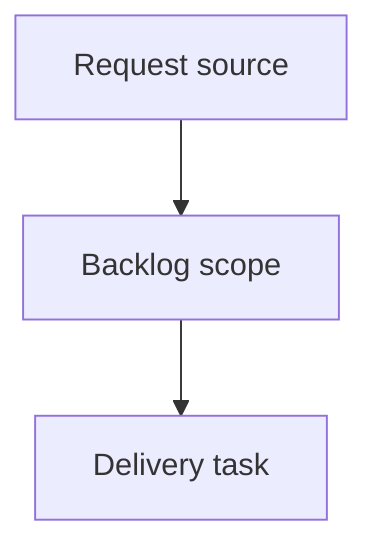

## item_633_tune_floating_splice_visual_placement_and_wire_export_naming - Tune floating splice visual placement and wire export naming
> From version: 1.16.2
> Schema version: 1.0
> Status: Done
> Understanding: 95%
> Confidence: 90%
> Progress: 100%
> Complexity: Medium
> Theme: Network Summary and exports
> Reminder: Update status/understanding/confidence/progress and linked request/task references when you edit this doc.

# Problem
Floating splice markers in Network Summary are currently too strongly correlated with the exact percentage distance between the splice offset and the two segment endpoints. When a splice is close to an endpoint, the visual marker can drift too close to the node, making the diagram harder to read and causing segment length labels to sit under node/splice icons.
The visual placement should remain generally near the center of the segment, with only a slight bias toward the side/end from which the splice is physically closer. The persisted physical offset and route length semantics must not change; this is a rendering/layout adjustment only.
Wire-to-wire export filenames should include the selected network name so exported files are identifiable outside the app.
Grouped exports that include multiple selected harnesses/networks should include each selected harness/network name in generated filenames for all relevant output formats (PDF, XLSX, CSV, and equivalent export artifacts).
Grouped BOM export should include the wire list in the grouped output, so the operator receives a complete grouped package without running a separate wire-list export.
In Network Summary, clicking a splice should open the splice edit flow directly, matching the existing connector click/edit behavior.

# Scope
- In:
  - Add a render-only center-biased placement mapping for floating splice markers in Network Summary. The mapping should keep markers near the segment midpoint, apply only a mild orientation toward the physically closer endpoint, and preserve existing anti-superposition/readability behavior.
  - Keep all physical placement data and calculations unchanged: splice `placement`, route computation, wire length, validation, edit forms, persistence, and export data continue to use the real segment offset.
  - Extend export filename builders so wire-to-wire exports include the active network name and grouped exports include all selected harness/network names across PDF, XLSX, CSV, and equivalent grouped outputs.
  - Extend grouped BOM export composition to include the wire list in the grouped output package.
  - Make floating splice clicks in Network Summary open the splice edit workflow directly, following the connector interaction pattern for selection/focus/edit activation.
  - Add focused tests for the render mapping, export filename generation, grouped BOM wire-list inclusion, and direct splice edit activation.
- Out:
  - Changing persisted splice placement (`segmentId`, `fromNodeId`, `offsetMm`) or any route/wire length semantics.
  - Redesigning the export UI, changing BOM row semantics beyond including the wire list in grouped BOM output, or changing single-network exports except for filename naming.
  - Drag-to-place or drag-to-move splice placement.
  - New architecture decisions; this is an implementation-level refinement of existing floating splice and export workflows.

# Acceptance criteria
- AC1: Floating splice marker rendering in Network Summary uses a bounded visual interpolation: the marker stays generally near the segment center while showing only a slight directional bias toward the endpoint from which the physical splice offset is closer.
- AC2: The rendering guard prevents splice icons from being placed too close to endpoint node icons under normal segment lengths, and preserves readability of segment length labels. Length labels must not disappear under connector/node/splice icons as a result of the splice visual placement.
- AC3: The visual bias is render-only. Persisted placement (`segmentId`, `fromNodeId`, `offsetMm`), routing, wire lengths, validation, export data, and edit form values continue to use the real physical offset.
- AC4: Edge cases remain deterministic and readable: very short segments, zero-offset splices, end-offset splices, multiple splices on the same segment, and existing anti-superposition offsets must not produce hidden or stacked unreadable markers.
- AC5: Wire-to-wire export filenames include the selected network name using the same user-visible network label shown in the app, with filename-safe sanitization.
- AC6: Grouped exports for multiple selected harnesses/networks include every selected harness/network name in the generated filename for PDF, XLSX, CSV, and any equivalent grouped export artifacts. The order is deterministic and follows the selected/exported order or a documented stable fallback.
- AC7: Grouped BOM export includes the wire list in the grouped export output, without requiring the operator to run a separate wire-list export. Existing single-network BOM export behavior is unchanged except where explicitly extended by filename naming.
- AC8: In Network Summary, clicking a splice opens the splice edit workflow directly, matching the connector edit behavior for focus, selection, and edit panel/modal activation.
- AC9: Targeted tests cover the bounded visual placement behavior, filename generation for single and grouped exports, grouped BOM inclusion of wire list content, and direct splice edit activation from Network Summary.

# AC Traceability
- request-AC1 -> This backlog slice. Proof: AC1: Floating splice marker rendering in Network Summary uses a bounded visual interpolation: the marker stays generally near the segment center while showing only a slight directional bias toward the endpoint from which the physical splice offset is closer.
- request-AC2 -> This backlog slice. Proof: AC2: The rendering guard prevents splice icons from being placed too close to endpoint node icons under normal segment lengths, and preserves readability of segment length labels. Length labels must not disappear under connector/node/splice icons as a result of the splice visual placement.
- request-AC3 -> This backlog slice. Proof: AC3: The visual bias is render-only. Persisted placement (`segmentId`, `fromNodeId`, `offsetMm`), routing, wire lengths, validation, export data, and edit form values continue to use the real physical offset.
- request-AC4 -> This backlog slice. Proof: AC4: Edge cases remain deterministic and readable: very short segments, zero-offset splices, end-offset splices, multiple splices on the same segment, and existing anti-superposition offsets must not produce hidden or stacked unreadable markers.
- request-AC5 -> This backlog slice. Proof: AC5: Wire-to-wire export filenames include the selected network name using the same user-visible network label shown in the app, with filename-safe sanitization.
- request-AC6 -> This backlog slice. Proof: AC6: Grouped exports for multiple selected harnesses/networks include every selected harness/network name in the generated filename for PDF, XLSX, CSV, and any equivalent grouped export artifacts. The order is deterministic and follows the selected/exported order or a documented stable fallback.
- request-AC7 -> This backlog slice. Proof: AC7: Grouped BOM export includes the wire list in the grouped export output, without requiring the operator to run a separate wire-list export. Existing single-network BOM export behavior is unchanged except where explicitly extended by filename naming.
- request-AC8 -> This backlog slice. Proof: AC8: In Network Summary, clicking a splice opens the splice edit workflow directly, matching the connector edit behavior for focus, selection, and edit panel/modal activation.
- request-AC9 -> This backlog slice. Proof: AC9: Targeted tests cover the bounded visual placement behavior, filename generation for single and grouped exports, grouped BOM inclusion of wire list content, and direct splice edit activation from Network Summary.

# Decision framing
- Product framing: Not needed
- Product signals: (none detected)
- Product follow-up: No product brief follow-up is expected based on current signals.
- Architecture framing: Not needed
- Architecture signals: Existing ADR/request coverage for floating splice rendering is sufficient; this backlog item stays render-only and export/UI scoped.
- Architecture follow-up: No architecture decision follow-up is expected based on current signals.

# Links
- Product brief(s): (none yet)
- Architecture decision(s): (none yet)
- Request: `req_147_floating_splice_placement_and_wire_export_names`
- Primary task(s): `task_142_tune_floating_splice_visual_placement_and_wire_export_naming`

# AI Context
- Summary: Tune floating splice visual placement and wire export naming
- Keywords: backlog-groom, request, tune floating splice visual placement and wire export naming, bounded slice
- Use when: Use when implementing or reviewing the delivery slice for Tune floating splice visual placement and wire export naming.
- Skip when: Skip when the change is unrelated to this delivery slice or its linked request.

# Implementation notes
- Network Summary floating-splice rendering should likely be adjusted near the render model or graph layer rather than in persisted state. Candidate files include `src/app/components/network-summary/NetworkSummaryCanvasPanel.tsx`, `src/app/components/network-summary/graph/NetworkSummaryGraphLayers.tsx`, and related render helpers.
- The visual mapping should be deterministic and bounded, for example by remapping the physical percentage into a narrow visual band around 50% before existing collision offsets are applied. Exact constants should be validated against short and normal segment cases.
- Export naming should centralize filename-safe network/harness label handling so CSV/XLSX/PDF paths do not diverge.
- Candidate export surfaces include `src/app/components/network-summary/export/useNetworkSummaryExportActions.ts`, `src/app/components/network-summary/export/networkSummaryExport.ts`, `src/app/lib/pdfExport.ts`, `src/app/lib/tabularExport.ts`, `src/app/lib/networkSummaryBomCsv.ts`, `src/app/lib/wireListExport.ts`, and controller export handlers.
- Splice click-to-edit should reuse the connector edit/open pathway where possible instead of adding a parallel interaction mode.

# Priority
- Impact: Medium-high — improves diagram readability and makes exported deliverables easier to identify and complete.
- Urgency: Medium-high — follows the floating-splice rollout and export uniformity fixes, and addresses operator-facing friction.

# Notes
- Hybrid rationale: Derived from request `req_147_floating_splice_placement_and_wire_export_names` and kept bounded to one coherent delivery slice.
- Source file: `logics/request/req_147_floating_splice_placement_and_wire_export_names.md`.
- Generated locally by logics-manager.
- Task `task_142_tune_floating_splice_visual_placement_and_wire_export_naming` was finished via `logics-manager flow finish task` on 2026-06-18.

# Tasks
- `task_142_tune_floating_splice_visual_placement_and_wire_export_naming`

# Tasks
- `task_142_tune_floating_splice_visual_placement_and_wire_export_naming`
