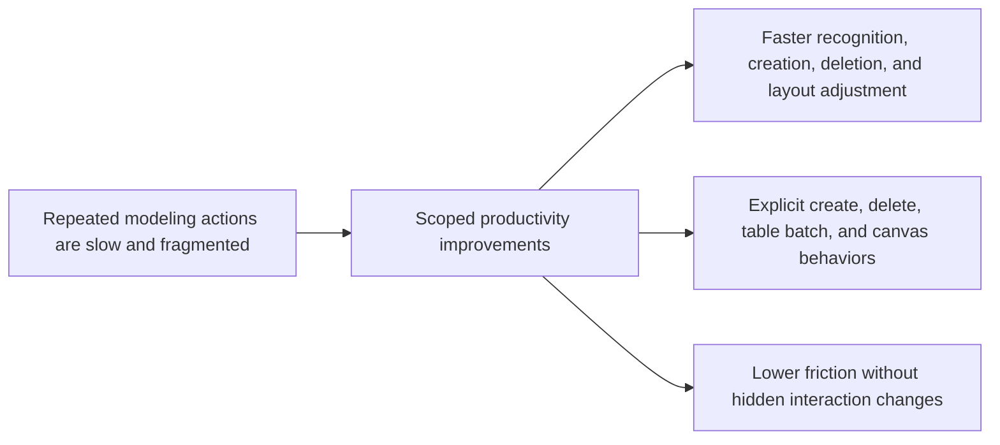

## prod_000_modeling_productivity_and_repeated_action_ergonomics - Modeling productivity and repeated action ergonomics
> Date: 2026-04-02
> Status: Proposed
> Related request: `req_114_connector_and_splice_catalog_labels_show_names_and_create_forms_support_chained_new_action`, `req_115_keyboard_confirmation_shortcut_for_delete_modals_with_explicit_safety_policy`, `req_116_batch_delete_mode_for_modeling_tables_with_explicit_multi_selection_and_mixed_impact_handling`, `req_117_shift_click_multi_selection_and_grouped_move_on_the_2d_modeling_canvas`
> Related backlog: `item_565_connector_and_splice_catalog_selector_labels_include_catalog_names_and_safe_fallback_formatting`, `item_566_bottom_new_action_across_modeling_create_forms_with_silent_draft_reset`, `item_567_regression_coverage_and_closure_for_modeling_create_form_chained_new_and_catalog_label_ergonomics`, `item_568_delete_and_cascade_delete_dialog_enter_shortcut_contract_with_cancel_focused_safety`, `item_569_keyboard_enter_confirmation_wiring_scoped_to_destructive_delete_dialogs_only`, `item_570_regression_coverage_and_closure_for_destructive_dialog_enter_confirmation_behavior`, `item_571_modeling_table_batch_mode_state_selection_contract_and_explicit_entry_exit_behavior`, `item_572_modeling_table_checkbox_ui_and_batch_context_panel_wiring`, `item_573_batch_delete_preflight_confirmation_and_one_operation_execution_for_modeling_tables`, `item_574_regression_coverage_and_closure_for_modeling_table_batch_delete_flows`, `item_575_canvas_shift_click_multi_selection_state_and_node_only_selection_contract`, `item_576_grouped_node_drag_and_persisted_multi_move_behavior_on_the_2d_modeling_canvas`, `item_577_canvas_multi_selection_inspector_summary_and_single_selection_compatibility_wiring`, `item_578_regression_coverage_and_closure_for_canvas_multi_selection_and_grouped_move_behavior`
> Related task: `task_092_super_orchestration_delivery_execution_for_req_114_to_req_117_with_validation_gates_and_staged_checkpoints`
> Related architecture: `adr_002_destructive_interaction_contracts_for_keyboard_confirmation_and_modeling_batch_delete`, `adr_003_modeling_create_flow_reset_and_canvas_group_movement_interaction_contracts`
> Reminder: Update status, linked refs, scope, decisions, success signals, and open questions when you edit this doc.

# Overview
The product direction is to reduce repetitive friction in high-frequency Modeling workflows without turning the UI into a mode-heavy expert tool.
Users should recognize catalog choices faster, create multiple entities in sequence faster, confirm destructive actions faster, and manipulate several items spatially with fewer repeated gestures.
The selected direction keeps each acceleration scoped and explicit: create-flow speedups stay in create forms, delete speedups stay in destructive dialogs, table batch delete stays mode-based, and canvas grouped move stays on the canvas.
Expected outcomes are lower interaction cost, fewer unnecessary scroll round-trips, and clearer separation between single-item edit context and multi-item operation context.

# Product problem
Modeling users currently pay repeated interaction tax for common operations:
- catalog selector labels can be harder to scan than needed;
- chained create flows require unnecessary return travel to list-side actions;
- delete confirmations are safe but slower than necessary for keyboard users;
- deleting several rows requires repeated one-by-one handling;
- moving several items on the 2D canvas requires repeated single-item drag operations.

The product problem is not lack of raw capability but lack of efficient, coherent interaction contracts across repeated actions. The product direction should improve operator throughput while keeping safety, discoverability, and context clarity intact.

# Target users and situations
- Primary users:
  - operators and engineers who do repeated data-entry and cleanup work in Modeling;
  - users who switch frequently between tables, forms, delete flows, and the 2D canvas.
- Main situations:
  - repetitive connector/splice selection in catalog-backed forms;
  - creating several similar items in sequence;
  - deleting several rows during cleanup;
  - adjusting local layout clusters on the canvas.

# Goals
- Reduce repeated interaction cost in Modeling without weakening destructive-action safety.
- Keep each accelerated behavior explicit enough that users understand which context they are in.
- Preserve the product’s current single-item editing model as the default path outside explicit batch or canvas multi-selection gestures.

# Non-goals
- Turn the app into a generic spreadsheet-style multi-edit system.
- Introduce broad hidden keyboard shortcuts across unrelated dialogs.
- Merge table batch selection and canvas multi-selection into one shared V1 concept.
- Add marquee/lasso canvas selection or batch editing of form fields in this wave.

# Scope and guardrails
- In:
  - catalog labels with stronger human-readable recognition;
  - bottom `New` on Modeling create forms only;
  - `Enter` confirmation on destructive delete dialogs only;
  - explicit table batch delete mode with strong blocked/safe separation;
  - `Shift+click` canvas multi-selection and grouped node movement.
- Out:
  - catalog create-form acceleration;
  - non-delete dialog shortcut changes;
  - partial batch deletion of only safe subsets;
  - segment-first or wire-first grouped canvas dragging.

# Key product decisions
- Keep acceleration local to the surface where the user is already working instead of adding global expert-only commands.
- Preserve single-item edit as the default product mental model; batch/table and multi-select/canvas behaviors are explicit alternate contexts.
- Prefer all-or-nothing batch delete in V1 to avoid ambiguous destructive outcomes.
- Prefer node-only canvas grouped move in V1 to keep the movement model understandable and mechanically stable.

# Success signals
- Users can complete representative repeated create and cleanup workflows with fewer clicks and less scrolling than before.
- Delete and batch-delete behavior remains understandable in usability review: users know when they are in single-edit mode vs multi-item mode.
- No spike in destructive-action confusion or accidental confirmations is observed during validation and review.
- Targeted regression suites for create flows, delete confirmations, list ergonomics, and canvas navigation remain stable.

# References
- `logics/request/req_114_connector_and_splice_catalog_labels_show_names_and_create_forms_support_chained_new_action.md`
- `logics/request/req_115_keyboard_confirmation_shortcut_for_delete_modals_with_explicit_safety_policy.md`
- `logics/request/req_116_batch_delete_mode_for_modeling_tables_with_explicit_multi_selection_and_mixed_impact_handling.md`
- `logics/request/req_117_shift_click_multi_selection_and_grouped_move_on_the_2d_modeling_canvas.md`
- `logics/architecture/adr_002_destructive_interaction_contracts_for_keyboard_confirmation_and_modeling_batch_delete.md`
- `logics/architecture/adr_003_modeling_create_flow_reset_and_canvas_group_movement_interaction_contracts.md`
- `logics/tasks/task_092_super_orchestration_delivery_execution_for_req_114_to_req_117_with_validation_gates_and_staged_checkpoints.md`

# Open questions
- Whether future iterations should extend bottom `New` beyond Modeling into Catalog or other workspaces.
- Whether later destructive dialogs beyond delete flows should adopt explicit keyboard-confirm semantics.
- Whether canvas multi-selection should later grow into box selection after the node-only V1 is proven.
