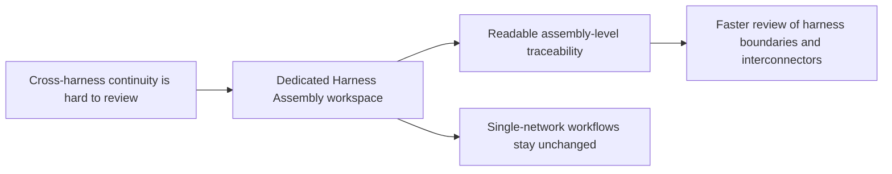

## prod_001_multi_harness_assembly_traceability - Multi-Harness Assembly Traceability
> Date: 2026-05-12
> Status: Settled
> Related request: `req_122_multi_harness_super_category_and_cross_harness_functional_schematic`
> Related backlog: `item_591_harness_assembly_data_model_persistence_and_migration`, `item_594_aggregated_functional_schematic_ui_interconnector_blocks_and_harness_coloring`
> Related task: `task_105_multi_harness_assembly_and_cross_harness_functional_schematic_orchestration`
> Related architecture: `adr_007_harness_assembly_and_physical_interconnector_contract`
> Reminder: Update status, linked refs, scope, decisions, success signals, and open questions when you edit this doc.

# Overview
The product direction is to let operators review continuity across several harnesses without losing the existing single-harness mental model.
`Harness Assembly` becomes the workspace for cross-harness grouping and trace review, while `Network Scope` remains focused on individual harness/network management.
Interconnector crossings should read as one physical continuity point instead of a chain of repeated connector blocks.
Expected outcomes are clearer assembly-level traceability, faster harness boundary review, and less visual ambiguity in functional schematic traces.

# Product Problem
Operators can model detailed harness/network data, but a vehicle-level or system-level review often spans several harnesses. Without a higher-level workspace, cross-harness continuity looks like unrelated single-network fragments, and interconnector boundaries can be mistaken for extra connector chains.

The product problem is to expose cross-harness continuity while keeping the detailed network model authoritative and familiar.

# Target Users and Situations
- Harness designers reviewing a functional trace that crosses physical interconnectors.
- Operators validating whether several harnesses form one coherent assembly.
- Reviewers checking harness ownership, connector boundaries, and functional filters before export or communication.

# Goals
- Make `Harness Assembly` the explicit place for cross-harness grouping and trace review.
- Keep each existing `Network` understandable as one harness inside an assembly.
- Render interconnectors as dedicated continuity blocks that reduce repeated connector noise.
- Use harness ownership color for visible trace links while preserving individual wire color on hover/focus.
- Let wire definitions carry explicit functional tags so filtering is controlled by the source data.

# Non-Goals
- Replace the existing Network Scope or Modeling workflows.
- Make the derived schematic editable as a second source model.
- Add free-form logical continuity declarations on interconnector links.
- Build packaging, routing, or 3D physical layout views in this release.

# Scope and Guardrails
- In:
  - dedicated top-level `Harness Assembly` navigation;
  - assembly-level trace rendering from the detailed model;
  - visible harness-colored traces with wire-specific hover color;
  - readable connector and interconnector block layouts;
  - explicit functional tags on wire definitions.
- Out:
  - editing the derived trace itself;
  - arbitrary pin mapping beyond the current symmetric continuity contract;
  - automatic full-system diagrams without selected trace roots.

# Key Product Decisions
- Put `Harness Assembly` after `Network Scope` and before `Modeling` because it is a higher-level review workspace, not a modeling form subsection.
- Keep `Network Scope` focused on network lifecycle and scope selection.
- Represent an interconnector crossing as one larger block so the UI does not imply three separate connectors in series.
- Make harness color the default visible trace color and keep the original wire color for hover/focus feedback.
- Prefer explicit wire functional tags over hidden text heuristics when the user has defined a tag.

# Success Signals
- Users can find the assembly trace from primary navigation without opening Network Scope internals.
- Interconnector blocks are distinguishable from ordinary connector blocks and do not visually imply duplicate connector endpoints.
- Harness ownership is visible at a glance in cross-harness traces.
- Wire filter labels are consistent with the wire definition choices.
- Existing single-harness functional schematic and network workflows remain stable.

# Open Questions
- Whether future releases should support non-symmetric pin mapping for adapter harnesses.
- Whether assembly-level exports need a distinct title block or can keep reusing the current schematic export surface.

# References
- Request: `logics/request/req_122_multi_harness_super_category_and_cross_harness_functional_schematic.md`
- Backlog: `logics/backlog/item_591_harness_assembly_data_model_persistence_and_migration.md`
- Backlog: `logics/backlog/item_594_aggregated_functional_schematic_ui_interconnector_blocks_and_harness_coloring.md`
- Task: `logics/tasks/task_105_multi_harness_assembly_and_cross_harness_functional_schematic_orchestration.md`
- Architecture: `logics/architecture/adr_007_harness_assembly_and_physical_interconnector_contract.md`
