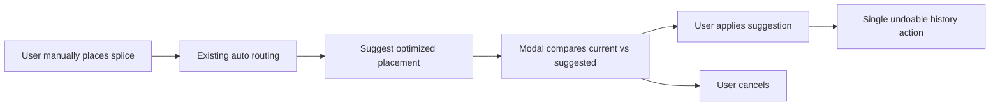

## prod_003_splice_optimized_placement_suggestion - Splice optimized placement suggestion
> Date: 2026-05-22
> Status: Validated
> Related request: TBD
> Related backlog: TBD
> Related task: TBD
> Related architecture: TBD
> Reminder: Update status, linked refs, scope, decisions, success signals, and open questions when you edit this doc.

# Overview
The product direction is to assist users after they manually place a splice by suggesting a better physical placement that reduces total copper volume while keeping the splice section split reasonably balanced between left and right sides.

The feature should not automatically move splices without user validation. The user keeps the current workflow:
- manually place or edit a splice;
- let the existing routing behavior compute wire paths;
- request an optimized placement suggestion from the splice edit panel;
- review a clear comparison in a modal;
- apply or cancel the suggestion.

The expected outcome is a more efficient harness layout with less copper mass and clearer splice quality feedback, without removing operator control.



# Product Problem
Splice position has a direct impact on harness material usage and splice quality.
Moving a splice changes which wires leave from each side, changes route lengths, and therefore changes the amount of copper required.

Today the user can place a splice and rely on routing, but the app does not help answer the key optimization question:

> Is this splice placed in a good position for both copper volume and left/right section balance?

This leaves the user to reason manually about several connected wires, route lengths, and wire sections. That is slow and error-prone, especially when a splice has multiple outgoing wires with different sections.

# Target Users and Situations
- Harness designers optimizing a routed electrical plan after initial modeling.
- Operators placing splices manually but wanting automated assistance before final validation.
- Reviewers checking whether a splice placement creates unnecessary copper mass or an excessive left/right section imbalance.

Typical situations:
- a splice has been placed roughly, then the user wants to refine its position;
- a splice validation warning reports a large left/right section imbalance;
- a design review needs a visible, explainable comparison before accepting a splice movement.

# Goals
- Provide an explicit assisted placement suggestion for a selected splice.
- Minimize copper volume using the existing wire section and route length data.
- Preserve or improve left/right section balance according to the directional splice model.
- Explain the suggestion with current vs suggested metrics before applying it.
- Make `Apply suggestion` a single undoable operation.
- Keep manual splice placement as the primary workflow.

# Non-Goals
- Automatically reposition all splices globally without user review.
- Replace the existing routing engine.
- Turn the feature into a full harness physical optimization solver in V1.
- Block the user from keeping a non-optimal splice placement.
- Optimize unrelated entities such as connectors, regular nodes, or segment topology in the first release.

# Experience Direction
The action should live in the splice edit panel, immediately after `Cancel edit`, with copy that makes the non-destructive behavior clear:

`Suggest optimized placement`

This placement is appropriate because the user is already editing a specific splice, and the operation concerns that selected splice only.

When clicked, the app computes the best candidate placement and opens a styled app modal. The suggestion is not applied until the user validates it.

Modal behavior:
- title: `Suggested splice placement`;
- primary action: `Apply suggestion`;
- secondary action: `Cancel`;
- if no better candidate exists, show a close-only informational state;
- if the best candidate improves copper but violates balance guidance, show that tradeoff explicitly instead of hiding the result.

Suggested modal content:

```text
Suggested splice placement

This suggestion reduces copper volume while keeping section balance within limits.

Copper volume
Current: 1280 mm3
Suggested: 1035 mm3
Improvement: -19%

Section balance
Current: 72% / 28%
Suggested: 54% / 46%

[Cancel] [Apply suggestion]
```

The canvas may show a temporary preview while the modal is open:
- current splice position remains visible;
- suggested position is shown as a ghost/outline marker;
- optional preview routes use a temporary visual style;
- closing the modal removes the preview unless the suggestion is applied.

# Optimization Model
The primary optimization score is copper volume:

```text
totalCopperVolume = sum(wire.sectionMm2 * routedLengthMm)
```

The app should compare the current placement against candidate placements using the same unit convention consistently. Since copper mass is proportional to volume for the same material, minimizing this value minimizes copper mass for copper-only networks.

The splice balance metric compares cumulative wire section on each directional side:

```text
leftSectionMm2 = sum(sectionMm2 for wires assigned to L)
rightSectionMm2 = sum(sectionMm2 for wires assigned to R)
balanceRatio = max(leftSectionMm2, rightSectionMm2) / min(leftSectionMm2, rightSectionMm2)
```

If one side has zero section, the balance should be treated as invalid or maximally imbalanced for warning purposes.

The suggestion should prefer candidates that:
- reduce `totalCopperVolume`;
- stay within the configured splice section imbalance threshold;
- improve balance when copper savings are otherwise close;
- avoid proposing tiny improvements that are not meaningful to the user.

# Key Product Decisions
- The user places splices manually; the feature proposes optimized placement after the fact.
- The trigger is explicit and scoped to the selected splice edit panel.
- The suggested movement is reviewed in a modal before being applied.
- `Apply suggestion` is the only action that mutates the plan.
- The apply operation is recorded as one undoable history action.
- The comparison must include copper volume and section balance for both current and suggested states.
- Existing directional left/right splice behavior remains authoritative for section balance.
- Section imbalance remains a warning/quality signal, not a hard save blocker.

# Functional Scope
In scope:
- selected-splice optimization trigger in the edit panel;
- candidate placement evaluation using route length and wire section;
- current vs suggested metrics;
- styled confirmation modal with apply/cancel behavior;
- temporary canvas preview while reviewing a suggestion;
- undo/redo integration for applied suggestions;
- no-result and tradeoff states;
- tests for scoring, modal behavior, apply/cancel, and undo.

Out of scope:
- global multi-splice optimization;
- automatic background suggestions without user action;
- persistent recommendation records or audit reports;
- changing the wire section recommendation engine;
- physical manufacturing constraints beyond route length, section, and side balance unless added later.

# Suggested States
- Valid improvement:
  - show suggested placement with copper reduction and acceptable balance.
- Copper improvement with balance warning:
  - show the suggestion as a tradeoff and mark the balance warning clearly.
- Balance improvement without copper improvement:
  - V1 should usually not propose it unless a balance warning exists on the current splice.
- No better placement:
  - show `No better placement found within current constraints.`
- Insufficient data:
  - show why the suggestion cannot be computed, for example missing wire sections, missing routes, or ambiguous splice connectivity.

# Success Signals
- Users understand that the feature is a suggestion and not an automatic mutation.
- Users can compare current and suggested copper volume and balance without inspecting raw wire tables.
- Applying the suggestion visibly moves the splice and updates routes as one coherent operation.
- Undo restores the previous splice position, routes, side assignment, and validation warnings.
- The feature avoids noisy suggestions when the improvement is negligible.
- Existing splice edit, routing, validation, and history workflows remain stable.

# Open Questions
- What minimum copper improvement should be required before showing an actionable suggestion?
- Should candidate positions be limited to existing route graph nodes/segments, or can the optimizer propose arbitrary canvas coordinates snapped to the routing grid?
- Should a balance warning block `Apply suggestion`, or only appear as a warning in the modal?
- Should the modal display absolute volume units only, percentage improvement only, or both?
- Should preview routes be shown in V1, or should V1 preview only the suggested splice marker?
- How should locked manual left/right side overrides interact with optimization: preserved strictly, or temporarily evaluated as part of the suggestion?

# References
- `logics/request/req_122_wire_twist_groups_and_left_right_splice_pin_mode.md`
- `logics/request/req_066_global_undo_redo_history_for_modeling_and_catalog_mutations.md`
