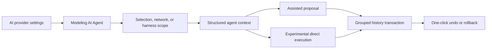

## prod_004_ai_agent_modeling_workspace - AI Agent Modeling Workspace
> Date: 2026-05-29
> Status: Draft
> Related request: `req_128_ai_agent_modeling_workspace`
> Related backlog: TBD
> Related task: TBD
> Related architecture: TBD
> Reminder: Update status, linked refs, scope, decisions, success signals, and open questions when you edit this doc.

# Overview
The product direction is to add an `AI Agent` workspace inside Modeling that helps users modify harness and network data through controlled, reversible operations.

The agent should accelerate real Modeling work: creating or adjusting connectors, splices, wires, nodes, routes, catalog assignments, labels, and selected-harness context. It should not become a generic chatbot or an external sidecar. The user stays inside the Modeling workflow, chooses a target scope, gives an instruction, grants permissions, and either reviews a proposal or runs an experimental direct execution.

The central product rule is reversibility. Every AI session must be grouped, visible, and undoable in one action.



# Product Problem
Modeling a harness can involve many precise but repetitive actions:
- creating several related entities;
- aligning connectors, splices, and nodes on the canvas;
- assigning wires and endpoints;
- keeping route and section choices coherent;
- cleaning labels, technical IDs, and catalog references;
- validating changes after a local design adjustment.

Users often know the desired outcome, but reaching it requires many manual operations across forms, tables, canvas interactions, and validation feedback. The product opportunity is to let users describe the intent while keeping the application in control of the actual mutations.

# Target Users and Situations
Primary users:
- harness designers working in Modeling;
- operators cleaning up network data after import or iterative design;
- reviewers who want quick guided adjustments before validation or export.

Typical situations:
- complete a partially modeled selected harness;
- add or correct wires after a connector or splice change;
- reorganize a local canvas area for readability;
- normalize names, technical IDs, or catalog-backed references;
- inspect warnings and request a targeted fix;
- ask for a bounded improvement on the active network.

# Goals
- Add an AI control surface directly in Modeling.
- Keep AI provider configuration centralized in Settings.
- Let users express intent in natural language while execution remains structured.
- Support a safe assisted mode where users review operations before application.
- Support an opt-in experimental mode where the agent can apply valid operations directly.
- Make every AI run one grouped, reversible session.
- Expose what the AI changed, skipped, or could not validate.
- Keep provider integration abstract so the feature is not locked to one AI vendor.

# Non-Goals
- Replace existing manual Modeling tools.
- Let an AI provider mutate raw application state.
- Run autonomous background modifications without user initiation.
- Create a general-purpose chat assistant unrelated to the active plan.
- Implement full harness optimization in the first version.
- Add persistent cross-project AI memory.
- Require cloud AI usage when local or custom providers are configured.

# Experience Direction
The new Modeling section should be named `AI Agent`.

It should feel like an operational cockpit:
- action selector;
- target scope selector;
- assisted vs experimental mode;
- instruction field;
- permission controls;
- run action;
- proposal or execution summary;
- detail view;
- apply, reject, undo, or rollback controls.

Suggested controls:

```text
AI Agent

Action
[Complete selected area]

Target
[Current selection]

Mode
(*) Assisted
( ) Experimental direct execution

Instruction
[Add the missing wires and connector-side references needed for this selected harness area.]

Permissions
[x] Add entities
[x] Move entities
[x] Update references
[x] Regenerate routes
[ ] Delete entities

Safety
[x] Create pre-run snapshot
[x] Group session into one undo step

[Run agent]
```

Assisted result state:

```text
Proposal ready
12 operations proposed
8 accepted by validation
4 need review

[View details] [Reject] [Apply]
```

Experimental result state:

```text
AI session applied
8 operations applied
2 operations rejected by validation

Session is rollbackable in one action.

[View details] [Rollback AI session]
```

# Modes
## Assisted mode
Assisted mode is the default and recommended mode.

The agent receives scoped context and returns a structured operation list. The app validates those operations, shows the user a summary and details, then waits for explicit application.

Expected flow:

```text
User instruction
-> Build scoped context
-> AI returns operations
-> Local validation
-> Proposal summary
-> User applies or rejects
-> One grouped history transaction
```

## Experimental direct mode
Experimental mode is opt-in and should be visually distinct.

The agent can apply validated operations without asking for confirmation after each operation. The app still owns all mutation, validation, history, and rollback behavior.

Expected flow:

```text
User instruction
-> Snapshot
-> Build scoped context
-> Agent calls bounded operations
-> Local validation per operation
-> Direct application
-> Summary
-> One-click rollback
```

# Operation Model
The agent should act through a small operation vocabulary, not through direct state writes.

Candidate operation families:
- `add_entity`: connector, splice, node, segment, wire;
- `move_entity`: connector, splice, node, or grouped canvas entities;
- `update_entity`: labels, technical IDs, sections, materials, colors, protection, route locks;
- `assign_endpoint`: connector cavity or splice port assignment;
- `assign_catalog_reference`: catalog-backed connector, splice, terminal, seal, plug, or protection reference;
- `regenerate_route`: recalculate routes within allowed scope;
- `delete_entity`: only when explicitly permitted.

Each operation should include:
- stable target IDs;
- target network or harness scope;
- before/after values when applicable;
- rationale from the agent;
- validation result;
- applied/rejected status.

# Safety and Trust
The product should communicate that AI is powerful but bounded.

Required safeguards:
- no raw state mutation by providers;
- local validation before mutation;
- permission gates for destructive or broad changes;
- delete disabled by default;
- snapshot before every AI execution;
- grouped undo for assisted application;
- grouped rollback for experimental execution;
- visible summary of applied and rejected operations;
- no silent fallback to broader scope when the selected scope is unavailable.

# Key Product Decisions
- The `AI Agent` belongs in Modeling because its purpose is to change modeling data.
- Provider configuration belongs in Settings because it is an application-level capability.
- Assisted mode is the default.
- Experimental mode is explicit, opt-in, and reversible.
- The operation contract is the shared foundation for both modes.
- The app validates and executes operations; the provider only proposes or requests them.
- Undo/rollback is a non-negotiable product requirement.
- V1 should start with a narrow operation vocabulary and expand after validation.

# Functional Scope
In scope:
- AI settings provider configuration;
- Modeling `AI Agent` section;
- selected scope and instruction capture;
- assisted operation proposal;
- experimental direct execution gate;
- operation validation;
- grouped history transaction;
- pre-run snapshot;
- rollback summary;
- basic operation detail view.

Out of scope:
- full automatic harness optimization;
- background AI execution;
- global multi-harness mutation in V1;
- human-readable AI reports;
- imported provider plugin marketplace;
- persistent conversation memory;
- unbounded tool execution.

# MVP Direction
Recommended V1:
- AI settings with one provider abstraction and extension points for additional providers;
- Modeling `AI Agent` entry;
- assisted mode only enabled by default;
- scope limited to current selection or active network;
- operation vocabulary limited to safe add, move, and update operations;
- delete unavailable or disabled by default;
- validation summary and operation details;
- apply as one history transaction;
- undo restores the previous state.

Recommended V2:
- experimental direct execution;
- selected-harness scope;
- route regeneration and endpoint assignment tools;
- catalog-reference assignment tools;
- richer visual diff on canvas;
- session history;
- provider capability reporting.

# Success Signals
- Users understand that the AI Agent modifies Modeling data through controlled operations.
- Assisted proposals are clear enough to apply or reject confidently.
- Experimental execution can be rolled back without hunting through individual undo steps.
- AI validation failures are understandable and actionable.
- Manual Modeling workflows remain unchanged for users who do not use the agent.
- Provider settings can be changed without rewriting the Modeling UI.
- The operation contract can support new actions without widening raw state access.

# Open Questions
- Which provider should be the first supported implementation?
- Should credentials be stored locally, in environment variables, or both?
- What is the smallest useful V1 operation vocabulary?
- Should selected-harness scope be V1 or V2, given the existing selected-harness agent JSON export?
- How detailed should the visual diff be before V1 ships?
- Should experimental mode require a per-run confirmation even after it is enabled in Settings?
- Should the app keep an AI session history, or only the latest session summary?

# References
- `logics/request/req_127_selected_harness_agent_json_export.md`
- `logics/request/req_128_ai_agent_modeling_workspace.md`
- `logics/product/prod_000_modeling_productivity_and_repeated_action_ergonomics.md`
- `logics/architecture/adr_003_modeling_create_flow_reset_and_canvas_group_movement_interaction_contracts.md`
