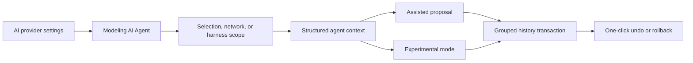

## prod_004_ai_agent_modeling_workspace - AI Agent Modeling Workspace
> Date: 2026-05-30
> Status: Validated
> Related request: `req_128_ai_agent_modeling_workspace`
> Related backlog: `item_600_ai_provider_settings_and_capability_contract`, `item_601_ai_agent_context_builder_and_operation_contract`, `item_602_modeling_ai_agent_assisted_proposal_workflow`, `item_603_ai_agent_experimental_direct_execution_and_rollback`, `item_604_ai_agent_validation_regression_and_release_gate`
> Related task: `task_112_ai_agent_modeling_workspace_release_validation`
> Related architecture: `adr_009_ai_agent_operation_contract_and_reversible_execution`
> Reminder: Update status, linked refs, scope, decisions, success signals, and open questions when you edit this doc.

# Overview
The product direction is to add an `AI Agent` workspace inside Modeling that helps users modify harness and network data through controlled, reversible operations.

The agent should accelerate real Modeling work: creating or adjusting connectors, splices, wires, nodes, routes, catalog assignments, labels, and selected-harness context. It should not become a generic chatbot or an external sidecar. The user stays inside the Modeling workflow, chooses a target scope, gives an instruction, grants permissions, and either reviews a proposal or uses the gated experimental mode affordance.

The central product rule is reversibility. Every AI session must be grouped, visible, and undoable in one action.



# Product Problem
Modeling a harness can involve many precise but repetitive actions:
- creating several related entities;
- aligning connectors, splices, and nodes on the canvas;
- assigning wires and endpoints;
- keeping route and section choices coherent;
- cleaning labels, technical IDs, and catalog references;
- validating changes after a local design adjustment.

Users often know the desired outcome, but reaching it requires many manual operations across forms, tables, canvas interactions, and validation feedback. The product opportunity is to let users describe the intent while keeping the application in control of the actual mutations.

# Target Users and Situations
Primary users:
- harness designers working in Modeling;
- operators cleaning up network data after import or iterative design;
- reviewers who want quick guided adjustments before validation or export.

Typical situations:
- complete a partially modeled selected harness;
- add or correct wires after a connector or splice change;
- reorganize a local canvas area for readability;
- normalize names, technical IDs, or catalog-backed references;
- inspect warnings and request a targeted fix;
- ask for a bounded improvement on the active network.

# Goals
- Add an AI control surface directly in Modeling.
- Keep AI provider configuration centralized in Settings.
- Support OpenAI and Gemini as the first configured providers.
- Let users express intent in natural language while execution remains structured.
- Support a safe assisted mode where users review operations before application.
- Support an opt-in experimental mode where the agent can apply valid operations directly.
- Make every AI run one grouped, reversible session.
- Expose what the AI changed, skipped, or could not validate.
- Keep provider integration abstract so the feature is not locked to one AI vendor.

# Non-Goals
- Replace existing manual Modeling tools.
- Let an AI provider mutate raw application state.
- Run autonomous background modifications without user initiation.
- Create a general-purpose chat assistant unrelated to the active plan.
- Implement full harness optimization in the first version.
- Add persistent cross-project AI memory.
- Require local or custom providers in V1.

# Experience Direction
The new Modeling section should be named `AI Agent`.
The entry point should live next to the existing `Wires` Modeling entry so it reads as another Modeling tool, not as a global assistant.
The entry remains visible but disabled until the selected provider is valid and ready.
Disabled copy should point the user to Settings AI provider configuration instead of hiding the feature.

It should feel like an operational cockpit:
- action selector;
- target scope selector;
- assisted vs experimental mode;
- instruction field;
- permission controls;
- run action;
- proposal or execution summary;
- detail view;
- apply, reject, undo, or rollback controls.

Suggested controls:

```text
AI Agent

Action
[Complete selected area]

Target
[Current selection]

Mode
(*) Assisted
( ) Experimental direct execution

Instruction
[Add the missing wires and connector-side references needed for this selected harness area.]

Permissions
[x] Add entities
[x] Move entities
[x] Update references
[x] Regenerate routes
[ ] Delete entities

Safety
[x] Create pre-run snapshot
[x] Group session into one undo step

[Run agent]
```

Assisted result state:

```text
Proposal ready
12 operations proposed
8 accepted by validation
4 need review

[View details] [Reject] [Apply]
```

Experimental result state:

```text
AI session applied
8 operations applied
2 operations rejected by validation

Session is rollbackable in one action.

[View details] [Rollback AI session]
```

# Modes
## Assisted mode
Assisted mode is the default and recommended mode.

The agent receives scoped context and returns a structured operation list. The app validates those operations, shows the user a summary and details, then waits for explicit application.

Expected flow:

```text
User instruction
-> Build scoped context
-> AI returns operations
-> Local validation
-> Proposal summary
-> User applies or rejects
-> One grouped history transaction
```

## Experimental direct mode
Experimental mode is opt-in and should be visually distinct.

In 1.11.0, experimental mode is gated in Settings but still uses the same validated proposal/apply controls before mutation. The app owns all mutation, validation, history, and rollback behavior.

Delivered 1.11.0 flow:

```text
User instruction
-> Snapshot
-> Build scoped context
-> Agent proposes bounded operations
-> Local validation
-> User applies accepted operations
-> Summary
-> One-click rollback
```

# Operation Model
The agent should receive a scoped editable plan JSON, modify that plan, and return the full modified plan.
The application computes the before/after diff and turns it into a small operation vocabulary.
This lets the AI reason naturally over the electrical plan while keeping mutation, validation, and history ownership inside the app.

Recommended V1 operation families:
- `add_entity`: connector, splice, node, segment, or wire with required network scope and explicit fields;
- `move_entity`: connector, splice, node, or selected canvas entity movement within the active network;
- `place_entity_relative_to_entity`: explicit relative placement such as moving SVC left of OBC, using validated target and anchor entities;
- `update_entity`: safe scalar fields such as name, technical ID, section, material, color, protection, route lock, and display metadata;
- `regenerate_route`: route recalculation for selected or active-network wires within the permitted scope.

Recommended V2 operation families:
- `assign_endpoint`: connector cavity or splice port assignment;
- `assign_catalog_reference`: connector, splice, terminal, seal, plug, or protection catalog association;
- `delete_entity`: destructive action, disabled unless explicitly permitted;
- selected-harness multi-network operations.

Each operation should include:
- stable target IDs;
- user-facing aliases only as fallback inputs, resolved locally to stable IDs before apply;
- target network or harness scope;
- before/after values when applicable;
- rationale from the agent;
- validation result;
- applied/rejected status.

# Safety and Trust
The product should communicate that AI is powerful but bounded.

Required safeguards:
- no raw state mutation by providers;
- local validation before mutation;
- permission gates for destructive or broad changes;
- delete disabled by default;
- snapshot before every AI execution;
- grouped undo for assisted application;
- grouped rollback for experimental execution;
- visible summary of applied and rejected operations;
- no silent fallback to broader scope when the selected scope is unavailable.
- the Modeling `AI Agent` entry is disabled when provider readiness is invalid, missing, or failed.

# Key Product Decisions
- The `AI Agent` belongs in Modeling because its purpose is to change modeling data.
- The `AI Agent` entry sits beside `Wires` in Modeling and uses provider readiness to enable or disable entry.
- Provider configuration belongs in Settings because it is an application-level capability.
- V1 supports OpenAI and Gemini provider configuration.
- Users enter their own API keys locally in the app settings and those keys are persisted in local storage with the rest of the local app settings; local development may also use `.env` keys for developer workflows.
- Provider model selection uses editable model-name fields in V1 instead of a rigid baked-in model list.
- Assisted mode is the default.
- Experimental mode is explicit, opt-in, and reversible.
- The operation contract is the shared foundation for both modes.
- The app validates and executes operations; the provider only proposes or requests them.
- Undo/rollback is a non-negotiable product requirement.
- V1.11.0 ships active-network, current-selection, selected-harness, and all-networks context scopes; multi-network mutation requires explicit or inferable `networkId` targeting.
- V1.11.0 ships add, move, update, route, delete, catalog assignment, connector layout, terminal-material, batch move, and route-lock operation families behind local validation and permissions.

# Functional Scope
In scope:
- AI settings provider configuration;
- Modeling `AI Agent` section;
- selected scope and instruction capture;
- assisted operation proposal;
- experimental direct execution gate;
- operation validation;
- grouped history transaction;
- pre-run snapshot;
- rollback summary;
- basic operation detail view.

Out of scope:
- full automatic harness optimization;
- background AI execution;
- global multi-harness mutation in V1;
- human-readable AI reports;
- imported provider plugin marketplace;
- persistent conversation memory;
- unbounded tool execution.

# MVP Direction
Delivered in V1.11.0:
- AI settings with OpenAI and Gemini provider adapters behind one provider abstraction;
- user-entered API keys persisted in local storage, with optional `.env` keys for development/test workflows;
- editable model-name fields for OpenAI and Gemini instead of a fixed model selector;
- Modeling `AI Agent` entry;
- assisted mode only enabled by default;
- scope support for current selection, active network, selected harness, and all networks;
- operation vocabulary for safe add, move, update, route, delete, catalog, connector layout, terminal material, and batch movement operations;
- delete disabled by default and gated by explicit permission;
- validation summary and operation details;
- apply as one history transaction;
- undo restores the previous state;
- impact preview and rollback for the last applied AI session.

Recommended V2:
- true one-click direct execution without the assisted proposal apply step;
- endpoint assignment tools;
- richer visual diff on canvas;
- session history;
- expanded provider capability reporting and local/custom provider support.

# Success Signals
- Users understand that the AI Agent modifies Modeling data through controlled operations.
- Assisted proposals are clear enough to apply or reject confidently.
- Experimental execution can be rolled back without hunting through individual undo steps.
- AI validation failures are understandable and actionable.
- Manual Modeling workflows remain unchanged for users who do not use the agent.
- Provider settings can be changed without rewriting the Modeling UI.
- The operation contract can support new actions without widening raw state access.

# Open Questions
- How detailed should the visual diff be before V1 ships?
- Should true direct execution require a per-run confirmation even after it is enabled in Settings?
- Should the app keep an AI session history, or only the latest session summary?

# Delivery Status
- Delivered in release `1.11.0`.
- Closure task: `logics/tasks/task_112_ai_agent_modeling_workspace_release_validation.md`.
- Release notes: `changelogs/CHANGELOGS_1_11_0.md`.
- Validation evidence includes lint, typecheck, AI/provider/settings/home targeted tests, build, Logics lint, and a local live OpenAI smoke test with `.env.local`.

# References
- `logics/request/req_127_selected_harness_agent_json_export.md`
- `logics/request/req_128_ai_agent_modeling_workspace.md`
- `logics/product/prod_000_modeling_productivity_and_repeated_action_ergonomics.md`
- `logics/architecture/adr_003_modeling_create_flow_reset_and_canvas_group_movement_interaction_contracts.md`
- `logics/architecture/adr_009_ai_agent_operation_contract_and_reversible_execution.md`
- `logics/backlog/item_600_ai_provider_settings_and_capability_contract.md`
- `logics/backlog/item_601_ai_agent_context_builder_and_operation_contract.md`
- `logics/backlog/item_602_modeling_ai_agent_assisted_proposal_workflow.md`
- `logics/backlog/item_603_ai_agent_experimental_direct_execution_and_rollback.md`
- `logics/backlog/item_604_ai_agent_validation_regression_and_release_gate.md`
