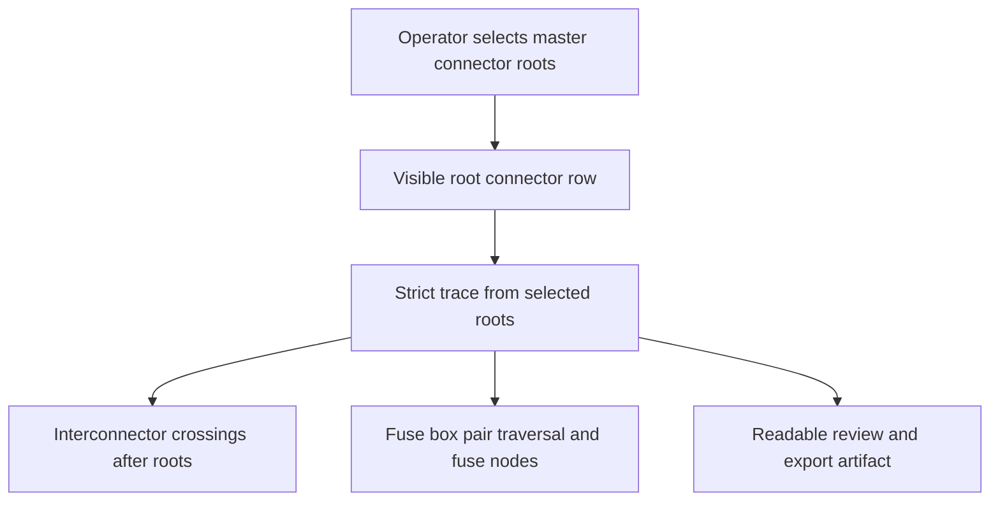

## prod_006_trustworthy_functional_schematic_review - Trustworthy Functional Schematic Review
> Date: 2026-06-05
> Status: Settled
> Related request: `req_136_harness_assembly_functional_schematic_root_fidelity_fuse_box_and_strict_scope`
> Related request: `req_134_harness_assembly_functional_trace_scope_boundaries_for_selected_master_connectors`
> Related backlog: `item_617_harness_assembly_functional_root_connector_visual_fidelity`, `item_618_harness_assembly_functional_strict_saved_root_scope`, `item_619_harness_assembly_functional_fuse_box_pair_traversal`
> Related task: TBD
> Related product: `prod_001_multi_harness_assembly_traceability`
> Related architecture: `adr_007_harness_assembly_and_physical_interconnector_contract`
> Reminder: Update status, linked refs, scope, decisions, success signals, and open questions when you edit this doc.

# Overview
Harness assembly functional schematics must be trusted as operator review artifacts.
When an operator selects one or more master connectors, the generated view should make those connector roots visible, include only electrically relevant traces from those roots, and preserve important electrical continuity elements such as fuse boxes.

The product direction is to keep the functional schematic derived and read-only, but make the derivation match the operator's explicit review intent. The view must no longer feel like a broad connected-component dump or hide the selected root connector behind an interconnector block.

# Product Problem
The current assembly functional schematic can be technically derived from the data while still being misleading to the operator:

- selected master connectors can be replaced visually by interconnector blocks at the top of the schematic;
- saved root connector state can differ from what the operator believes is currently selected;
- traces can include wires that are reachable through other root corridors but are not part of the selected connector's intended review scope;
- assembly graphs stop at fuse box connector pins instead of showing fuse continuity across configured fuse pairs.

These behaviors reduce confidence in the view. Operators need the schematic to answer a simple question: "What is connected to the connector roots I selected?"

# Target Users and Situations
- Harness designers reviewing a selected BCM, PCU, door, lighting, or fuse-box related trace.
- Operators validating cross-harness continuity before sharing a schematic or export.
- Reviewers checking whether one selected connector root actually owns the visible functional branch.
- Users preparing documentation where the root connector must be visible as the first visual reference.

# Goals
- Always show selected master connectors as the top/root visual elements of the assembly schematic.
- Keep interconnector blocks as crossing elements after the selected connector root, not as replacements for that root.
- Ensure the visible trace is scoped to the effective selected roots and does not include unrelated branches from other unselected corridors.
- Reflect root selection state predictably, including unsaved draft changes or a clearly explicit apply/save contract.
- Traverse fuse-box pair metadata in assembly schematics and render fuse nodes with ratings where available.
- Preserve existing valid cross-harness traversal through physical interconnector links.

# Non-Goals
- Making the functional schematic editable.
- Introducing non-symmetric interconnector pin mapping.
- Adding logical signal declarations on interconnector links.
- Replacing the detailed harness model as source of truth.
- Reworking the full assembly data model.

# Scope and Guardrails
- In:
  - assembly functional schematic root rendering;
  - strict root-scoped traversal;
  - draft vs saved root selection behavior;
  - fuse-box pair traversal and fuse rendering in assembly graphs;
  - targeted warnings and automated regression tests.
- Out:
  - single-network physical 2D canvas behavior;
  - arbitrary component taxonomy;
  - manual functional diagram layout authoring;
  - bulk export and PDF packaging, covered separately by `req_137_pdf_export_for_2d_plans_and_grouped_image_pdf_export`.

# Key Product Decisions
- The selected connector root is the operator's anchor and must remain visible even if the first electrical continuation crosses an interconnector.
- Root checkbox changes continue to follow the current saved-assembly contract for now: the graph updates from saved roots after `Save assembly`.
- Interconnectors remain important, but they are crossing points, not substitutes for the selected root connector.
- A selected-root filtered graph should be narrower than an all-roots assembly graph when the operator selects only one connector.
- Fuse boxes are electrical continuity elements in functional review, not ordinary connector stops.
- The current single-network functional schematic can remain unchanged unless shared helpers are extracted safely.

# Success Signals
- Selecting only `CT8.B BCM 40V` in the debug workspace does not show branches that belong to `CT11.A`, `CT8.A`, or other unselected roots.
- The first visible row contains the selected connector pins, not only `Interco lateral` or other interconnector blocks.
- Selecting `CT8.A` with `12V power` displays fuse-box continuity where the detailed model contains fuse pair metadata.
- Users can understand whether the graph is using saved roots, draft roots, or a temporary current selection.
- Existing assembly interconnector traversal tests continue to pass with stricter root-scope coverage.

# Open Questions
- Closed: root checkbox changes update the graph only after saving the assembly for now.
- Closed: selected root connectors render one visible node per connected pin.
- Closed: the first graph row is reserved for selected connector root nodes only.
- Closed: when a selected root pin crosses an interconnector, the intended chain is root connector pin -> local wire -> interconnector -> distant wire.
- Closed: fuse-box traversal uses only configured catalog pairs.
- Closed: fuse-box electrical expansion happens before domain filtering, while visible wires remain filter-scoped.

# References
- Request: `logics/request/req_136_harness_assembly_functional_schematic_root_fidelity_fuse_box_and_strict_scope.md`
- Backlog: `logics/backlog/item_617_harness_assembly_functional_root_connector_visual_fidelity.md`
- Backlog: `logics/backlog/item_618_harness_assembly_functional_strict_saved_root_scope.md`
- Backlog: `logics/backlog/item_619_harness_assembly_functional_fuse_box_pair_traversal.md`
- Existing request: `logics/request/req_134_harness_assembly_functional_trace_scope_boundaries_for_selected_master_connectors.md`
- Architecture: `logics/architecture/adr_007_harness_assembly_and_physical_interconnector_contract.md`
- Core implementation: `src/core/functionalSchematic.ts`
- UI implementation: `src/app/components/network-summary/FunctionalSchematicPanel.tsx`

# Settlement
- Validated on 2026-06-16: linked functional-schematic scope decisions are closed in this brief and the active workflow corpus has no remaining linked open items.
