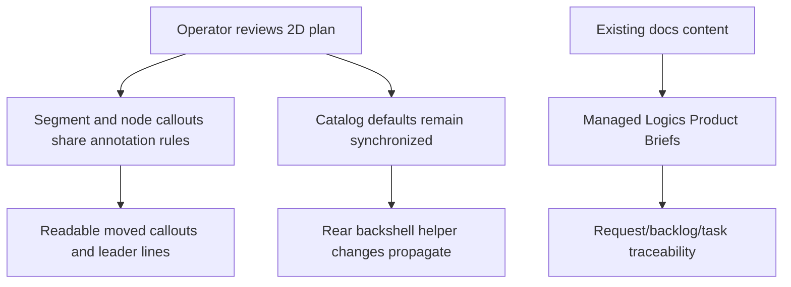

## prod_007_segment_callout_parity_and_product_brief_migration - Segment Callout Parity and Product Brief Migration
> Date: 2026-06-09
> Status: Proposed
> Related request: `req_141_segment_callout_layering_docs_product_brief_migration_and_connector_material_default_sync`
> Related backlog: `item_627_segment_callout_layering_product_brief_migration_and_connector_material_default_sync`
> Related task: `task_137_segment_callout_layering_product_brief_migration_and_connector_material_default_sync`
> Related architecture: (none yet)
> Reminder: Update status, linked refs, scope, decisions, success signals, and open questions when you edit this doc.

# Overview
Segment callouts are now part of the operator-facing 2D network summary, but they must behave like mature plan annotations rather than secondary overlays. Operators expect segment callouts to stay visible after movement, keep their leader lines readable even when crossing dense plan content, and follow the same visual hierarchy as node callouts.

This future development slice also completes a documentation hygiene step: product-facing briefs currently stored under `docs/` should become managed Logics Product Briefs so product intent, backlog work, and delivery evidence stay connected.

# Goals
- Segment callouts stay visible and readable with the same hierarchy expectations as node callouts.
- Segment callout dotted leader lines remain visible when crossing other rendered plan elements.
- Segment and node callout leader-line styling is unified so plan annotations look intentional and consistent.
- Connector material default edits for Rear backshell helper behave reliably across the defaults panel and Edit catalog item.
- Product-facing docs move into `logics/product` so future work can reference managed Product Briefs instead of unmanaged files.

# Non-goals
- Redesigning every annotation or label placement rule in the network summary.
- Replacing the existing node callout interaction model.
- Creating new product narratives unrelated to the current `docs/` files.
- Redesigning the full catalog editor beyond the Rear backshell helper synchronization defect.

# User Value
- Operators can trust that moved segment callouts remain on top of the plan context they explain.
- Dense plans remain inspectable because dotted leader lines do not disappear when crossing other content.
- Callout styling is predictable across node and segment annotations.
- Catalog material defaults behave consistently, avoiding silent mismatch between defaults and edited catalog items.
- Product intent is easier to maintain because Product Briefs live in the managed Logics corpus.

# Scope and Guardrails
- Preserve local-first, explicit user-controlled callout movement.
- Keep network-summary rendering deterministic on screen and in export-derived surfaces.
- Prefer shared callout primitives over segment-only visual rules.
- Treat faded segment callouts and position reset behavior as investigation items that must end in either a fix or a documented product rule.
- Keep Product Brief migration faithful to the existing docs instead of rewriting unrelated product strategy.

# Product Decisions
- Node callouts are the reference behavior for segment callout hierarchy and dotted leader-line styling.
- Segment callout leader lines should cross rendered content without becoming hidden by another overlay or callout.
- Existing `docs/` product-facing content should be migrated into individual Product Briefs under `logics/product`; `docs/` should not remain as a parallel product documentation surface.
- Rear backshell helper-only edits are meaningful catalog default changes and must propagate without requiring a second material-default field change.

# Open Questions
- Are faded segment callouts intentional under a specific selection, filtering, subnetwork, or export-readability state?
- Is segment callout position reset ever intentional, and if so, which user action or model change should trigger it?
- Does segment/node callout parity require a small ADR for shared layering, masking, or export-rendering contracts?

# Success Signals
- Segment callouts and node callouts share the same visible annotation hierarchy in dense plans.
- Segment callout leader lines remain visible across crossings and match node callout styling.
- A Rear backshell helper-only defaults edit is reflected in Edit catalog item state and persisted catalog data.
- Every existing `docs/` file has a corresponding managed Product Brief and repository references no longer point to `docs/...`.
- Logics lint and audit pass after migration.

# References
- Request: `logics/request/req_141_segment_callout_layering_docs_product_brief_migration_and_connector_material_default_sync.md`
- Backlog: `logics/backlog/item_627_segment_callout_layering_product_brief_migration_and_connector_material_default_sync.md`
- Task: `logics/tasks/task_137_segment_callout_layering_product_brief_migration_and_connector_material_default_sync.md`
- Prior request: `logics/request/req_140_connector_rear_backshell_helper_node_segment_sheath_metadata_and_mounting_labels.md`
- Prior callout request: `logics/request/req_101_network_summary_zoom_invariant_segments_and_callout_leader_lines.md`
