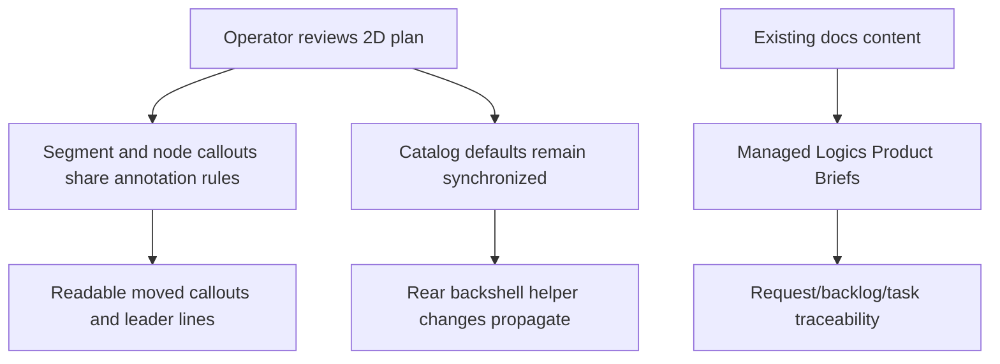

## prod_007_segment_callout_parity_and_product_brief_migration - Segment Callout Parity and Product Brief Migration
> Date: 2026-06-09
> Status: Settled
> Related request: `req_141_segment_callout_layering_docs_product_brief_migration_and_connector_material_default_sync`
> Related backlog: `item_627_segment_callout_layering_product_brief_migration_and_connector_material_default_sync`
> Related task: `task_137_segment_callout_layering_product_brief_migration_and_connector_material_default_sync`
> Related architecture: (none yet)
> Reminder: Update status, linked refs, scope, decisions, success signals, and open questions when you edit this doc.

# Overview
Segment callouts are now part of the operator-facing 2D network summary, but they must behave like mature plan annotations rather than secondary overlays. Operators expect segment callouts to stay visible after movement, keep their leader lines readable even when crossing dense plan content, and follow the same visual hierarchy as node callouts.

This delivery also completed a documentation hygiene step: product-facing briefs previously stored under `docs/` became managed Logics Product Briefs so product intent, backlog work, and delivery evidence stay connected.

# Goals
- Segment callouts stay visible and readable with the same hierarchy expectations as node callouts.
- Segment callout dotted leader lines remain visible when crossing other rendered plan elements.
- Segment and node callout leader-line styling is unified so plan annotations look intentional and consistent.
- Connector material default edits for Rear backshell helper behave reliably across the defaults panel and Edit catalog item.
- Product-facing docs move into `logics/product` so future work can reference managed Product Briefs instead of unmanaged files.

# Non-goals
- Redesigning every annotation or label placement rule in the network summary.
- Replacing the existing node callout interaction model.
- Creating new product narratives unrelated to the migrated legacy docs.
- Redesigning the full catalog editor beyond the Rear backshell helper synchronization defect.

# User Value
- Operators can trust that moved segment callouts remain on top of the plan context they explain.
- Dense plans remain inspectable because dotted leader lines do not disappear when crossing other content.
- Callout styling is predictable across node and segment annotations.
- Catalog material defaults behave consistently, avoiding silent mismatch between defaults and edited catalog items.
- Product intent is easier to maintain because Product Briefs live in the managed Logics corpus.

# Scope and Guardrails
- Preserve local-first, explicit user-controlled callout movement.
- Keep network-summary rendering deterministic on screen and in export-derived surfaces.
- Prefer shared callout primitives over segment-only visual rules.
- Treat faded segment callouts and position reset behavior as investigation items that must end in either a fix or a documented product rule.
- Keep Product Brief migration faithful to the existing docs instead of rewriting unrelated product strategy.

# Product Decisions
- Node callouts are the reference behavior for segment callout hierarchy and dotted leader-line styling.
- Segment callout leader lines should cross rendered content without becoming hidden by another overlay or callout.
- Legacy `docs/` product-facing content should live as individual Product Briefs under `logics/product`; `docs/` should not remain as a parallel product documentation surface.
- Rear backshell helper-only edits are meaningful catalog default changes and must propagate without requiring a second material-default field change.

# Delivery Decisions
- Faded segment callouts were not intentional. They inherited entity-group deemphasis opacity because they rendered inside segment entity groups; segment callouts now render in their own callout layer.
- Segment callout position reset was treated as a bug risk. User-moved segment callout positions must remain stable across ordinary rerenders and view changes.
- No ADR was required for this slice because segment callouts were aligned with the existing node callout class and layering contract instead of introducing a new architecture-level rendering contract.

# Success Signals
- Segment callouts and node callouts share the same visible annotation hierarchy in dense plans.
- Segment callout leader lines remain visible across crossings and match node callout styling.
- A Rear backshell helper-only defaults edit is reflected in Edit catalog item state and persisted catalog data.
- Every legacy `docs/` file has a corresponding managed Product Brief and repository references no longer point to `docs/...`.
- Logics lint and audit pass after migration.

# Delivery Evidence
- Segment callouts now render in `network-graph-layer-segment-callouts` after node layers.
- Segment callout dotted leaders reuse node callout styling classes and no longer clip against callout obstacles.
- Rear backshell helper-only Connector material defaults synchronization is covered by focused UI regression.
- Legacy docs were migrated into `prod_008_fuse_box_functional_schematic`, `prod_009_network_import_conflict_resolution`, `prod_010_network_statistics_dashboard`, and `prod_011_pin_level_current_dimensioning`.
- `npm run -s ci:blocking` passed for the delivered slice.

# References
- Request: `logics/request/req_141_segment_callout_layering_docs_product_brief_migration_and_connector_material_default_sync.md`
- Backlog: `logics/backlog/item_627_segment_callout_layering_product_brief_migration_and_connector_material_default_sync.md`
- Task: `logics/tasks/task_137_segment_callout_layering_product_brief_migration_and_connector_material_default_sync.md`
- Prior request: `logics/request/req_140_connector_rear_backshell_helper_node_segment_sheath_metadata_and_mounting_labels.md`
- Prior callout request: `logics/request/req_101_network_summary_zoom_invariant_segments_and_callout_leader_lines.md`
- Migrated brief: `logics/product/prod_008_fuse_box_functional_schematic.md`
- Migrated brief: `logics/product/prod_009_network_import_conflict_resolution.md`
- Migrated brief: `logics/product/prod_010_network_statistics_dashboard.md`
- Migrated brief: `logics/product/prod_011_pin_level_current_dimensioning.md`
- Product back-reference: `item_627_segment_callout_layering_product_brief_migration_and_connector_material_default_sync`
- Task back-reference: `task_137_segment_callout_layering_product_brief_migration_and_connector_material_default_sync`
