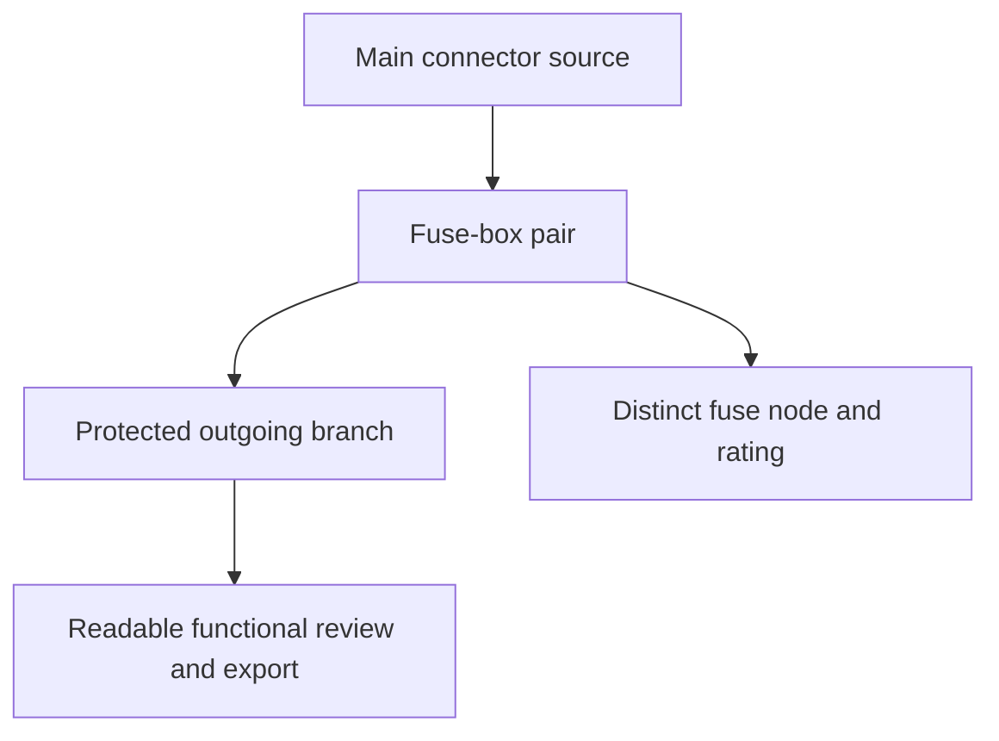

## prod_008_fuse_box_functional_schematic - Fuse-Box Functional Schematic
> Date: 2026-06-09
> Status: Validated
> Related request: `req_133_pin_level_source_consumer_currents_and_harness_dimensioning_diagnostics`, `req_136_harness_assembly_functional_schematic_root_fidelity_fuse_box_and_strict_scope`
> Related backlog: `item_619_harness_assembly_functional_fuse_box_pair_traversal`
> Related task: `task_128_harness_assembly_functional_fuse_box_pair_traversal`
> Related architecture: (none yet)
> Reminder: Update status, linked refs, scope, decisions, success signals, and open questions when you edit this doc.

# Overview
Fuse-box based traces must be reliable and readable in the functional schematic. A valid network can feed a fuse-box pin and leave the paired protected pin toward a consumer; the schematic must show both sides of that protected branch instead of stopping at the incoming wire.

# User Problem
When a main connector feeds one side of a fuse-box pair and another wire leaves the paired pin, the stored network is valid but the functional schematic can hide the outgoing protected branch. That makes the schematic unsuitable for review, export, or debugging.

The previous fuse visual also looked too similar to a splice, and fuse ratings were entered through opaque `pairIndex,amps` text lines that were easy to mistype.

# Product Scope
- Expand functional traces across fuse-box pairs as well as splices.
- Keep the persisted data model additive and backward-compatible.
- Render fuse-box pairs as explicit fuse nodes with a cartridge-style schematic symbol.
- Show missing ratings as `?A`.
- Display fuse-to-fuse wires as explicit labeled interconnections.
- Render same-pair fuse-box loops instead of hiding them, so invalid or surprising wiring can be debugged visually.
- Replace the connector fuse rating textarea with one editable row per configured pair.
- Provide quick-pick ratings: `3`, `4`, `5`, `7.5`, `10`, `15`, `20`, `25`, `30`, `40`.
- Allow any valid non-negative numeric rating; do not reject large numeric ratings in the editor.

# Fuse Rating Editor
- The row order is free-text amperage input, the unit suffix `Amp`, then quick-pick rating chips.
- Fuse pairs can be edited inside the connector form with editable `pin A` and `pin B` inputs.
- Pair overrides persist on the connector as optional overrides and never mutate the catalog item.
- Without an override, catalog `fuseBoxConfig.pairs` continues to drive the editor and functional schematic.

# Non-goals
- Backend, cloud sync, or import/export file format changes beyond additive optional connector fields.
- A broad rewrite of functional schematic routing.
- Release version bump or changelog work.

# Success Signals
- Seeding a functional schematic from either side of a fuse-box pair includes both incoming and outgoing wires when both exist.
- Trace expansion never bridges unrelated fuse-box pairs.
- Mixed splice and fuse-box traces expand through both electrical link types.
- Fuse-to-fuse wires and same-pair loops render as visible labeled edges.
- Existing stored `Connector.fusePairRatings` hydrate into the structured editor.
- Empty pair ratings omit the pair from `Connector.fusePairRatings`.
- Quick-pick buttons update the targeted pair and expose matching pressed state.

# References
- Request: `logics/request/req_133_pin_level_source_consumer_currents_and_harness_dimensioning_diagnostics.md`
- Request: `logics/request/req_136_harness_assembly_functional_schematic_root_fidelity_fuse_box_and_strict_scope.md`
- Backlog: `logics/backlog/item_619_harness_assembly_functional_fuse_box_pair_traversal.md`
- Task: `logics/tasks/task_128_harness_assembly_functional_fuse_box_pair_traversal.md`
