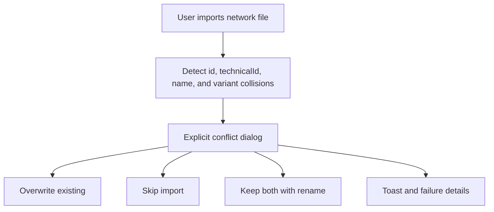

## prod_009_network_import_conflict_resolution - Network Import Conflict Resolution
> Date: 2026-06-09
> Status: Validated
> Related request: `req_132_network_import_conflict_resolution_and_feedback`
> Related backlog: `item_607_network_import_conflict_resolution_and_feedback`
> Related task: `task_115_network_import_conflict_resolution_and_feedback`
> Related architecture: (none yet)
> Reminder: Update status, linked refs, scope, decisions, success signals, and open questions when you edit this doc.

# Overview
Network import must be predictable and never silent. Every identity collision should surface an explicit overwrite, skip, or keep-both choice, and every terminal failure should surface actionable feedback.

# User Problem
When an imported network collides with an existing workspace network, silent rename or silent rejection forces users to inspect the network list manually or delete the target network before retrying. That workaround is destructive and breaks everyday import workflows.

Collision paths include raw `id`, `technicalId`, `name`, and suffix variants such as `-import` / `-IMP`.

# Product Scope
- Detect any identity overlap between imported payloads and existing networks.
- Use the overwrite dialog as the single decision point for collisions.
- List every candidate with the visible match reason.
- Offer three explicit choices per candidate: overwrite existing, skip, or keep both by renaming the incoming network.
- Provide a bulk "Apply to all remaining" row with the same three actions.
- Preserve the existing network `id` when overwriting so intra-workspace references survive.
- Remove default silent suffix renaming; suffix renaming only happens after an explicit keep-both choice.
- Propagate reducer-level rejection reasons back to the controller for user-visible toasts and the failure dialog.

# Feedback Contract
- File read, parse, schema, and future-version failures surface `error` feedback.
- Resolved-zero imports surface `error` feedback and failure details.
- Partial imports surface a `warning` summary.
- Clean imports surface a `success` summary.
- Reducer-level rejections surface a `warning` toast and open `ImportFailureDialog` with per-network reasons.
- Cancelling the conflict dialog leaves workspace state untouched and surfaces `Import cancelled`.

# Non-goals
- Bulk multi-file import.
- Import from URL or cloud storage.
- Per-connector or per-wire merge.
- AI Agent workspace changes.
- Persistence schema version changes.

# Success Signals
- `id`, `technicalId`, `name`, and `nameVariant` collisions all open the conflict dialog.
- Overwrite replaces the existing network under the existing `id`.
- Skip imports nothing for that candidate.
- Keep-both performs an explicit suffix rename and reports it.
- No suffix rename happens automatically without user choice.
- User cancellation clears the file input and leaves the workspace unchanged.
- Every terminal outcome has visible feedback.

# References
- Request: `logics/request/req_132_network_import_conflict_resolution_and_feedback.md`
- Backlog: `logics/backlog/item_607_network_import_conflict_resolution_and_feedback.md`
- Task: `logics/tasks/task_115_network_import_conflict_resolution_and_feedback.md`
