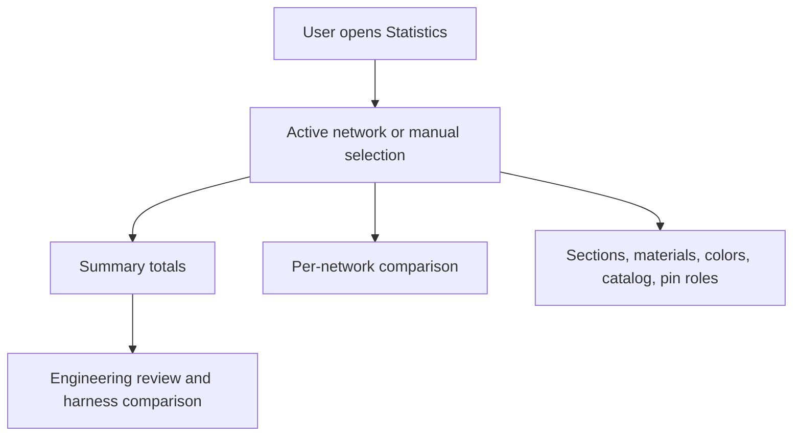

## prod_010_network_statistics_dashboard - Network Statistics Dashboard
> Date: 2026-06-09
> Status: Validated
> Related request: `req_135_network_statistics_dashboard_for_one_or_multiple_networks`
> Related backlog: `item_616_network_statistics_dashboard_for_one_or_multiple_networks`
> Related task: `task_124_network_statistics_calculator_and_scope_contract`, `task_125_statistics_workspace_tab_ui_design_and_validation`
> Related architecture: (none yet)
> Reminder: Update status, linked refs, scope, decisions, success signals, and open questions when you edit this doc.

# Overview
The Statistics workspace gives users a read-only quantitative view of one network or a manual multi-network selection. It answers what a network contains and how selected networks compare without requiring spreadsheet export.

# User Problem
Before this dashboard, connector counts, splice counts, wire counts, total wire lengths, occupancy, and catalog usage were spread across entity tables and exports. Users had to inspect several screens or export data to estimate harness complexity, compare variants, spot incomplete routing, or prepare lightweight review material.

# Product Scope
- Add a top-level **Statistics** tab positioned between **Modeling** and **Validation**.
- Keep the tab read-only.
- Show active-network statistics by default.
- Allow manual multi-network selection.
- Show both aggregate totals and per-network comparison for multi-network scope.
- Display core counts for connectors, splices, routing nodes, segments, wires, and catalog items.
- Display routed wire length, average/min/max/median, routed-wire count, route-lock count, and top 10 longest wires.
- Exclude wires without a physical route or explicit physical length from length calculations.
- Show wire section, material, color, fuse-protection, and pin-role distributions when available.
- Show connector/splice utilization and catalog linkage indicators.
- Use clear empty states instead of `NaN`, crashes, or misleading zero totals.

# Non-goals
- Editing from the Statistics tab.
- New persistence fields.
- New charting dependencies.
- Server-side analytics, telemetry, or cloud reporting.
- PDF generation.
- CSV export, pricing rollups, or cost statistics in the first release.
- AI Agent integration.

# Product Decisions
- The UI label is **Statistics**.
- Active network is the default scope.
- Multi-network scope is manual selection.
- Multi-network statistics include both totals and per-network comparison.
- Lengths are displayed in meters while preserving millimeter precision internally.
- No charting dependency is required; tables and compact visual bars are sufficient.

# Success Signals
- Users can open Statistics from the workspace navigation.
- Active-network metrics render by default.
- Manual multi-network scope renders aggregate and per-network metrics.
- Statistics are deterministic and derived from current store state without mutation.
- Empty or incomplete data produces clear empty states.
- Unit and UI coverage protect calculator scope, route fallback, occupancy, tab navigation, scope switching, and multi-network comparison.

# References
- Request: `logics/request/req_135_network_statistics_dashboard_for_one_or_multiple_networks.md`
- Backlog: `logics/backlog/item_616_network_statistics_dashboard_for_one_or_multiple_networks.md`
- Task: `logics/tasks/task_124_network_statistics_calculator_and_scope_contract.md`
- Task: `logics/tasks/task_125_statistics_workspace_tab_ui_design_and_validation.md`
