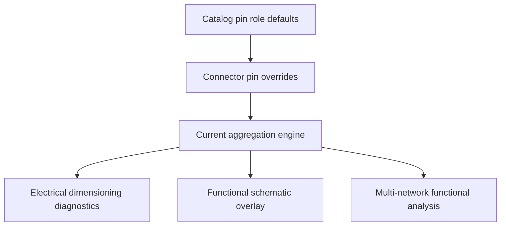

## prod_011_pin_level_current_dimensioning - Pin-Level Current Dimensioning
> Date: 2026-06-09
> Status: Validated
> Related request: `req_133_pin_level_source_consumer_currents_and_harness_dimensioning_diagnostics`
> Related backlog: `item_608_pin_electrical_role_data_model_and_catalog_defaults`, `item_610_in_network_pin_load_aggregation_engine`, `item_611_electrical_dimensioning_validation_category`, `item_612_pin_role_inspector_and_cross_connector_mass_edit_view`, `item_613_functional_schematic_electrical_overlay`, `item_614_multi_network_functional_analysis_view_and_assembly_scope`, `item_615_pin_role_release_validation_and_permissiveness_gate`
> Related task: `task_116_pin_electrical_role_data_model_and_catalog_defaults`, `task_117_automotive_ampacity_reference_table_and_project_override`, `task_118_in_network_pin_load_aggregation_engine`, `task_119_electrical_dimensioning_validation_category`
> Related architecture: `adr_010_inter_network_current_bridge_semantics`
> Reminder: Update status, linked refs, scope, decisions, success signals, and open questions when you edit this doc.

# Overview
Pin-level current dimensioning moves electrical current declarations from wires to connector cavities, distinguishes sources from consumers, and uses the richer model to drive harness diagnostics: cable sections, fuse ratings, device supply versus output sums, branch coherence, and multi-network bridge analysis.

# User Problem
Wire-level `currentA` and fuse metadata cannot express whether a connector pin emits or absorbs current. A connector with one supply pin and several outputs cannot be balanced, a fuse cannot be checked against downstream consumer sums, and consumers in another harness network are invisible to assembly-level analysis.

The user usually knows the source pins and consumer pins first; the app should derive carried currents and diagnostics from those declarations.

# Product Scope
## Pin electrical role model
- Add optional pin roles on connectors and catalog defaults.
- Role values are `source`, `consumer`, `passive`, and `bidirectional`, with `passive` as the default.
- Each role can include optional non-negative `currentA`, `label`, and `notes`.
- Per-connector entries override catalog defaults per pin.
- Networks without pin roles continue to load, validate, and export as before.

## Current model
- Continuous worst-case current only.
- No mode toggle, duty cycle, inrush, peak, or RMS derivation.
- 12 V harness dimensioning only; signal lines should be passive or undeclared.
- Ship a default automotive copper ampacity table, overridable per project under Settings -> Electrical.
- Aluminum is derived from copper through the existing material-resistivity ratio.

## Aggregation and diagnostics
- Resolve pin roles from catalog plus per-connector overrides.
- Propagate current through splices, fuse-box pairs, and inter-network bridges when the selected scope allows it.
- Compute carried current per wire, device-level balance, and downstream protected load per fuse or fuse-box pair.
- Use `currentNetwork` scope for validation center, connector inspector, BOM, and functional schematic overlay.
- Use `assembly` scope for the multi-network functional analysis view.
- Emit Electrical dimensioning findings:
  - D1 wire section versus carried current.
  - D2 fuse rating versus downstream load.
  - D3 device supply pin versus declared output sum.
  - D4 branch source/consumer coherence.
  - L1 link declaration mismatch in multi-network analysis.

## Editing surfaces
- Pin electrical roles in connector inspector.
- Pin electrical roles in catalog item editor.
- Cross-connector mass edit view with filtering, bulk apply, and CSV-style paste.
- Functional schematic overlay for declared pin currents and propagated wire currents.
- Multi-network functional analysis view.
- Optional BOM column for computed downstream load on fuse rows.

# Permissiveness Contract
- New fields are optional.
- Missing data never raises error-level issues.
- Only contradictions in declared data become warnings or errors.
- D3, D4, and L1 are non-blocking warning/info families.
- Disabling the Electrical dimensioning category hides every D finding.
- Existing fixtures load without new issues.

# Non-goals
- Frequency analysis, thermal bundling derating, inrush, duty-cycle, or RMS modeling.
- Voltage-drop revisions beyond the existing sizing helpers.
- Catalog-drift diagnostics.
- Aggregation outside the active `HarnessAssembly`.
- AI Agent integration.
- Changes to the 2D modeling canvas.

# Success Signals
- Catalog defaults seed connector instances and per-connector overrides win per pin.
- Device supply headroom and under-rated supply warnings are computed from pin declarations.
- Wire section and fuse rating diagnostics use derived current when manual wire current is absent.
- Current-network surfaces do not silently aggregate sibling networks.
- Multi-network analysis traverses declared inter-network bridges within the active assembly.
- Loop handling is cycle-safe and emits one warning instead of crashing.
- Bulk pin-role edits record one history entry per operation.

# References
- Request: `logics/request/req_133_pin_level_source_consumer_currents_and_harness_dimensioning_diagnostics.md`
- Backlog: `logics/backlog/item_608_pin_electrical_role_data_model_and_catalog_defaults.md`
- Backlog: `logics/backlog/item_610_in_network_pin_load_aggregation_engine.md`
- Backlog: `logics/backlog/item_611_electrical_dimensioning_validation_category.md`
- Backlog: `logics/backlog/item_612_pin_role_inspector_and_cross_connector_mass_edit_view.md`
- Backlog: `logics/backlog/item_613_functional_schematic_electrical_overlay.md`
- Backlog: `logics/backlog/item_614_multi_network_functional_analysis_view_and_assembly_scope.md`
- Backlog: `logics/backlog/item_615_pin_role_release_validation_and_permissiveness_gate.md`
- Task: `logics/tasks/task_116_pin_electrical_role_data_model_and_catalog_defaults.md`
- Task: `logics/tasks/task_117_automotive_ampacity_reference_table_and_project_override.md`
- Task: `logics/tasks/task_118_in_network_pin_load_aggregation_engine.md`
- Task: `logics/tasks/task_119_electrical_dimensioning_validation_category.md`
- Architecture: `logics/architecture/adr_010_inter_network_current_bridge_semantics.md`
