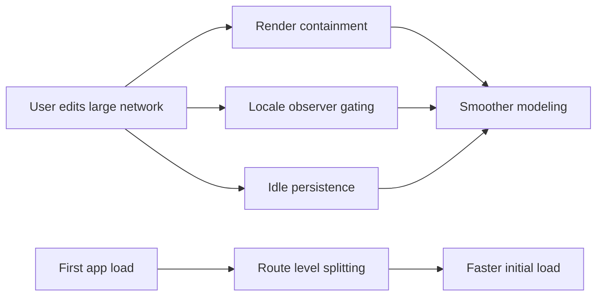

## prod_012_editor_responsiveness_and_load_time_performance - Editor responsiveness and load-time performance
> Date: 2026-07-03
> Status: Proposed
> Related request: `req_161_runtime_rendering_and_initial_bundle_performance_overhaul`
> Related backlog: `item_647_contain_canvas_drag_pan_and_form_re_renders_with_raf_coalescing_and_memo_boundaries`, `item_648_gate_the_locale_dom_translation_observer_in_base_locale_and_scope_attribute_re_walks`, `item_649_restore_route_level_code_splitting_and_re_baseline_bundle_budgets`, `item_650_move_steady_state_persistence_serialization_off_the_critical_input_path`
> Related task: `task_156_orchestrate_runtime_rendering_and_initial_bundle_performance_overhaul`
> Related architecture: (none yet)
> Reminder: Update status, linked refs, scope, decisions, success signals, and open questions when you edit this doc.
> Non-semantic edit: refreshed Mermaid signatures

# Overview
Keep the local-first editor responsive while modeling large networks and cut first-load JavaScript, without changing any modeling behavior or persistence guarantees.

# Goals
- Smooth canvas drag/pan and form typing on large networks by containing re-renders to the components that actually changed.
- Eliminate avoidable DOM-translation overhead in the base locale.
- Restore effective route-level code splitting so first load only ships what the visible screen needs.
- Move steady-state persistence serialization off the critical input path without weakening the page-lifecycle data-loss guarantees.

# Non-goals
- No visual or functional change to modeling, validation, import/export, or undo/redo behavior.
- No replacement of the custom store with an external state library.
- No migration of persistence storage backend (localStorage remains the store; IndexedDB is out of scope).
- No change to the exceljs lazy-loading boundary or PWA offline strategy.

# Scope and guardrails
- In: scaffolded request, product, backlog, orchestration task, validation, and handoff context.
- Out: unrelated workflow docs and implementation of generated tasks.

# Key product decisions
- Use structured input as the source of truth for generated docs.
- Keep generated write paths local and repo-bounded.

# Success signals
- Generated docs pass lint and audit without broad manual rewrites.
- Context-pack output can be handed to an implementation agent directly.

# References
- Product back-reference: `req_161_runtime_rendering_and_initial_bundle_performance_overhaul`
- Task back-reference: `task_156_orchestrate_runtime_rendering_and_initial_bundle_performance_overhaul`
