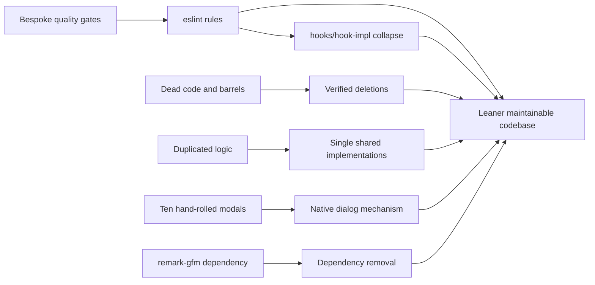

## prod_013_codebase_simplification_and_tooling_consolidation - Codebase simplification and tooling consolidation
> Date: 2026-07-03
> Status: Settled
> Related request: `req_162_over_engineering_reduction_replace_bespoke_gates_with_eslint_collapse_mirror_layers_delete_dead_code`
> Related backlog: `item_651_replace_bespoke_quality_gate_scripts_with_eslint_rules_and_trim_ci_redundancy`
> Related task: `task_157_orchestrate_over_engineering_reduction_across_gates_layers_dead_code_and_dependencies`
> Related architecture: (none yet)
> Reminder: Update status, linked refs, scope, decisions, success signals, and open questions when you edit this doc.
> Confidence: 8
> Non-semantic edit: added overview Mermaid diagram

# Overview
Cut ~2,500 lines of bespoke tooling, mirror layers, dead code, and duplication identified by a verified repo-wide audit, replacing custom enforcement with standard eslint rules and native platform features, without changing any user-visible behavior.

# Goals
- Enforce architectural rules with standard eslint configuration instead of bespoke CI scripts, so rules surface in-editor and cost nothing to maintain.
- Collapse structural workarounds (the hooks/hook-impl mirror) that exist only to satisfy a gate, restoring one honest directory layout.
- Delete verified dead code and speculative flexibility; consolidate copy-pasted logic into single shared implementations.
- Reduce dependency surface where the platform or existing code already covers the need.

# Non-goals
- No user-visible behavior, layout, or wording change anywhere in the editor.
- No removal of gates with real policy value (npm-audit allowlist, PWA build artifacts, bundle metrics).
- No store, persistence-format, or migration-semantics change; retain the test injection seam that verifies migration failure recovery.
- No new runtime dependencies.

# Scope and guardrails
- In: scaffolded request, product, backlog, orchestration task, validation, and handoff context.
- Out: unrelated workflow docs and implementation of generated tasks.

# Key product decisions
- Use structured input as the source of truth for generated docs.
- Keep generated write paths local and repo-bounded.
- Reverify every audit candidate before deletion; preserve active seams when removal would weaken behavior or regression coverage.

# Success signals
- Generated docs pass lint and audit without broad manual rewrites.
- Context-pack output can be handed to an implementation agent directly.

# References
- Product back-reference: `item_651_replace_bespoke_quality_gate_scripts_with_eslint_rules_and_trim_ci_redundancy`
- Task back-reference: `task_157_orchestrate_over_engineering_reduction_across_gates_layers_dead_code_and_dependencies`
