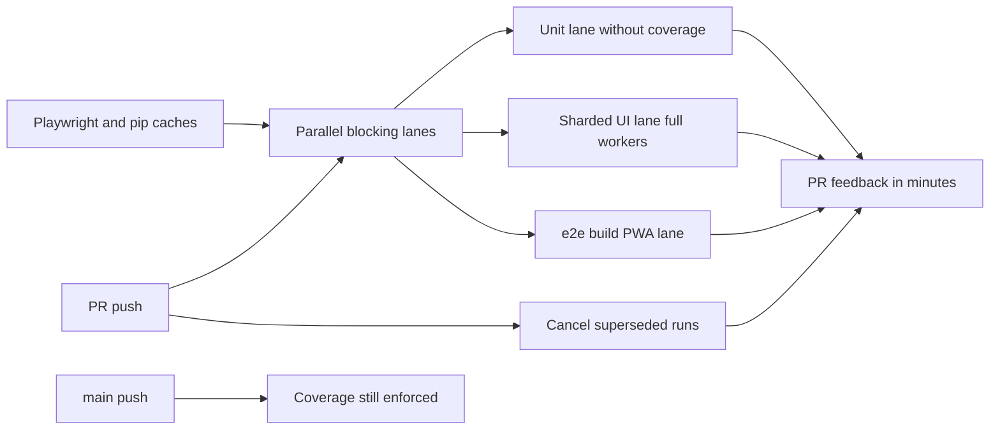

## prod_014_ci_speed_and_developer_feedback_latency - CI speed and developer feedback latency
> Date: 2026-07-03
> Status: Settled
> Related request: `req_163_ci_wall_clock_reduction_parallel_jobs_pr_scoped_coverage_runner_utilization_cached_browsers`
> Related backlog: `item_657_split_the_serial_ci_job_into_parallel_blocking_lanes_with_concurrency_cancellation`, `item_658_scope_coverage_instrumentation_to_main_and_drop_it_from_pr_runs`, `item_659_match_test_runner_parallelism_to_runner_hardware_and_shard_the_ui_lane`, `item_660_cache_playwright_browsers_and_pip_setup_gate_e2e_cost_on_the_pr_path`
> Related task: `task_158_orchestrate_ci_wall_clock_reduction`
> Related architecture: (none yet)
> Reminder: Update status, linked refs, scope, decisions, success signals, and open questions when you edit this doc.
> Confidence: 8
> Non-semantic edit: added overview Mermaid diagram

# Overview
Cut pull-request CI wall-clock time by parallelizing the serial blocking chain, scoping coverage to main, using the runner hardware fully, and caching per-run setup — without weakening any blocking verification.

# Goals
- PR feedback in minutes, bounded by the slowest parallel lane rather than the sum of all steps.
- Zero redundant per-run setup cost (browser downloads, pip installs) on cache hits.
- Coverage and other main-only signals removed from the PR critical path.
- No superseded run consuming runner time.

# Non-goals
- No weakening of the blocking check set — everything that blocks merge today still blocks merge.
- No change to test content, assertions, or the fast/UI lane split semantics.
- No replacement of the quality-gate scripts themselves (owned by the over-engineering reduction request).
- No self-hosted or larger paid runners.

# Scope and guardrails
- In: scaffolded request, product, backlog, orchestration task, validation, and handoff context.
- Out: unrelated workflow docs and implementation of generated tasks.

# Key product decisions
- Use structured input as the source of truth for generated docs.
- Keep generated write paths local and repo-bounded.

# Success signals
- Generated docs pass lint and audit without broad manual rewrites.
- Context-pack output can be handed to an implementation agent directly.

# References
- Product back-reference: `req_163_ci_wall_clock_reduction_parallel_jobs_pr_scoped_coverage_runner_utilization_cached_browsers`
- Task back-reference: `task_158_orchestrate_ci_wall_clock_reduction`
