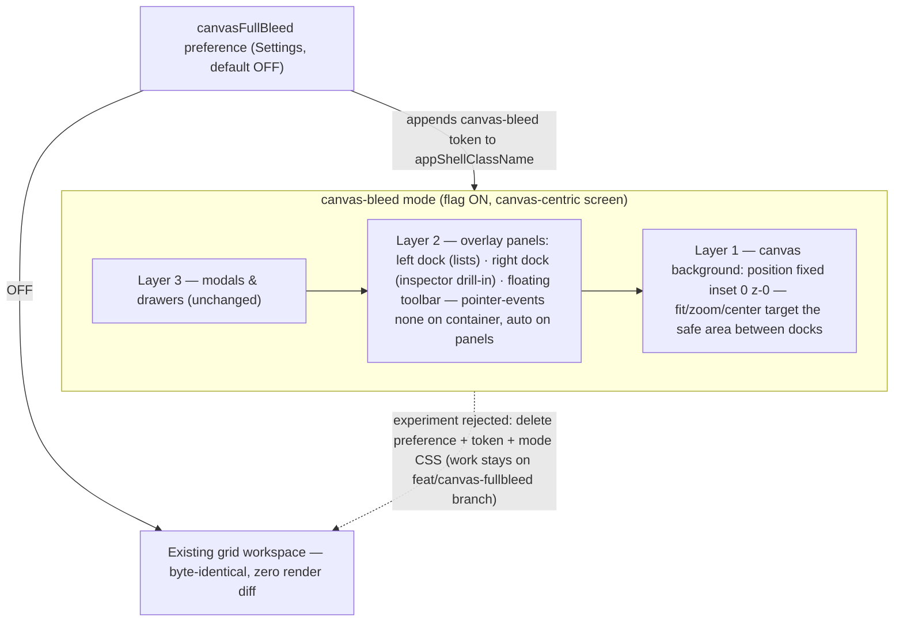

## prod_015_canvas_first_workspace_shell - Canvas-first workspace shell
> Date: 2026-07-03
> Status: Archived
> Related request: `req_164_full_bleed_canvas_workspace_canvas_as_application_background_behind_a_feature_flag_docks_as_overlay_ui`
> Related backlog: `item_661_canvas_bleed_foundations_and_network_scope_pilot_behind_a_settings_flag`, `item_662_derived_dock_surface_theme_variables_with_all_themes_contact_sheet_validation`, `item_663_dock_content_system_container_queries_inspector_host_drill_in_stack`, `item_664_analysis_screen_full_bleed_with_route_highlighting_and_low_zoom_decluttering`
> Related task: `task_160_orchestrate_the_canvas_first_workspace_shell`
> Related architecture: (none yet)
> Reminder: Update status, linked refs, scope, decisions, success signals, and open questions when you edit this doc.
> Non-semantic edit: added the overview Mermaid diagram (three-layer mode vs legacy, flag switch, branch containment).

# Overview
Invert the workspace hierarchy on canvas-centric screens: the canvas becomes the application background and all other UI floats above it (Figma/Miro model), shipped as an opt-in CSS-first mode behind a persisted settings flag with zero impact when off. Wide panels transform into dock-shaped content via container queries and drill-in navigation; all ~30 themes are covered by derived surface variables validated with a screenshot contact sheet.

# Goals
- The canvas is the primary selection and orientation surface: click an entity to inspect it, see routes light up across the whole screen, navigate anywhere with a palette.
- One shell, one mode: the flag adds a class token and an insets parameter, never a parallel layout implementation.
- Every panel keeps its capability when it moves: transformation by content type (single-column forms, key-value rows, drill-in depth) instead of horizontal compression.
- Theme coverage by construction: derived translucent surfaces with an opacity floor, point overrides only on contact-sheet-proven failures.
- The model is proven at real scale (30+ connectors, 150+ wires) before expanding beyond the pilot screen.

# Non-goals
- No mobile/PWA bottom-sheet redesign — recorded as the follow-up with the biggest upside, but a chapter of its own.
- No onboarding-tour rewrite beyond keeping it functional flag-off; the spotlight rebuild is a separate effort.
- No Settings or Home reorganization (relocating preferences, hub redesign) — independent of full bleed.
- No Harness Assembly or Validation screen conversion in this request; the audit verdicts stand for later requests.
- No new theme and no free-form dock resizing or floating window management.
- No Tab shortcut for hiding panels — it breaks keyboard-accessibility focus traversal; the hide-all binding avoids Tab.

# Scope and guardrails
- In: scaffolded request, product, backlog, orchestration task, validation, and handoff context.
- Out: unrelated workflow docs and implementation of generated tasks.

# Key product decisions
- Archived on 2026-07-04: redesign idea rejected after visual review; implementation branch `feat/canvas-fullbleed` was deleted and no code from this chain should be pursued.
- Use structured input as the source of truth for generated docs.
- Keep generated write paths local and repo-bounded.

# Success signals
- Generated docs pass lint and audit without broad manual rewrites.
- Context-pack output can be handed to an implementation agent directly.

# References
- Product back-reference: `req_164_full_bleed_canvas_workspace_canvas_as_application_background_behind_a_feature_flag_docks_as_overlay_ui`
- Task back-reference: `task_160_orchestrate_the_canvas_first_workspace_shell`
