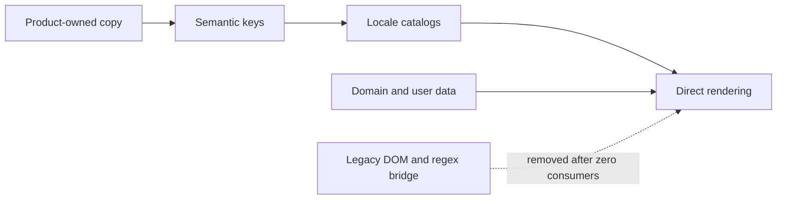

## prod_017_semantic_localization_completion - Semantic localization completion
> Date: 2026-07-13
> Status: Settled
> Related request: `req_166_complete_semantic_i18n_migration_and_retire_runtime_text_compatibility`
> Related backlog: `item_670_migrate_settings_shared_shell_actions_and_forms_to_semantic_keys`
> Related task: `task_163_orchestrate_completion_of_semantic_localization`
> Related architecture: (none yet)
> Reminder: Update status, linked refs, scope, decisions, success signals, and open questions when you edit this doc.

# Overview
Finish the staged move from runtime text replacement to explicit semantic localization across the application, then remove the compatibility bridge once direct-key coverage is proven.

# Goals
- Make every product-owned string traceable to a stable catalog key.
- Preserve a strict boundary between interface copy and domain or user data.
- Delete the runtime DOM and source-text translation machinery.
- Keep both supported locales complete and testable through the shared contract.

# Non-goals
- Translating configured component names, imported files, user-entered values, identifiers, or model content.
- Adding a new locale during the migration.
- Redesigning workflows or changing domain behavior.
- Replacing the established i18n runtime or central contract.

# Scope and guardrails
- In: settings and shared UI, modeling and catalog workflows, validation and diagnostics, onboarding, controller notifications, import/export states, compatibility removal, coverage guard, tests, and closure evidence.
- Out: translation of configured domain data, imported content, identifiers, model values, and user-authored text; new locales; workflow redesign.

# Key product decisions
- Stable semantic keys are the only supported production lookup mechanism after migration.
- Dynamic product messages use named placeholders; domain values remain interpolation data.
- Compatibility code is removed only after an automated report proves zero consumers.
- A reviewed static guard prevents new hardcoded product copy.

# Success signals
- Locale and placeholder parity pass with no legacy namespace or runtime source-text lookup.
- The DOM observer and regular-expression translation handlers are absent from production code.
- Boundary tests prove configured, imported, model, identifier, and user values remain unchanged across locales.
- Contract checks, repository tests, type checks, and production build pass.

# References
- Product back-reference: `item_670_migrate_settings_shared_shell_actions_and_forms_to_semantic_keys`
- Task back-reference: `task_163_orchestrate_completion_of_semantic_localization`
