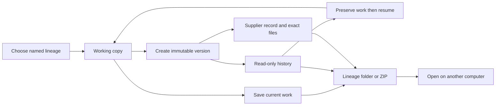

## prod_018_portable_named_workspace_lineages_and_supplier_history - Portable named workspace lineages and supplier history
> Date: 2026-10-07
> Status: Settled
> Related request: `req_167_named_portable_workspace_lineages_with_immutable_version_history_and_supplier_handoffs`
> Related backlog: `item_674_named_lineage_and_immutable_workspace_version_contracts`
> Related task: `task_164_deliver_named_workspace_lineages_version_history_and_supplier_archives`
> Related architecture: (none yet)
> Reminder: Update status, linked refs, scope, decisions, success signals, and open questions when you edit this doc.
> Indicators reviewed: 2026-10-07 16:16:37

# Overview
Provide independent named project workspaces with a stable editable working copy, explicit immutable numbered milestones, read-only historical consultation and exact supplier handoff archives. A lineage folder or equivalent ZIP carries the entire project history between computers independently of browser cache.

# Goals
- Resume Series or Prototypes immediately from a named workspace selector.
- Keep ordinary saving simple while making milestone versions meaningful and searchable.
- Retain original supplier artifacts and provenance with the corresponding frozen design.
- Support complete offline folder/ZIP portability and conservative conflict recovery.
- Adopt existing timestamped snapshots without destroying or guessing their history.

# Non-goals
- Hosted accounts, cloud-provider SDKs, real-time collaboration, automatic model merging or Git integration.
- Major/minor/patch semantic versioning, arbitrary branching/rebasing or cross-lineage cherry-picking.
- Automatic supplier communication, delivery verification or automatic email attachment discovery.
- Visual design diffs, delta snapshot storage, automatic deletion/pruning of history and machine-independent distributed locking.
- General application redesign or changing network-level import/export semantics.

# Scope and guardrails
- Named independent lineages, a stable working snapshot and explicit immutable numbered versions.
- History consultation in read-only mode and recovery-preserving restore.
- Supplier handoff records with exact optional attachment archives.
- Folder/ZIP portability, manual browser fallback, conservative divergence handling and previewable legacy adoption.
- No runtime implementation is delivered by this scoping change; the linked task defines the subsequent development work.

# Key product decisions
- Series and Prototypes are initial user examples, not a hard-coded two-workspace limit.
- Save updates work; Create version records a milestone. Version numbers are independent of app releases and technical save revisions.
- Copyable lineage folders are the portable source; a browser registry is a recovery/cache mechanism. ZIP mirrors the same layout.
- Frozen versions and handoffs are immutable. Historical viewing cannot mutate them; restoration preserves displaced work first.
- Retain divergent heads and number collisions with ID disambiguation. No timestamp-based winner or automatic entity merging.
- Existing timestamped files enter through explicit grouping and ordering, preserving original provenance.

# Success signals
- A user switches between Series and Prototypes and resumes the right work without locating the newest timestamp manually.
- A copied folder or imported ZIP on a second computer reveals current work and the same historical versions without the first browser cache.
- An older supplier handoff yields both its original design snapshot and byte-identical archived delivered files.
- Restoring an old version and reconciling two offline copies preserves every prior committed milestone.
- Save and failure statuses accurately distinguish local recovery, disk persistence and initiated downloads.

# References
- Product back-reference: `item_674_named_lineage_and_immutable_workspace_version_contracts`
- Task back-reference: `task_164_deliver_named_workspace_lineages_version_history_and_supplier_archives`
