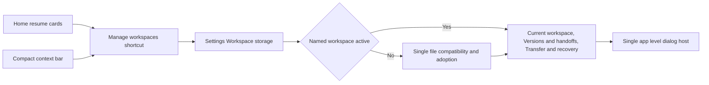

## prod_019_workspace_storage_settings_information_architecture_and_theme_consistency - Workspace storage settings information architecture and theme consistency
> Date: 2026-10-08
> Status: Settled
> Related request: `req_168_consolidate_release_1_19_workspace_controls_in_settings_storage_and_align_global_ui`
> Related backlog: `item_681_consolidate_named_workspace_management_in_settings_storage`, `item_682_retire_obsolete_storage_controls_with_explicit_legacy_compatibility`, `item_683_align_storage_settings_and_lineage_dialogs_with_global_themes_and_localization`, `item_684_validate_workspace_storage_consolidation_and_document_the_updated_workflow`
> Related task: `task_165_deliver_workspace_storage_settings_consolidation_and_ui_alignment`
> Related architecture: (none yet)
> Reminder: Update status, linked refs, scope, decisions, success signals, and open questions when you edit this doc.
> Indicators reviewed: 2026-10-08 10:16:33

# Overview
Make Settings > Workspace storage the canonical management surface for existing named workspace features, with truthful mode-specific controls and consistent global styling. Persistence semantics remain governed by prod_018.

# Goals
- One predictable location for workspace management.
- Remove misleading single-file actions from named sessions while preserving compatibility.
- Consistent themes, localization, responsive layout and keyboard navigation.

# Non-goals
- New persistence models or changes to immutable versions and supplier archives.
- Cloud providers, automatic synchronization or data cleanup.
- A global Settings redesign or changes to network export semantics.

# Scope and guardrails
- In: scaffolded request, product, backlog, orchestration task, validation, and handoff context.
- Out: unrelated workflow docs and implementation of generated tasks.

# Key product decisions
- Use structured input as the source of truth for generated docs.
- Keep generated write paths local and repo-bounded.

# Success signals
- Generated docs pass lint and audit without broad manual rewrites.
- Context-pack output can be handed to an implementation agent directly.

# References
- Product back-reference: `req_168_consolidate_release_1_19_workspace_controls_in_settings_storage_and_align_global_ui`
- Task back-reference: `task_165_deliver_workspace_storage_settings_consolidation_and_ui_alignment`
