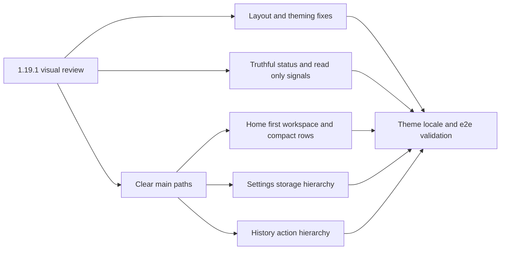

## prod_020_workspace_experience_polish_after_the_1_19_1_visual_review - Workspace experience polish after the 1.19.1 visual review
> Date: 2026-10-08
> Status: Proposed
> Related request: `req_169_remediate_workspace_ui_and_ux_findings_from_the_1_19_1_visual_review_on_home_and_settings`
> Related backlog: `item_685_fix_home_panel_overlap_and_unthemed_workspace_buttons`, `item_686_make_workspace_status_alerts_and_read_only_signals_truthful_and_localized`, `item_687_clarify_home_workspace_vocabulary_first_workspace_creation_and_compact_workspace_rows`, `item_688_restructure_settings_workspace_storage_hierarchy_and_simplify_legacy_mode`, `item_689_give_the_history_dialog_a_clear_action_hierarchy_and_readable_metadata`, `item_690_validate_the_workspace_ux_remediation_and_update_the_workflow_guide`
> Related task: `task_166_deliver_workspace_ux_remediation_from_the_1_19_1_visual_review`
> Related architecture: (none yet)
> Reminder: Update status, linked refs, scope, decisions, success signals, and open questions when you edit this doc.
> Indicators reviewed: 2026-10-08 15:36:45

# Overview
Fix the visual defects and clarify the workspace flows found in the 1.19.1 review: no overlapping or unthemed UI, truthful and calm status signals, an obvious first-workspace and main-action path on Home and Settings, and a History dialog with a clear action hierarchy. Persistence semantics remain governed by prod_018 and the Settings information architecture by prod_019.

# Goals
- No visual breakage or unthemed controls on Home and Settings workspace surfaces.
- Status, alerts and read-only signals that are truthful, localized and proportionate.
- A clear primary path: create the first workspace, save, create a version, consult history.

# Non-goals
- Changes to persistence formats, versions, handoffs or recovery semantics.
- A redesign of Settings outside Workspace storage or of network Import/Export.
- New cloud, sync or collaboration features.

# Scope and guardrails
- In: scaffolded request, product, backlog, orchestration task, validation, and handoff context.
- Out: unrelated workflow docs and implementation of generated tasks.

# Key product decisions
- Use structured input as the source of truth for generated docs.
- Keep generated write paths local and repo-bounded.

# Success signals
- Generated docs pass lint and audit without broad manual rewrites.
- Context-pack output can be handed to an implementation agent directly.

# References
- Product back-reference: `req_169_remediate_workspace_ui_and_ux_findings_from_the_1_19_1_visual_review_on_home_and_settings`
- Task back-reference: `task_166_deliver_workspace_ux_remediation_from_the_1_19_1_visual_review`
