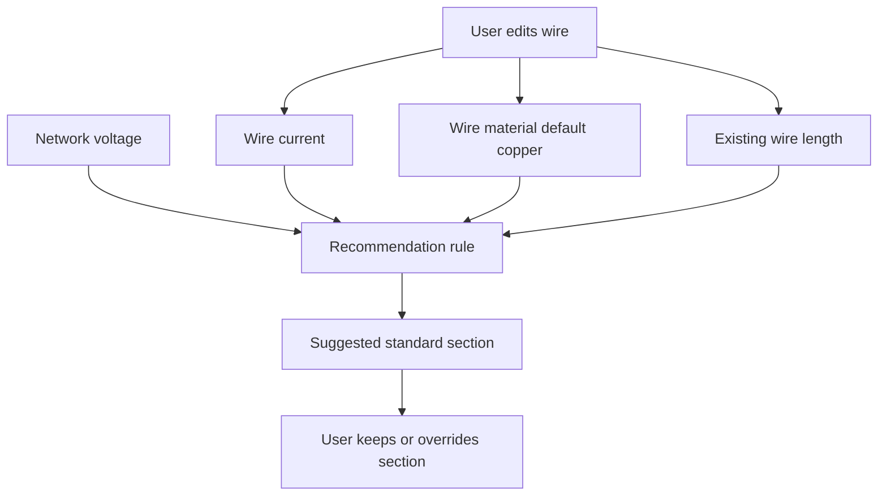

## req_110_automatic_recommended_wire_section_from_current_material_network_voltage_and_wire_length - Automatic recommended wire section from current, material, network voltage, and wire length
> From version: 1.4.3
> Schema version: 1.0
> Status: Done
> Understanding: 100% (implemented as a V1 assisted-sizing flow with network voltage, wire current/material, centralized recommendation logic, helper-text placement below `Section (mm²)`, and explicit `Apply`)
> Confidence: 100% (the shipped behavior, compatibility paths, and targeted regression coverage now confirm the scoped request end to end)
> Complexity: Medium-High
> Theme: Wire sizing assistance / network electrical metadata / modeling ergonomics
> Reminder: Update status/understanding/confidence and references when you edit this doc.

# Needs
- Users want the app to suggest a suitable wire cable section instead of entering `sectionMm2` blindly for every wire.
- The recommendation should be based on a small, pragmatic set of inputs already available or easy to add:
  - wire current
  - wire material
  - network voltage
  - wire length already computed by the current routing model
- The result should assist wire creation and editing without removing manual control of the final wire section.

# Context
The app already stores and exposes explicit wire cable section (`sectionMm2`) and computed wire length (`lengthMm`). However, section selection remains fully manual today. This creates two problems:
- operators must know or look up a suitable section outside the app
- data entry becomes slower and more error-prone when several wires must be sized

The user clarified the intended V1 behavior:
- network voltage should be stored at the `Network` level
- wire current should be stored at the `Wire` level
- wire material should be stored at the `Wire` level
- default wire material should be `copper`
- the existing computed wire length should be reused as the length input for the recommendation

V1 should remain a practical recommendation feature, not a full normative electrical-engineering engine. In particular, the request should avoid pretending to solve all real-world sizing variables such as installation mode, ambient temperature, bundle derating, or advanced voltage-drop rules unless they are explicitly added later.

# Objective
- Add a V1 recommendation workflow that suggests a wire cable section from wire current, wire material, network voltage, and existing wire length.
- Keep `sectionMm2` as the persisted wire value used by the model and visible in existing UI.
- Keep the recommendation transparent and non-destructive:
  - recommendation assists the user
  - the user still decides the final stored `sectionMm2`

# Default decisions (V1)
- Display location:
  - show the recommendation in the wire create/edit form directly below `Section (mm²)`
- Display format:
  - helper text pattern: `Recommended section: X mm²`
  - include an explicit `Apply` action next to the recommendation when a value is available
- Recommendation behavior:
  - recommendation is informational by default and does not silently overwrite `sectionMm2`
  - `Apply` copies the recommended value into the wire section draft
- Recompute policy:
  - recalculate the recommendation live when `currentA`, `material`, `lengthMm`, or `network.voltageV` changes
- Missing-input policy:
  - do not show a recommendation if `currentA` is missing
  - do not show a recommendation if `network.voltageV` is missing
- Length policy:
  - V1 uses the existing stored wire `lengthMm` as the calculation length input
- Standard section set:
  - V1 supported standard values should be locked in code and include at least:
    - `0.5`
    - `0.75`
    - `1`
    - `1.5`
    - `2.5`
    - `4`
    - `6`
    - `10`
    - `16`
    - `25`

# Functional scope
## A. Network data model extension (high priority)
- Extend `Network` with a numeric voltage field, recommended naming:
  - `voltageV`
- `voltageV` is considered network-wide in V1.
- Validation rules:
  - optional for backward compatibility
  - when filled, must be a finite positive number
- Backward compatibility:
  - existing networks without voltage remain loadable and editable
  - no automatic fake default voltage should silently rewrite old data unless the implementation explicitly documents such a fallback

## B. Wire data model extension (high priority)
- Extend `Wire` with sizing inputs used for the recommendation:
  - `currentA?: number`
  - `material?: "copper" | "aluminum"`
- V1 default material policy:
  - if no explicit wire material is selected, use `copper`
- `sectionMm2` remains the persisted wire section field already used in the model.
- Backward compatibility:
  - existing wires without `currentA` or `material` remain valid
  - legacy wires should behave as manual-section wires when recommendation inputs are absent

## C. Recommendation engine contract (high priority)
- Add a dedicated calculation/recommendation module in the core domain for wire section recommendation.
- Inputs for the V1 recommendation:
  - `currentA`
  - `material`
  - `voltageV`
  - `lengthMm`
- Output contract:
  - a recommended section value expressed in `mm2`
  - rounded or mapped to supported standard wire sections used by the product
- The rule may be implemented as:
  - a formula
  - a lookup table
  - or a hybrid approach
- The rule must be centralized in code so UI forms do not each invent their own sizing logic.
- If required inputs are missing or invalid, the engine must return no recommendation instead of fabricating a result.

## D. Wire form UX and behavior (high priority)
- In wire create/edit flows, add:
  - optional `Current (A)` input
  - `Material` selector with `Copper` as the default
- In network create/edit flows, add:
  - optional `Voltage (V)` input at network scope
- Wire form behavior:
  - when all required inputs are available, the UI shows a recommended section directly below `Section (mm²)`
  - the recommendation is displayed as helper text plus an explicit `Apply` action
  - the user can still type or keep a manual `sectionMm2`
- V1 recommendation policy is locked:
  - recommendation is informational until the user explicitly applies it
  - recommendation does not silently mutate persisted or draft `sectionMm2`
- Editing semantics must stay predictable:
  - recommendation is recomputed live from the current draft/context inputs
  - `Apply` updates the section draft to the recommended value
  - `Cancel edit` restores persisted values as usual

## E. Standard section normalization and visibility (medium-high priority)
- The recommendation must resolve to standard cable section values supported by the app domain, for example:
  - `0.5`
  - `0.75`
  - `1`
  - `1.5`
  - `2.5`
  - `4`
  - `6`
  - `10`
  - `16`
  - `25`
  - and any other standard values explicitly adopted by implementation
- Existing wire-focused UI should continue showing the final stored `sectionMm2`.
- If useful and low-cost, wire-focused UI may also expose the origin of the current section:
  - manual
  - or recommended/applied
- This visibility enhancement is optional in V1 if it expands scope too much.

## F. Persistence, import/export, and compatibility (medium priority)
- Preserve new network and wire sizing fields through:
  - local persistence
  - file import/export
  - migration/normalization paths
- Existing save data must remain compatible.
- Imported legacy data missing the new sizing inputs must not fail to load.
- Existing CSV/BOM/export flows must remain non-regressed if they do not yet surface the new metadata.

## G. Validation and regression coverage (high priority)
- Add regression coverage for:
  - network voltage create/edit persistence and validation
  - wire current/material create/edit persistence and validation
  - copper default behavior when material is not explicitly set
  - recommendation presence when all required inputs exist
  - no recommendation when current or network voltage is missing
  - section normalization to supported standard values
  - save/cancel semantics for wire edit drafts
  - backward compatibility for legacy networks and wires lacking the new fields

# Non-functional requirements
- The V1 recommendation must be deterministic for the same inputs.
- The calculation logic should live in core/domain code rather than being duplicated in UI components.
- The feature should remain understandable to operators; avoid a black-box experience where section changes without explanation.
- Existing wire workflows must remain performant and stable.

# Validation and regression safety
- Add or extend tests covering reducer/state normalization, form behavior, persistence compatibility, and recommendation logic.
- Run the relevant validation pipeline after implementation:
  - `npm run -s lint`
  - `npm run -s typecheck`
  - `npm test -- --run <targeted recommendation and form specs>`
  - `npm run -s build`

# Delivery notes
- Delivered in `task_090` after the lower-risk `req_111` wave.
- V1 UX is locked as:
  - helper text directly below `Section (mm²)`
  - explicit `Apply`
  - no automatic overwrite of `sectionMm2`
- Implemented surfaces:
  - `Network.voltageV`
  - `Wire.currentA`
  - `Wire.material`
  - centralized recommendation logic and standard section normalization
  - persistence and portability compatibility
  - targeted reducer, portability, persistence, and UI regression coverage

# Acceptance criteria
- AC1: When a wire has valid current input, valid material input or default copper behavior, valid computed length, and the active network has valid voltage, the app can produce a recommended wire section.
- AC2: The recommended result is normalized to one of the standard supported wire sections used by the product.
- AC3: In the wire create/edit form, the recommendation is shown directly below `Section (mm²)` as helper text with an explicit `Apply` action.
- AC4: `sectionMm2` remains user-editable and the recommendation does not remove manual override capability.
- AC5: The recommendation is recalculated live from the current draft/context inputs and is not applied automatically.
- AC6: Network voltage is editable and persisted at network scope without regressing existing network workflows.
- AC7: Wire current and material are editable and persisted at wire scope without regressing existing wire workflows.
- AC8: When required inputs are missing or invalid, the app does not fabricate a recommendation and existing manual section behavior still works.
- AC9: Existing persisted/imported networks and wires that lack the new voltage/current/material fields remain loadable and editable.
- AC10: Regression tests cover recommendation logic, default copper behavior, form semantics, and compatibility paths.

# Out of scope
- Full electrical standards compliance across all installation contexts.
- Additional sizing inputs such as installation mode, ambient temperature, conductor grouping, insulation family, or advanced derating rules.
- Multi-voltage modeling inside the same network in V1.
- Automatic hard-locking of `sectionMm2` to the recommendation.
- Bulk recalculation of every existing wire in a network.

# Definition of Ready (DoR)
- [x] Problem statement is explicit and user impact is clear.
- [x] Scope boundaries (in/out) are explicit.
- [x] Acceptance criteria are testable.
- [x] Dependencies and known risks are listed.

# Companion docs
- Product brief(s): (none yet)
- Architecture decision(s): (none yet)

# AI Context
- Summary: Add a V1 wire section recommendation flow based on wire current, default copper material, network voltage, and existing computed wire length while preserving manual `sectionMm2` control.
- Keywords: wire section, section recommendation, current, copper, material, voltage, network metadata, wire length
- Use when: Use when framing model changes, form behavior, recommendation logic, and compatibility scope for assisted wire sizing.
- Skip when: Skip when the work targets full electrical-compliance modeling, multi-voltage topologies, or unrelated wire metadata.

# Backlog
- `logics/backlog/item_542_wire_sizing_metadata_and_recommendation_core_contract.md`
- `logics/backlog/item_543_wire_and_network_forms_for_voltage_current_material_and_section_recommendation_apply_flow.md`
- `logics/backlog/item_544_wire_sizing_persistence_compatibility_and_standard_section_normalization.md`
- `logics/backlog/item_545_req_110_validation_matrix_and_assisted_wire_sizing_closure_traceability.md`

# Orchestration task
- `logics/tasks/task_090_super_orchestration_delivery_execution_for_req_110_to_req_112_with_validation_gates_and_staged_checkpoints.md`

# References
- `src/core/entities.ts`
- `src/core/wireSection.ts`
- `src/core/networkMetadata.ts`
- `src/store/actions.ts`
- `src/store/reducer/networkReducer.ts`
- `src/store/reducer/wireReducer.ts`
- `src/adapters/persistence/migrations.ts`
- `src/adapters/portability/networkFile.ts`
- `src/app/components/workspace/ModelingWireFormPanel.tsx`
- `src/app/components/workspace/NetworkScopeWorkspaceContent.tsx`
- `src/app/components/workspace/AnalysisWireWorkspacePanels.tsx`
- `logics/request/req_038_wire_cable_section_mm2_field_default_preference_and_backward_compat_patch.md`
- `logics/request/req_067_wire_protection_metadata_v1_fuse_kind_with_required_reference.md`
