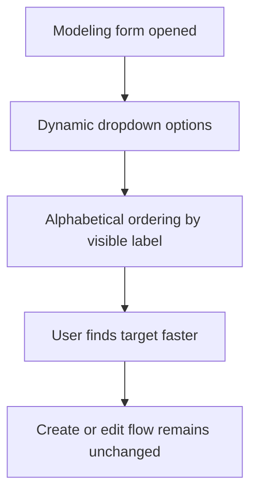

## req_111_alphabetically_sorted_dropdown_menus_in_modeling_screens - Alphabetically sorted dropdown menus in modeling screens
> From version: 1.4.3
> Schema version: 1.0
> Status: Draft
> Understanding: 96% (user intent is clear: dropdown menus used in the `Modeling` screens should be easier to scan by sorting their selectable options alphabetically)
> Confidence: 94% (the scope is narrow and local to existing form dropdowns if the request is limited to user-facing selectable entity lists in modeling workflows)
> Complexity: Medium
> Theme: Modeling form ergonomics / option ordering / data-entry efficiency
> Reminder: Update status/understanding/confidence and references when you edit this doc.

# Needs
- Users want the dropdown menus used in the `Modeling` screens to be sorted alphabetically instead of reflecting insertion order or internal list order.
- The current unsorted behavior makes form completion slower, especially when the project contains many connectors, splices, nodes, or catalog items.
- The sorted order should improve scanability without changing the underlying entity model or selection semantics.

# Context
The `Modeling` workspace exposes several form dropdowns driven by current entity lists:
- connector catalog item selector
- splice catalog item selector
- wire endpoint connector selector
- wire endpoint splice selector
- node connector selector
- node splice selector
- segment node selectors
- any other modeling-only dynamic select whose options come from current workspace entities or catalog items

Today, these lists appear to follow current array order rather than a deterministic alphabetical user-facing order. For end users, this means:
- harder scanning when many options exist
- inconsistent ordering across sessions or test/sample data
- avoidable friction in frequent create/edit workflows

This request should stay focused on `Modeling` dropdown ordering. It is not asking for a global redesign of every select in the app, and it should not force a sort policy onto static enum-like selects where the current semantic order is deliberate.

# Objective
- Ensure dynamic dropdown menus in the `Modeling` screens are sorted alphabetically by the user-visible label.
- Keep current create/edit/save behavior unchanged except for the ordering of options.
- Preserve explicit exceptions where the current option order is semantic and should not be alphabetized.

# Default decisions (V1)
- In-scope controls:
  - all dynamic selects in `Modeling` backed by current entities or catalog items
- Sort algorithm:
  - sort by the exact visible option label shown to the user
  - normalize by trimming text and comparing case-insensitively
- Tie-break policy:
  - first fallback = stable technical identifier when available
  - second fallback = stable entity ID
- Missing selected option policy:
  - if the currently selected option is represented by a compatibility fallback because the entity is missing, keep that fallback visible at the top of the dropdown
- Out-of-scope controls:
  - static semantic selects keep their current order and are not alphabetized

# Functional scope
## A. In-scope modeling dropdowns (high priority)
- Apply alphabetical sorting to dynamic, user-facing dropdowns in `Modeling`, including at minimum:
  - connector catalog item selector
  - splice catalog item selector
  - wire endpoint connector selectors
  - wire endpoint splice selectors
  - node connector selector
  - node splice selector
  - segment node selectors
- Include equivalent modeling dropdowns added by nearby features if they follow the same dynamic entity-list pattern.

## B. Sort key policy (high priority)
- Sort by the label the user actually reads in the dropdown, not by internal object ID order.
- Recommended policy:
  - primary sort key = visible label text shown in the option
  - secondary tie-breaker = stable technical identifier or ID
- The sort should be deterministic across rerenders.
- Leading/trailing whitespace must be ignored for comparison.
- Case differences must not create unstable ordering.
- Missing optional names should fall back to the visible label contract already rendered by the select.

## C. Semantic-order exceptions (medium-high priority)
- Do not alphabetize static or intentionally semantic selects where order conveys meaning, for example:
  - yes/no
  - ascending/descending
  - route or mode enums
  - degree/size/priority scales
- The implementation should explicitly distinguish:
  - dynamic entity/catalog selects that should be alphabetized
  - static semantic selects that should preserve their deliberate order

## D. Missing and legacy option handling (medium priority)
- If a currently selected entity is missing but still represented as a fallback option, it must remain visible/selectable.
- Missing fallback options should not disappear just because normal options are sorted.
- Selected missing fallback options should remain pinned above the normal sorted list for clarity and safety.
- Sorting should remain safe for legacy/imported data where names or references may be absent.

## E. Regression safety (medium priority)
- Existing selection, save/cancel behavior, and prefilled edit behavior must remain unchanged.
- Sorting should not mutate stored entity order in state; this is a presentation concern for the dropdowns.
- No regression to test flows that depend on select availability and labels.

# Non-functional requirements
- Sorting should be implemented in a reusable and readable way rather than duplicating ad hoc comparator logic in every component.
- The ordering must be deterministic and locale-safe enough for the current EN/FR product scope.
- The feature should not add noticeable UI lag in normal modeling workflows.

# Validation and regression safety
- Add or extend tests covering sorted option ordering for representative modeling forms.
- Validate that static semantic selects preserve their existing order.
- Run targeted validation after implementation:
  - `npm run -s lint`
  - `npm run -s typecheck`
  - `npm test -- --run <targeted modeling form dropdown specs>`
  - `npm run -s build`

# Acceptance criteria
- AC1: Dynamic dropdowns in the `Modeling` screens that list current entities or catalog items are displayed in alphabetical order by user-visible label.
- AC2: Static semantic dropdowns in `Modeling` keep their deliberate non-alphabetical order.
- AC3: Alphabetical sorting is case-insensitive and based on trimmed visible option labels.
- AC4: Existing create/edit/save behavior remains unchanged apart from option ordering.
- AC5: Missing selected fallback options, when present for compatibility reasons, remain visible, usable, and pinned above the normal sorted options.
- AC6: Regression tests cover representative connector, splice, wire, node, and segment modeling dropdown ordering behavior.

# Out of scope
- Reordering non-modeling dropdowns across the whole application.
- Changing table sort defaults or list sorting outside dropdown menus.
- Renaming entities or changing the displayed option label format itself.
- Large UX redesign of modeling forms.

# Definition of Ready (DoR)
- [x] Problem statement is explicit and user impact is clear.
- [x] Scope boundaries (in/out) are explicit.
- [x] Acceptance criteria are testable.
- [x] Dependencies and known risks are listed.

# Companion docs
- Product brief(s): (none yet)
- Architecture decision(s): (none yet)

# AI Context
- Summary: Sort dynamic dropdown menus in the `Modeling` workspace alphabetically by visible label while preserving semantic-order static selects.
- Keywords: modeling, dropdown, select, alphabetical, sort, connector, splice, node, segment, catalog
- Use when: Use when implementing or validating option ordering in modeling forms.
- Skip when: Skip when changing static enum ordering or non-modeling screen controls.

# Backlog
- `logics/backlog/item_546_shared_alphabetical_sorting_contract_for_modeling_dynamic_dropdown_options.md`
- `logics/backlog/item_547_modeling_form_dropdown_wiring_for_alphabetical_option_ordering_and_missing_fallback_pinning.md`
- `logics/backlog/item_548_req_111_validation_matrix_and_modeling_dropdown_ordering_closure_traceability.md`

# Orchestration task
- `logics/tasks/task_090_super_orchestration_delivery_execution_for_req_110_to_req_112_with_validation_gates_and_staged_checkpoints.md`

# References
- `src/app/components/workspace/ModelingConnectorFormPanel.tsx`
- `src/app/components/workspace/ModelingSpliceFormPanel.tsx`
- `src/app/components/workspace/ModelingWireFormPanel.tsx`
- `src/app/components/workspace/ModelingNodeFormPanel.tsx`
- `src/app/components/workspace/ModelingSegmentFormPanel.tsx`
- `src/app/AppController.tsx`
- `src/tests/app.ui.creation-flow-ergonomics.spec.tsx`
- `src/tests/app.ui.catalog.spec.tsx`
