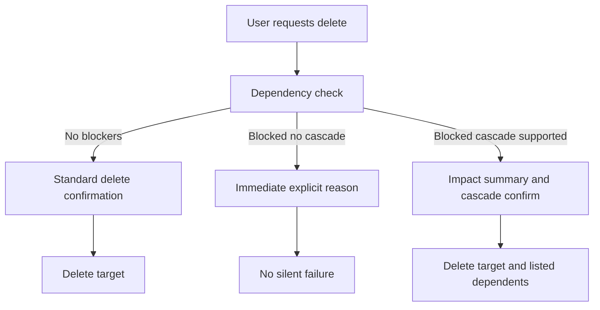

## req_112_explicit_blocked_delete_feedback_and_dependency_aware_cascade_delete_confirmation - Explicit blocked delete feedback and dependency-aware cascade delete confirmation
> From version: 1.4.3
> Schema version: 1.0
> Status: Done
> Understanding: 100% (the delivered V1 contract is explicit: blocked deletes now surface dedicated impact dialogs with structured dependency summaries, while cascade delete remains limited to safe connector/splice cases with exact local impact)
> Confidence: 98% (UI coverage, conservative cascade guards, and undo/redo proof points confirm the scoped req_112 behavior end to end)
> Complexity: High
> Theme: Destructive-action clarity / dependency visibility / safe cascade deletion
> Reminder: Update status/understanding/confidence and references when you edit this doc.

# Needs
- When a delete action is impossible because the target is still referenced, the product must explain that immediately and clearly.
- Current behavior can feel like “nothing happened”, which leaves users unsure whether:
  - the click was ignored
  - the app is broken
  - or the delete is blocked by existing dependencies
- In some blocked cases, users would prefer an explicit option to delete the target together with the dependent items, provided the app clearly explains the impact before confirmation.

# Context
`req_074` already ensured that delete actions go through a confirmation modal before mutation. However, that request intentionally preserved the existing reducer guard semantics. As a result, a delete flow may still feel opaque when:
- the user confirms deletion
- the reducer blocks the action because the entity is referenced
- the only feedback is a generic top-level error banner that can be missed in the current workflow

Examples already enforced by reducers include:
- connector deletion blocked while connector nodes reference it
- connector deletion blocked while wire endpoints reference it
- splice deletion blocked while splice nodes or wire endpoints reference it
- node deletion blocked while segments are connected to it
- catalog item deletion blocked while connectors, splices, or fuse wires reference it

The user specifically highlighted the connector case:
- deleting a connector that is still used by a wire is not allowed
- current UX does not make the reason visible enough
- ideally, the app should offer a deliberate dependency-aware delete path so the user can choose to remove the connector and all related items after a strong warning

This request is therefore a follow-up to `req_074`:
- keep explicit confirmation before destructive actions
- improve the visibility of blocked-delete reasons
- optionally support cascade deletion where the dependency scope is deterministic and can be explained safely

# Objective
- Make blocked delete attempts explicit and understandable at the moment the user tries to delete.
- Avoid UX patterns where a blocked delete appears to do nothing.
- Add dependency-aware cascade delete only where the impacted entities can be identified and summarized clearly before confirmation.

# Default decisions (V1)
- Feedback surface:
  - blocked delete feedback should use a dedicated modal/dialog tied to the delete attempt, not rely only on the global error banner
- Feedback content:
  - include the target entity identity
  - include the blocker category or categories
  - include dependency counts where the app can determine them cheaply
  - include representative labels when helpful and low-cost
- Delivery priority:
  - first priority is explicit blocked-delete feedback for all guarded delete actions
  - cascade delete is only enabled for entity types with a bounded, deterministic, and clearly summarized impact set
- Default cascade support matrix:
  - `connector`: candidate for V1 cascade support if the app can summarize the exact impacted dependents before confirmation
  - `splice`: candidate for V1 cascade support if the app can summarize the exact impacted dependents before confirmation
  - `node`: explanation-only by default in V1
  - `segment`: explanation-only by default in V1
  - `catalog item`: explanation-only by default in V1
  - `network`: explanation-only by default in V1
- Safety fallback:
  - if the exact impact summary cannot be produced confidently for a candidate cascade case, fall back to explanation-only blocking
- Undo/redo policy:
  - any supported cascade delete should be recorded as one logical destructive operation for undo/redo purposes

# Functional scope
## A. Immediate blocked-delete feedback (high priority)
- When a delete action is blocked by existing references or integrity constraints, the product must provide immediate, prominent feedback.
- The feedback should be closer to the delete interaction than the current passive error-banner-only experience.
- V1 feedback direction is locked:
  - use a dedicated modal/dialog explaining why deletion cannot proceed
- The message should say:
  - what could not be deleted
  - why it is blocked
  - which dependency type is causing the block

## B. Dependency detail visibility (high priority)
- Blocked-delete feedback should be more informative than a generic “cannot remove” string.
- Where feasible, the user should see the impacted dependency categories and representative references, for example:
  - connector node references
  - wire endpoint references
  - connected segments
  - linked catalog usages
- V1 does not require a full exhaustive explorer UI, but the user should understand what is preventing deletion.

## C. Dependency-aware cascade delete flow (high priority, scoped)
- For delete cases where the dependency tree is deterministic enough to summarize safely, the app should support a cascade-delete confirmation path.
- The confirmation must explicitly state that related entities will also be removed.
- The dialog should summarize the impact before the user confirms, for example:
  - target entity
  - dependent entities to be deleted
  - counts and/or representative labels
- Cascade deletion must be opt-in and explicit.
- If the dependency scope is too broad, ambiguous, or risky, the app should prefer explanation-only blocking rather than silent or unsafe cascade behavior.
- V1 default support should start conservatively:
  - candidate support only for `connector` and `splice`
  - all other blocked-delete entity types remain explanation-only unless explicitly expanded later

## D. Scope policy for cascade support (medium-high priority)
- V1 should define exactly which blocked-delete cases support cascade deletion and which remain explanation-only.
- Recommended V1 policy:
  - support cascade only for local, deterministic dependency chains with clear summaries
  - keep more complex or graph-wide cases blocked with explicit explanation until a safer deletion contract exists
  - treat `connector` and `splice` as the only default V1 cascade candidates
- The final supported matrix must be documented in the implementation and tests.

## E. Relationship to existing delete confirmation (medium priority)
- Preserve the existing `req_074` confirmation rule:
  - user-triggered delete actions still require explicit confirmation
- The new behavior refines what happens when the target cannot be removed directly:
  - explanation modal if blocked
  - or cascade-impact modal if supported
- Normal successful delete flows should remain non-regressed.

## F. Error-surfacing contract (medium priority)
- If reducers still emit `lastError` strings for integrity guards, UI must surface those errors in a way users will actually notice in delete flows.
- The implementation may keep the global error banner as a secondary channel, but delete-specific feedback should not depend on that banner alone.
- The delete UX should not feel silent even when no mutation occurs.

## G. Regression safety (high priority)
- Existing integrity protections must not be weakened accidentally.
- Cascade deletion must not remove entities outside the explicitly summarized impact set.
- Selection, undo/redo, and persistence behavior must remain coherent after successful cascade deletion.

# Non-functional requirements
- Cascade deletion must be conservative and predictable.
- Feedback copy should be explicit, short, and user-readable.
- The user should never be surprised by hidden extra deletions.
- The implementation should reuse existing confirmation/dialog infrastructure where possible.

# Validation and regression safety
- Add or extend tests covering:
  - blocked delete feedback visibility
  - explanation content for representative blocked cases
  - cascade confirmation content and confirm/cancel semantics where supported
  - non-regression of normal delete confirmation flows
  - integrity preservation when deletion remains blocked
- Run targeted validation after implementation:
  - `npm run -s lint`
  - `npm run -s typecheck`
  - `npm test -- --run <targeted delete feedback and cascade specs>`
  - `npm run -s build`

# Acceptance criteria
- AC1: A delete action blocked by existing dependencies gives immediate explicit feedback and no longer feels like a silent no-op.
- AC2: The blocked-delete feedback identifies the reason category for the failure, not just that the delete did not occur.
- AC3: Blocked delete feedback is shown in a dedicated modal/dialog tied to the delete attempt and does not depend on the top-level error banner alone.
- AC4: For any entity types that support cascade deletion in V1, the user receives a dedicated impact summary and must explicitly confirm removal of the target plus its listed dependents.
- AC5: Canceling a blocked-delete explanation or cascade-delete confirmation leaves state unchanged.
- AC6: Existing delete confirmation behavior from `req_074` remains non-regressed for normal deletions.
- AC7: Integrity guards remain enforced for unsupported or unsafe cascade cases.
- AC8: By default, `node`, `segment`, `catalog item`, and `network` blocked deletions remain explanation-only in V1 unless a later explicit expansion is documented.
- AC9: Regression tests cover representative connector, splice, node, and catalog blocked-delete flows, plus any supported cascade cases.

# Out of scope
- Automatic unconditional deletion of all related graph entities without explicit user confirmation.
- Full dependency-graph visualization tooling.
- Broad changes to business rules that decide whether an entity may exist without its current dependents.
- Backend permission or audit-log systems.

# Definition of Ready (DoR)
- [x] Problem statement is explicit and user impact is clear.
- [x] Scope boundaries (in/out) are explicit.
- [x] Acceptance criteria are testable.
- [x] Dependencies and known risks are listed.

# Companion docs
- Product brief(s): (none yet)
- Architecture decision(s): (none yet)

# AI Context
- Summary: Improve delete UX by making blocked deletions explicit and adding safe, dependency-aware cascade confirmation where supported.
- Keywords: delete, blocked delete, cascade delete, confirmation, dependency, connector, wire, feedback, modal
- Use when: Use when implementing or validating blocked-delete explanations and safe cascade deletion in modeling and catalog workflows.
- Skip when: Skip when only adding basic delete confirmations already covered by `req_074`.

# Backlog
- `logics/backlog/item_549_dedicated_blocked_delete_feedback_modal_and_delete_guard_explanation_orchestration.md`
- `logics/backlog/item_550_delete_dependency_summary_contract_and_representative_impacted_reference_visibility.md`
- `logics/backlog/item_551_safe_connector_and_splice_cascade_delete_confirmation_and_execution_contract.md`
- `logics/backlog/item_552_req_112_validation_matrix_and_blocked_delete_closure_traceability.md`

# Orchestration task
- `logics/tasks/task_090_super_orchestration_delivery_execution_for_req_110_to_req_112_with_validation_gates_and_staged_checkpoints.md`

# References
- `logics/request/req_074_all_delete_actions_require_styled_confirmation_modal.md`
- `src/app/components/workspace/AppHeaderAndStats.tsx`
- `src/app/components/dialogs/ConfirmDialog.tsx`
- `src/app/AppController.tsx`
- `src/store/reducer/connectorReducer.ts`
- `src/store/reducer/spliceReducer.ts`
- `src/store/reducer/nodeReducer.ts`
- `src/store/reducer/catalogReducer.ts`
- `src/store/reducer/networkReducer.ts`
- `src/tests/app.ui.delete-confirmations.spec.tsx`

# Delivery
- Added a dedicated delete-impact modal flow for blocked delete attempts so connector, splice, node, segment, and catalog guard failures no longer depend on the passive error banner.
- Added a shared delete-impact summary contract with category counts and representative references for connector nodes, splice nodes, connected segments, wire endpoints, routed wires, connectors, splices, and fuse wires.
- Enabled conservative V1 cascade delete only for connector/splice cases where the exact impact set is limited to the linked node set and no wires or connected segments remain.
- Preserved normal delete confirmations for direct deletions and kept `node`, `segment`, `catalog item`, and `network` as explanation-only in V1.
