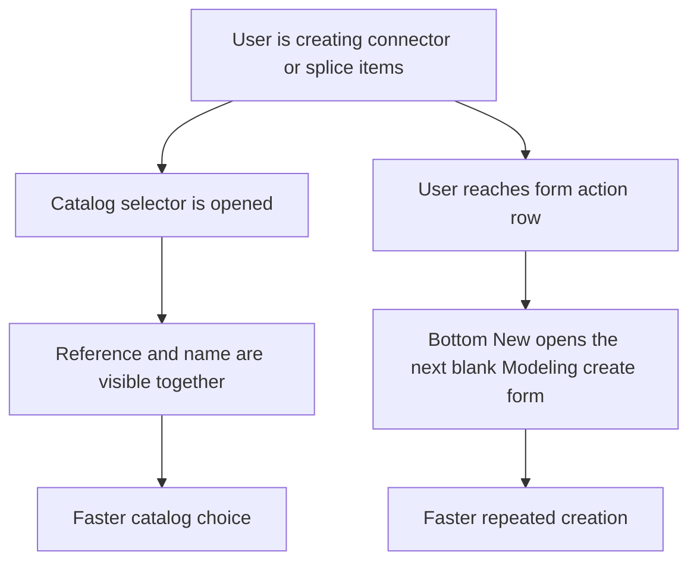

## req_114_connector_and_splice_catalog_labels_show_names_and_create_forms_support_chained_new_action - Connector and splice catalog labels show names and create forms support chained New action
> From version: 1.4.4
> Schema version: 1.0
> Status: Done
> Understanding: 96% (the requested scope is clear: improve connector/splice catalog option readability and reduce repetitive scrolling during chained create flows)
> Confidence: 98% (current UI patterns and nearby requests define the interaction boundaries clearly, and the remaining bottom-action behavior is now locked to silent reset semantics within Modeling forms only)
> Complexity: Medium
> Theme: Modeling form ergonomics / catalog readability / repetitive-entry speed
> Reminder: Update status/understanding/confidence and references when you edit this doc.

# Needs
- In connector and splice create/edit forms, the `Catalog item (manufacturer reference)` selector is harder to scan than necessary because the visible option label emphasizes the manufacturer reference and count but not the catalog item name.
- When catalog references are short, cryptic, or visually similar, users need the human-readable catalog name in the same option label to identify the correct part faster.
- During repetitive creation sessions, the current bottom action row forces users to scroll back to the top or to the list-side `New` action after each create, even though they are already working inside the create form.
- Users want a local `New` action next to `Create` and `Cancel` across Modeling create forms so they can immediately reset the form for the next item without losing momentum.

# Context
`req_051` introduced the catalog-first connector/splice workflow and made the catalog selector a core part of creation flows. `req_111` then standardized alphabetical ordering for dynamic modeling dropdowns, but it intentionally did not change the visible label format itself. As a result, the connector/splice catalog dropdowns are currently ordered well but can still be slow to interpret when several catalog items share similar manufacturer references or when the reference is less recognizable than the item name.

Separately, `req_109` introduced scroll-to-form behavior for explicit `New` and `Edit` actions so list-driven form opening is easier to follow. That improved entry into the create flow, but it did not remove the repeated round-trip cost once the user is already at the bottom of a create form and wants to chain several creations in sequence. The bottom action row currently offers `Create` and `Cancel`, which means the user must still leave the local action context to start the next item.

This request is a focused follow-up ergonomics pass:
- point A improves option readability in connector/splice catalog selectors by including the catalog item name in the displayed label;
- point B adds a bottom-of-form `New` action across Modeling create flows so the next blank form can be opened locally without extra scrolling.

# Objective
- Make connector/splice catalog selection faster by showing both the manufacturer reference and the catalog item name in the visible option label.
- Reduce repetitive scrolling during chained create flows by adding a local bottom `New` action beside the existing create/cancel controls across all Modeling create forms.
- Preserve current create/edit validation, derived-field synchronization, and form-mode semantics outside this targeted ergonomics scope.

# Scope
- In:
  - update connector and splice catalog dropdown option labels to include the catalog item name when available;
  - keep catalog option ordering deterministic and compatible with the existing alphabetical dropdown contract from `req_111`;
  - add a bottom `New` action in create-form action rows across all Modeling create flows where users may chain several creations in a row;
  - define how the bottom `New` action resets or reopens a blank create form after a successful create;
  - add regression coverage for the new label and action-row behavior.
- Out:
  - redesign of catalog item data model or mandatory-name policy;
  - changing the underlying catalog item identity key away from manufacturer reference;
  - broad form-layout redesign beyond the extra bottom action;
  - changes to delete behavior, keyboard-confirm behavior, or multi-selection workflows covered elsewhere.

# Locked execution decisions
- Decision 1: The connector and splice catalog selector must keep manufacturer reference visible in the option label; the name is additive context, not a replacement.
- Decision 2: If a catalog item has no usable name, the dropdown falls back safely to the current reference-first label behavior.
- Decision 3: The visible-label format must remain deterministic and compact enough for dropdown scanning on normal desktop and mobile widths.
- Decision 4: The bottom `New` action is available only in create mode, not in edit mode.
- Decision 5: Activating bottom `New` must leave the user in a fresh create form state for the same entity type without requiring list-panel interaction.
- Decision 6: Existing top/list-side `New` actions from `req_109` remain valid; the new bottom action complements them rather than replacing them.
- Decision 7: V1 bottom `New` coverage is locked to all Modeling create forms:
  - connector;
  - splice;
  - node;
  - segment;
  - wire.
- Decision 8: `Create catalog item` is out of scope for the bottom `New` action in this request.
- Decision 9: Activating bottom `New` uses a silent reset to the next blank draft state and does not require additional success/toast feedback.

# Functional behavior contract
## A. Connector and splice catalog selector labels
- The `Catalog item (manufacturer reference)` dropdown in connector and splice forms must display labels that include:
  - the manufacturer reference;
  - the catalog item name when available;
  - the existing connection-count cue.
- Recommended baseline format:
  - `manufacturerReference - name (connectionCount)`
- If `name` is empty or missing:
  - preserve a safe fallback equivalent to the current visible contract.
- Missing compatibility options should remain distinguishable from normal options and continue to follow the existing missing-option behavior.

## B. Ordering compatibility with req_111
- The updated label format must not break the existing sorted-dropdown contract.
- If sorting continues to use the full visible label, implementation and tests must explicitly confirm the resulting order is stable and acceptable.
- If a narrower sort key is introduced later, that decision must remain compatible with `req_111` and be documented explicitly.

## C. Bottom chained New action for create flows
- In create mode, the action row must expose a `New` button near `Create` and `Cancel` across all Modeling create forms.
- Clicking `New` from a create form should open or reset the same create form to a clean next-item state for the current entity type.
- The action should support chained workflows such as:
  - create connector A;
  - click bottom `New`;
  - immediately start connector B without returning to the list panel.
- The new action must preserve existing defaults and prefills already defined for create mode, such as suggested technical IDs and create-mode defaults.
- V1 coverage for the bottom `New` action includes:
  - `Create Connector`
  - `Create Splice`
  - `Create Node`
  - `Create Segment`
  - `Create Wire`
- `Create catalog item` does not gain the bottom `New` action in V1.

## D. Non-triggering and edit-mode rules
- Edit mode keeps its current action semantics and should not gain a bottom `New` action unless explicitly expanded later.
- `Cancel` keeps its current meaning and must not be repurposed.
- The new bottom action must not silently submit the form or mutate state by itself.

## E. Regression safety
- Existing create/save/cancel flows must remain functional.
- Derived connector/splice fields driven by catalog selection must remain non-regressed.
- Existing explicit action-driven scroll behavior from `req_109` must remain intact for list-side `New` and `Edit`.
- New tests should prove that chained create behavior does not require manual scroll recovery between successive entries.

# Validation and regression safety
- `python3 logics/skills/logics-doc-linter/scripts/logics_lint.py`
- `npm run -s lint`
- `npm run -s typecheck`
- `npm test -- --run src/tests/app.ui.modeling-dropdown-ordering.spec.tsx src/tests/app.ui.creation-flow-ergonomics.spec.tsx src/tests/app.ui.catalog.spec.tsx`
- targeted checks around:
  - connector/splice catalog option label content;
  - connector/splice catalog option ordering after label update;
  - bottom `New` action visibility in create mode only;
  - chained create-form reset behavior and preserved defaults.

# Acceptance criteria
- AC1: Connector and splice catalog selectors display labels that include the manufacturer reference and the catalog item name when a name is available.
- AC2: Catalog items without a usable name fall back to a safe label format that keeps current selection semantics intact.
- AC3: The connector/splice catalog dropdown ordering remains deterministic and non-regressed after the visible label format change.
- AC4: All Modeling create forms expose a bottom `New` action alongside the existing create/cancel controls while the form is in create mode.
- AC5: Clicking bottom `New` resets or reopens the same entity create form in a fresh create state without requiring the user to scroll back to the list-panel `New` action.
- AC6: Existing create-mode prefills and defaults remain intact after the bottom `New` action is used.
- AC7: Edit-mode flows remain non-regressed and do not unintentionally gain create-only behavior.
- AC8: Regression tests cover representative connector/splice catalog label rendering and representative chained create-flow paths for the Modeling bottom `New` action coverage.

# Definition of Ready (DoR)
- [x] Problem statement is explicit and user impact is clear.
- [x] Scope boundaries are explicit.
- [x] Acceptance criteria are testable.
- [x] Dependencies and known risks are listed.

# Risks
- Label expansion may reduce dropdown compactness if the chosen format is too verbose.
- If sorting depends on the full visible label, adding names may subtly change option order and require explicit acceptance.
- Bottom `New` action semantics can become ambiguous if implementation does not define clearly whether it is available before or after a successful create.
- Reusing create-form reset flows across several entity types may expose inconsistencies in current form-default logic.

# Companion docs
- Product brief(s): `logics/product/prod_000_modeling_productivity_and_repeated_action_ergonomics.md`
- Architecture decision(s): `logics/architecture/adr_003_modeling_create_flow_reset_and_canvas_group_movement_interaction_contracts.md`

# AI Context
- Summary: Improve connector/splice creation ergonomics by showing catalog names in catalog selector labels and adding a bottom chained `New` action in create forms.
- Keywords: modeling, connector, splice, catalog, manufacturer reference, name, create form, new action, ergonomics
- Use when: Use when implementing or validating connector/splice catalog label readability and repeated create-flow speed improvements.
- Skip when: Skip when the work only changes delete flows, keyboard shortcuts, or unrelated non-modeling UI.

# References
- `logics/request/req_051_catalog_screen_with_catalog_item_crud_navigation_integration_and_required_manufacturer_reference_connection_count.md`
- `logics/request/req_109_new_and_edit_actions_scroll_to_corresponding_form_panel.md`
- `logics/request/req_111_alphabetically_sorted_dropdown_menus_in_modeling_screens.md`
- `src/app/components/workspace/ModelingConnectorFormPanel.tsx`
- `src/app/components/workspace/ModelingSpliceFormPanel.tsx`
- `src/app/components/workspace/ModelingNodeFormPanel.tsx`
- `src/app/components/workspace/ModelingSegmentFormPanel.tsx`
- `src/app/components/workspace/ModelingWireFormPanel.tsx`
- `src/app/components/workspace/ModelingCatalogFormPanel.tsx`
- `src/app/lib/modelingSelectOptions.ts`
- `src/tests/app.ui.modeling-dropdown-ordering.spec.tsx`
- `src/tests/app.ui.creation-flow-ergonomics.spec.tsx`

# Backlog
- `item_565_connector_and_splice_catalog_selector_labels_include_catalog_names_and_safe_fallback_formatting`
- `item_566_bottom_new_action_across_modeling_create_forms_with_silent_draft_reset`
- `item_567_regression_coverage_and_closure_for_modeling_create_form_chained_new_and_catalog_label_ergonomics`
