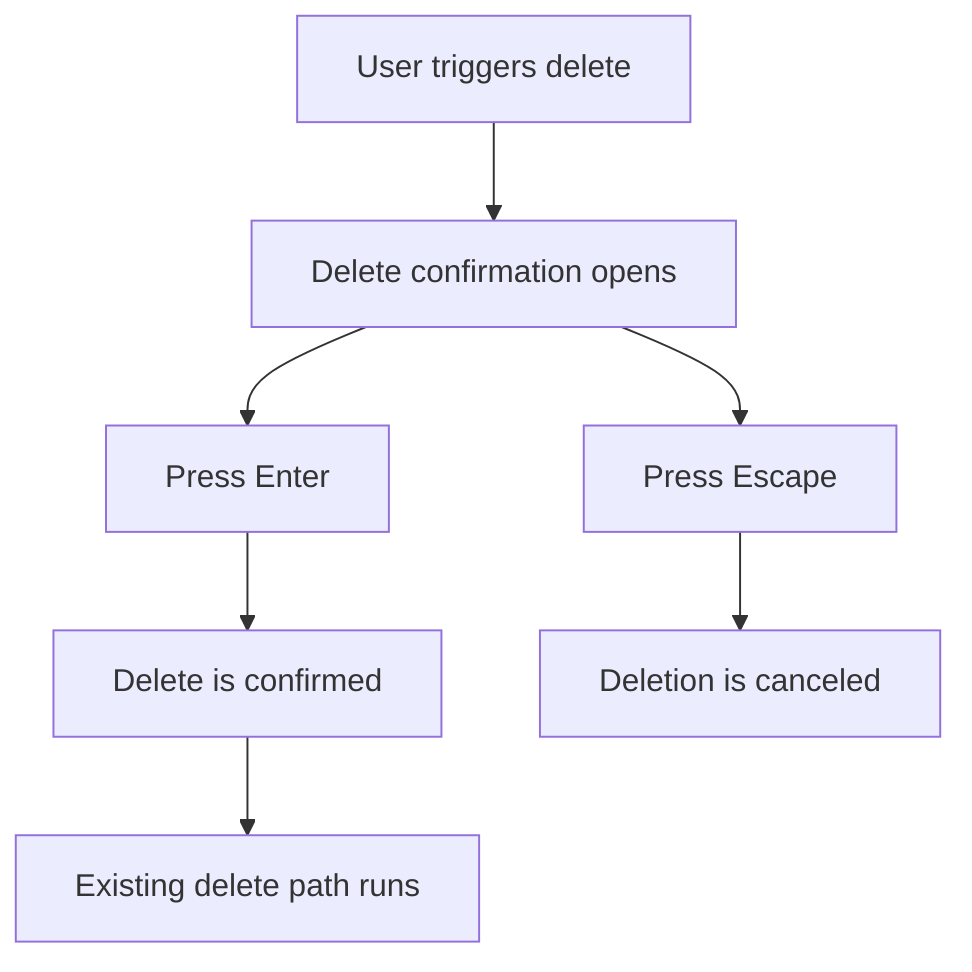

## req_115_keyboard_confirmation_shortcut_for_delete_modals_with_explicit_safety_policy - Keyboard confirmation shortcut for delete modals with explicit safety policy
> From version: 1.4.4
> Schema version: 1.0
> Status: Draft
> Understanding: 97% (the user intent is specific: when a delete confirmation opens, pressing Enter should confirm faster without broadening the rule to unrelated confirmation dialogs)
> Confidence: 97% (the main product tradeoff is explicit and localized, and the remaining keyboard-scope details are now locked to the current delete-dialog shape with focus preserved on cancel)
> Complexity: Medium
> Theme: Destructive-action ergonomics / keyboard flow / confirmation safety
> Reminder: Update status/understanding/confidence and references when you edit this doc.

# Needs
- Repetitive delete flows are slower than necessary because the current confirmation dialog requires mouse interaction or extra keyboard navigation before the destructive action can be confirmed.
- Users want a faster keyboard path: open delete confirmation, then press `Enter` to confirm.
- The current dialog behavior is intentionally safety-first: focus lands on `Cancel`, and the dialog only handles `Escape` and focus trapping explicitly.
- Any faster keyboard confirmation behavior must therefore define its safety policy clearly instead of changing destructive confirmation semantics implicitly.

# Context
`req_074` established that delete actions must go through the shared styled confirmation modal before mutation. `req_112` later expanded delete UX with blocked-delete explanation dialogs and safe cascade-delete confirmations. Today, delete and cascade flows are already centralized enough that keyboard-confirm behavior can be treated as a focused follow-up request rather than a full modal redesign.

The current dialog implementation shows the main tradeoff directly:
- the dialog stores prior focus and restores it on close;
- focus is moved to the cancel button when the modal opens;
- `Escape` closes the dialog;
- `Tab` and `Shift+Tab` are trapped inside the dialog;
- there is no explicit `Enter` shortcut policy beyond whatever the focused element does by default.

This means the current destructive-confirmation contract is cautious but slower for operators who are doing repeated cleanup work. The requested behavior is to accelerate only delete-confirmation flows while keeping the safety boundary explicit and testable.

# Objective
- Make destructive delete confirmation faster for keyboard users by supporting `Enter` confirmation in delete-specific dialogs.
- Keep the scope narrow and explicit so generic non-delete confirmation flows do not unexpectedly change behavior.
- Document the safety tradeoff clearly so implementation and tests align on the intended destructive-keyboard contract.

# Scope
- In:
  - standard delete confirmation dialogs covered by `req_074`;
  - destructive cascade-delete confirmation dialogs covered by `req_112`;
  - keyboard behavior, focus policy, and regression coverage for those dialogs.
- Out:
  - non-delete confirmation dialogs such as save/import/replace flows;
  - blocked-delete explanation dialogs that do not expose a destructive confirm action;
  - broader keyboard shortcut redesign outside modal confirmation behavior.

# Locked execution decisions
- Decision 1: V1 scope is limited to delete-confirmation and cascade-delete-confirmation dialogs only.
- Decision 2: Plain `Enter` is the requested fast-path key in V1; `Ctrl+Enter` is not the default contract.
- Decision 3: The destructive keyboard behavior must be explicit and testable:
  - opening the dialog and pressing `Enter` confirms the destructive primary action.
- Decision 4: The chosen implementation must not allow the same triggering key event that opened the dialog to immediately auto-confirm it.
- Decision 5: `Escape`, explicit `Cancel`, and backdrop-dismiss rules remain non-regressed where they are already allowed.
- Decision 6: Blocked-delete explanation dialogs remain non-destructive and do not inherit the `Enter = confirm delete` rule.
- Decision 7: V1 applies to the current delete-dialog shape only and does not pre-define behavior for future dialogs that might introduce text inputs or other form fields.
- Decision 8: The preferred V1 UX keeps the visible initial focus on `Cancel` while supporting destructive `Enter` confirmation through explicit dialog-level handling.

# Functional behavior contract
## A. In-scope dialogs
- The new keyboard confirmation rule applies to:
  - direct delete confirmations;
  - safe cascade-delete confirmations where the primary action remains destructive.
- It does not apply to:
  - blocked-delete explanation dialogs;
  - generic neutral or warning confirm dialogs outside delete flows.

## B. Enter confirmation behavior
- When an in-scope destructive delete dialog is open and fully active, pressing `Enter` confirms the destructive action.
- The confirm action should behave exactly like activating the dialog's primary destructive button.
- The behavior must work for both:
  - standard delete confirmation;
  - cascade delete confirmation.

## C. Safety policy
- The product must make the destructive keyboard policy explicit in implementation and tests.
- Minimum safety constraints:
  - the key event that opened the dialog must not also confirm it;
  - the dialog must not confirm repeatedly from a stale keypress sequence;
  - non-destructive dialog variants must not accidentally adopt the same shortcut.
- Implementation may satisfy the contract either by:
  - changing initial focus to the primary destructive action for in-scope dialogs;
  - or adding explicit dialog-level `Enter` confirmation handling.
- V1 direction is locked:
  - preserve visible initial focus on `Cancel`;
  - add explicit dialog-level `Enter` confirmation handling for in-scope destructive dialogs.
- Future dialogs with editable text inputs are outside the current contract and should be specified separately if needed later.

## D. Existing cancellation and accessibility behavior
- `Escape` must still cancel.
- Explicit `Cancel` click/activation must still cancel.
- Focus restoration after close must remain non-regressed.
- Dialog accessibility semantics and focus trapping must remain intact.

## E. Regression safety
- Existing delete mutation paths, guard errors, and cascade summaries must remain unchanged apart from the added keyboard-confirm affordance.
- The feature must not change confirmation behavior for save/import/replace dialogs unless a later request expands the scope.

# Validation and regression safety
- `python3 logics/skills/logics-doc-linter/scripts/logics_lint.py`
- `npm run -s lint`
- `npm run -s typecheck`
- `npm test -- --run src/tests/app.ui.delete-confirmations.spec.tsx`
- targeted checks around:
  - `Enter` confirming direct delete dialogs;
  - `Enter` confirming cascade delete dialogs;
  - `Escape` still canceling;
  - blocked-delete dialogs not inheriting destructive `Enter` behavior;
  - no double-confirm on the same event that opened the dialog.

# Acceptance criteria
- AC1: In-scope delete confirmation dialogs support confirming the destructive action with `Enter`.
- AC2: The same `Enter` behavior also works for in-scope cascade-delete confirmation dialogs.
- AC3: Blocked-delete explanation dialogs remain non-destructive and do not accidentally adopt the destructive `Enter` rule.
- AC4: `Escape`, explicit `Cancel`, and focus restoration behavior remain non-regressed.
- AC5: The key event that opened the dialog cannot immediately auto-confirm the destructive action.
- AC6: Non-delete confirmation dialogs remain unchanged in V1.
- AC7: Regression tests cover both direct delete and cascade delete keyboard-confirm paths.

# Definition of Ready (DoR)
- [x] Problem statement is explicit and user impact is clear.
- [x] Scope boundaries are explicit.
- [x] Acceptance criteria are testable.
- [x] Dependencies and known risks are listed.

# Risks
- Changing delete-modal keyboard semantics may increase accidental destructive confirmations if the safety policy is under-specified.
- A dialog-level `Enter` override can conflict with focused-button semantics if implemented carelessly.
- Initial-focus changes may improve speed but weaken the current safety-first orientation if not documented clearly.

# Companion docs
- Product brief(s): `logics/product/prod_000_modeling_productivity_and_repeated_action_ergonomics.md`
- Architecture decision(s): `logics/architecture/adr_002_destructive_interaction_contracts_for_keyboard_confirmation_and_modeling_batch_delete.md`

# AI Context
- Summary: Add a fast `Enter` confirmation path for delete and cascade-delete dialogs while keeping the safety policy explicit and limited to destructive delete flows.
- Keywords: delete, confirm dialog, keyboard, enter, cascade delete, destructive action, focus, shortcut
- Use when: Use when implementing or validating keyboard confirmation behavior for delete modals.
- Skip when: Skip when changing non-delete confirms or blocked-delete explanation dialogs.

# References
- `logics/request/req_074_all_delete_actions_require_styled_confirmation_modal.md`
- `logics/request/req_112_explicit_blocked_delete_feedback_and_dependency_aware_cascade_delete_confirmation.md`
- `src/app/components/dialogs/ConfirmDialog.tsx`
- `src/app/hooks/controller/useConfirmDialogController.ts`
- `src/app/AppController.tsx`
- `src/tests/app.ui.delete-confirmations.spec.tsx`

# Backlog
- `item_568_delete_and_cascade_delete_dialog_enter_shortcut_contract_with_cancel_focused_safety`
- `item_569_keyboard_enter_confirmation_wiring_scoped_to_destructive_delete_dialogs_only`
- `item_570_regression_coverage_and_closure_for_destructive_dialog_enter_confirmation_behavior`
