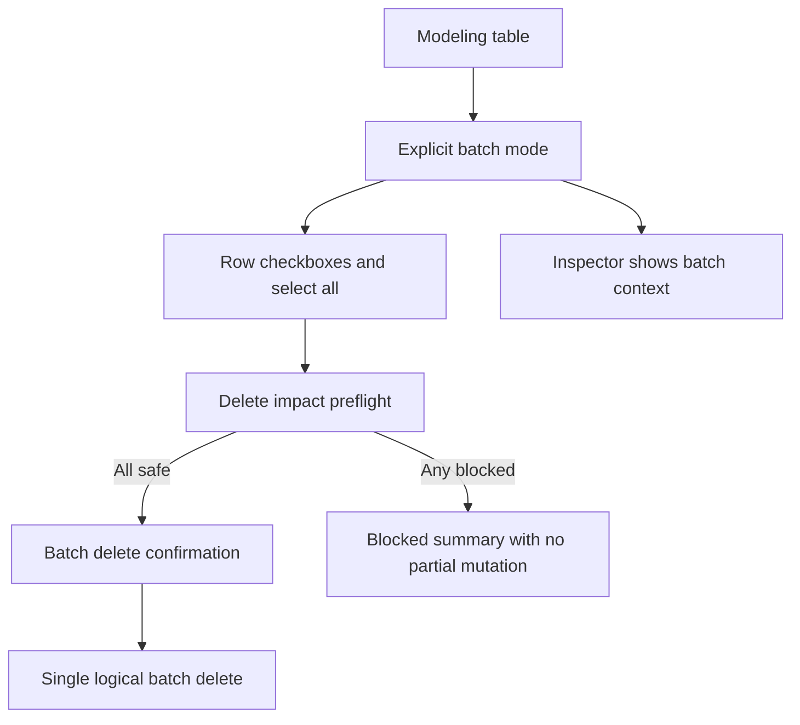

## req_116_batch_delete_mode_for_modeling_tables_with_explicit_multi_selection_and_mixed_impact_handling - Batch delete mode for modeling tables with explicit multi-selection and mixed-impact handling
> From version: 1.4.4
> Schema version: 1.0
> Status: Draft
> Understanding: 97% (the requested user value is clear: delete several modeling items in one operation, but only through an explicit multi-selection mode that does not break existing row-to-edit behavior)
> Confidence: 98% (the main delete-impact policy is explicit, the batch-mode UX now clearly separates multi-selection context from single-item editing, and the remaining list-state behaviors are now locked)
> Complexity: High
> Theme: Modeling list ergonomics / batch destructive actions / dependency-aware deletion
> Reminder: Update status/understanding/confidence and references when you edit this doc.

# Needs
- Users want to delete several modeling items in one pass instead of repeating the same open-select-delete-confirm loop for each row.
- Current modeling tables are built around single-row selection:
  - clicking a row selects it and opens edit behavior;
  - the action row exposes `New`, `Edit`, and `Delete` for one focused row at a time.
- Delete behavior is no longer uniform:
  - some entities are directly deletable;
  - some connector/splice cases are safely cascade-deletable;
  - other cases are blocked and explained through dependency-aware dialogs.
- Because delete outcomes can differ item by item, multi-delete must define what happens when the selected set mixes direct, cascade-capable, and blocked items.

# Context
`req_074` ensured all delete flows are explicitly confirmed. `req_112` then added blocked-delete explanation dialogs and conservative safe cascade-delete support for bounded connector/splice cases. These requests improved safety and clarity for single-item delete flows, but they did not address repetitive cleanup workflows where the operator wants to remove several rows at once.

At the UI layer, the current modeling tables are still single-selection-first:
- connector and splice rows are focusable and open edit on click or keyboard activation;
- action rows operate on the currently focused item only;
- there is no explicit batch-selection mode or checkbox column.

This creates two design constraints for V1 multi-delete:
- adding permanent checkboxes directly into the current table interaction model risks colliding with the existing click-to-edit pattern;
- the right-side editing/form area cannot keep pretending to edit one row while the user is intentionally composing a multi-row batch selection.

Batch deletion must therefore be:
- explicit;
- predictable;
- conservative when mixed delete outcomes exist;
- visually separated from single-item edit mode.

# Objective
- Let users delete several modeling rows in one operation through an explicit batch-selection workflow.
- Preserve the existing single-row click-to-edit interaction outside batch mode.
- Define a conservative V1 mixed-impact policy so batch delete never performs ambiguous partial mutation.

# Scope
- In:
  - modeling table batch selection for row-based entity lists;
  - explicit batch mode UI with row checkboxes;
  - batch delete preflight analysis against existing delete-impact rules;
  - confirmation and blocked-summary UX for multi-selection sets;
  - undo/redo and regression coverage for successful batch deletes.
- Out:
  - cross-screen or cross-entity-type global selection;
  - background auto-selection from canvas or analysis panels;
  - catalog/network-scope batch delete unless explicitly expanded later;
  - partial silent deletion of only the safe subset while blocked rows remain selected.

# Locked execution decisions
- Decision 1: V1 batch delete is limited to modeling tables and operates within the active table/sub-screen only.
- Decision 2: Batch selection is explicit:
  - users enter a dedicated multi-selection mode before checkbox selection appears.
- Decision 3: Outside batch mode, current row click and keyboard activation behavior remains unchanged.
- Decision 4: V1 does not support mixed entity-type batch delete across several tables at once.
- Decision 5: V1 batch delete is all-or-nothing:
  - if any selected row is blocked or otherwise unsafe under existing rules, no rows are deleted.
- Decision 6: Safe cascade-capable connector/splice rows may participate in batch delete only if the exact impact set remains valid under the existing `req_112` contract.
- Decision 7: A successful batch delete is recorded as one logical history operation for undo/redo.
- Decision 8: Entering batch mode exits single-item edit context for the active table.
- Decision 9: While batch mode is active, the editing/form panel is repurposed into a batch-context panel rather than showing an editable single-item form.
- Decision 10: Batch mode exposes a header-level select-all checkbox for currently visible rows rather than a separate `Select all visible` action button.
- Decision 11: Exiting batch mode clears the transient batch selection set.
- Decision 12: Batch mode may be entered on filtered tables, but batch actions remain disabled when no visible/selectable rows are available.
- Decision 13: The batch-context panel should show a compact status summary split across at least:
  - directly deletable;
  - safe cascade-capable;
  - blocked.

# Functional behavior contract
## A. Explicit batch-selection mode
- Each in-scope modeling table should offer an explicit entry point into batch-selection mode.
- In batch mode:
  - a checkbox column appears for rows in the active table;
  - users can toggle individual rows;
  - a header-level select-all checkbox targets the currently visible filtered rows.
- Exiting batch mode clears transient batch selection.

## B. Interaction compatibility with existing tables
- Normal single-selection editing behavior remains the default outside batch mode.
- Batch mode must not unexpectedly open edit forms when the user is trying to toggle row selection.
- Existing filters, sort order, and visible-row counts remain functional.
- Entering batch mode clears or suspends the current single-row edit context for the active table.

## C. Batch context panel behavior
- While batch mode is active, the right-side panel for the active modeling context must stop behaving like a single-item edit form.
- Recommended V1 behavior:
  - replace the edit form with a batch-context panel;
  - show that multi-selection mode is active;
  - summarize the current selection count and selection type;
  - expose batch actions such as `Delete selected` and `Cancel batch mode`.
- The batch-context panel may also surface preflight-oriented information when available, for example:
  - selected row count;
  - directly deletable count;
  - safe cascade-capable count;
  - blocked count.
- This status summary is recommended as a first-class V1 part of the panel, not an optional extra.
- While batch mode is active:
  - single-item form fields are not editable;
  - the UI must not imply that one selected row is still being edited.

## D. Batch delete preflight policy
- Before any destructive batch mutation, the app must analyze every selected row against the current delete-impact contract.
- The preflight result must classify the set at least into:
  - directly deletable rows;
  - safe cascade-capable rows;
  - blocked rows.
- If any blocked rows are present:
  - the app shows a blocked batch summary;
  - no partial deletion occurs in V1.

## E. Confirmation behavior for safe sets
- If every selected row is either directly deletable or safely cascade-capable under existing rules, the app shows a batch confirmation summary before deletion.
- The summary should make the scope understandable, for example:
  - how many rows are selected;
  - what entity type is being deleted;
  - whether local cascade impacts are included.
- Confirming the dialog executes the full batch as one logical operation.

## F. Mixed-impact blocked summary behavior
- If the selected set mixes safe and blocked rows, the app must explain that the current selection cannot be deleted as a batch.
- The blocked summary should identify at least:
  - how many selected rows are blocked;
  - representative blocked references;
  - why batch mutation is refused in V1.
- Users can then adjust the selection and retry.

## G. In-scope entity policy
- Recommended V1 entity coverage:
  - connectors;
  - splices;
  - nodes;
  - segments;
  - wires.
- Connectors/splices may use the existing safe-cascade delete contract where applicable.
- Nodes, segments, and wires continue to respect their existing direct/blocked semantics.

## H. Regression safety
- Existing single-row delete flows must remain available and non-regressed.
- Existing blocked-delete explanation dialogs and safe cascade summaries for single-row flows must remain intact.
- Batch mode must not weaken integrity guards or silently delete a smaller subset than the user selected.
- Exiting batch mode must restore the normal single-item editing workflow cleanly.

# Validation and regression safety
- `python3 logics/skills/logics-doc-linter/scripts/logics_lint.py`
- `npm run -s lint`
- `npm run -s typecheck`
- `npm test -- --run src/tests/app.ui.delete-confirmations.spec.tsx src/tests/app.ui.list-ergonomics.spec.tsx`
- targeted checks around:
  - entering and exiting batch mode;
  - row checkbox selection and select-all behavior;
  - edit panel replacement by batch-context panel while batch mode is active;
  - blocked mixed-impact batch preflight with zero mutation;
  - successful batch delete for safe direct and safe-cascade cases;
  - undo/redo behavior as one logical batch operation.

# Acceptance criteria
- AC1: Modeling tables support an explicit multi-selection mode with row checkboxes without breaking default single-row edit behavior outside that mode.
- AC2: Users can select multiple rows within the active modeling table and trigger one batch delete action for that selected set.
- AC3: While batch mode is active, the single-item edit/form panel for the active table is replaced or suspended by a batch-context panel and no longer behaves like an active single-item editor.
- AC4: Batch delete performs a preflight analysis against existing delete-impact rules before any mutation.
- AC5: If any selected rows are blocked or unsafe, the app shows an explicit blocked batch summary and performs no partial deletion in V1.
- AC6: If all selected rows are directly deletable or safely cascade-capable, the app shows one explicit batch confirmation summary before mutation.
- AC7: A successful batch delete is recorded as one logical undoable operation.
- AC8: Existing single-row delete, blocked-delete explanation, and safe cascade-delete behaviors remain non-regressed.
- AC9: Regression tests cover at least one blocked mixed-impact batch case, one successful safe batch case, and the batch-context-panel behavior.
- AC10: The batch table header exposes a select-all checkbox for currently visible rows, and exiting batch mode clears the transient batch selection state.

# Definition of Ready (DoR)
- [x] Problem statement is explicit and user impact is clear.
- [x] Scope boundaries are explicit.
- [x] Acceptance criteria are testable.
- [x] Dependencies and known risks are listed.

# Risks
- Multi-selection can easily conflict with current click-to-edit table behavior if batch mode is not explicit.
- Keeping a single-item edit form visible during multi-selection would create strong UX ambiguity about what context is active.
- Mixed delete-impact sets can become confusing if the app does not clearly explain why a batch is refused.
- Batch deletion plus safe cascade can create unexpectedly large mutation scopes if the summary is not specific enough.
- Undo/redo semantics can become noisy if the batch is recorded as several separate row deletes instead of one logical operation.

# Companion docs
- Product brief(s): `logics/product/prod_000_modeling_productivity_and_repeated_action_ergonomics.md`
- Architecture decision(s): `logics/architecture/adr_002_destructive_interaction_contracts_for_keyboard_confirmation_and_modeling_batch_delete.md`

# AI Context
- Summary: Add an explicit batch-selection mode to modeling tables so users can delete several rows at once while preserving existing single-row edit behavior and replacing the single-item form with a batch-context panel during multi-selection.
- Keywords: batch delete, multi select, checkbox, modeling table, connectors, splices, nodes, segments, wires, cascade delete
- Use when: Use when implementing or validating explicit multi-selection and batch delete behavior in modeling tables.
- Skip when: Skip when changing only single-row delete flows or non-modeling screens.

# References
- `logics/request/req_074_all_delete_actions_require_styled_confirmation_modal.md`
- `logics/request/req_112_explicit_blocked_delete_feedback_and_dependency_aware_cascade_delete_confirmation.md`
- `src/app/components/workspace/ModelingPrimaryTables.tsx`
- `src/app/components/workspace/ModelingSecondaryTables.tsx`
- `src/store/deleteImpact.ts`
- `src/app/AppController.tsx`
- `src/tests/app.ui.delete-confirmations.spec.tsx`
- `src/tests/app.ui.list-ergonomics.spec.tsx`

# Backlog
- `item_571_modeling_table_batch_mode_state_selection_contract_and_explicit_entry_exit_behavior`
- `item_572_modeling_table_checkbox_ui_and_batch_context_panel_wiring`
- `item_573_batch_delete_preflight_confirmation_and_one_operation_execution_for_modeling_tables`
- `item_574_regression_coverage_and_closure_for_modeling_table_batch_delete_flows`
