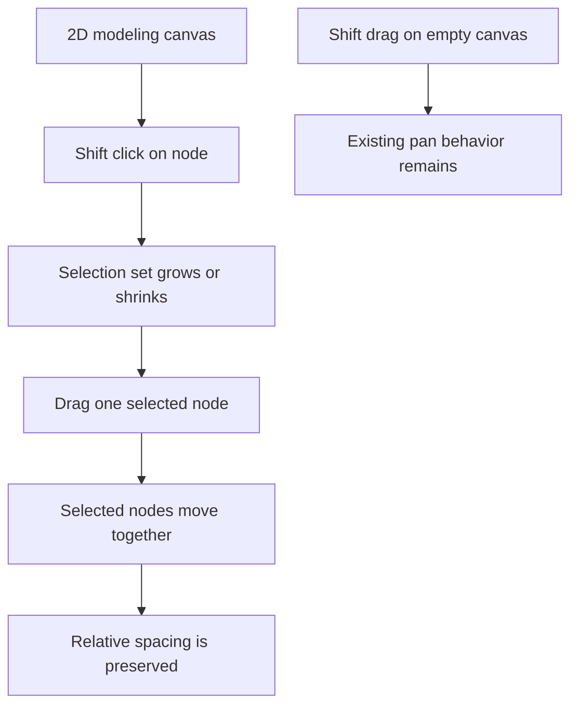

## req_117_shift_click_multi_selection_and_grouped_move_on_the_2d_modeling_canvas - Shift click multi selection and grouped move on the 2D modeling canvas
> From version: 1.4.4
> Schema version: 1.0
> Status: Done
> Understanding: 97% (the feature goal is clear: support canvas-side multi-selection with `Shift+click`, then move the selected set together on the 2D modeling canvas)
> Confidence: 97% (the current canvas already supports single-node selection and single-node drag, and the remaining grouped-selection semantics are now locked to a node-only V1 with explicit group-drag and summary behavior)
> Complexity: High
> Theme: Canvas ergonomics / multi selection / grouped movement
> Reminder: Update status/understanding/confidence and references when you edit this doc.

# Needs
- Users want to manipulate several elements on the 2D modeling canvas in one gesture instead of moving each item individually.
- The current canvas interaction model is centered on single-item selection and single-node drag.
- For layout cleanup and quick spatial adjustments, users need a direct canvas-side way to:
  - add several items to the current selection;
  - keep that selection visible and understandable;
  - move the selected items together while preserving their relative spacing.
- A keyboard-assisted selection gesture is preferred over a persistent special mode for V1.

# Context
The current canvas interaction layer already provides the foundations for this request:
- clicking a node or segment in select mode activates a single target;
- clicking empty canvas in select mode clears the current selection;
- dragging a node moves that single node when entity movement is not locked;
- holding `Shift` while dragging empty canvas starts panning.

That last point is important for the V1 contract:
- `Shift` is already reserved for panning when the pointer starts on empty canvas;
- therefore, `Shift+click` on a selectable canvas entity can be introduced as an additive-selection gesture without conflicting with existing empty-canvas panning behavior.

The current drag implementation is also node-based:
- movement persists through node positions;
- connectors and splices are represented on the canvas through their linked nodes;
- segments and wires derive their rendered geometry from node positions and routing rather than acting as independently dragged visual objects.

This naturally suggests a pragmatic V1:
- multi-selection on the canvas is built around selectable/movable nodes rendered in the 2D view;
- grouped move applies to the selected node set;
- segments and wires update as a consequence of node movement rather than becoming separate dragged entities.

# Objective
- Add canvas-side multi-selection with `Shift+click` in the 2D modeling canvas.
- Allow grouped movement of the selected node set through the existing drag workflow.
- Preserve the current single-selection, empty-canvas clear-selection, and `Shift+drag empty canvas = pan` contracts.

# Scope
- In:
  - additive/removal selection on the 2D modeling canvas via `Shift+click`;
  - visible multi-selection state for the selected canvas items;
  - grouped movement of the selected movable node set;
  - persistence of the moved positions through the existing node-position mechanism;
  - regression coverage for selection, panning, and grouped move behavior.
- Out:
  - list-side batch mode from `req_116`;
  - marquee or lasso rectangle selection in V1;
  - direct independent dragging of segments or wires as separate draggable objects;
  - cross-screen multi-selection shared between tables and canvas in V1.

# Locked execution decisions
- Decision 1: V1 selection gesture is `Shift+click` on a selectable canvas entity.
- Decision 2: Existing `Shift+drag` on empty canvas remains the pan gesture and is not repurposed.
- Decision 3: V1 grouped movement is node-based:
  - movable node positions are the source of truth for the group move.
- Decision 4: V1 grouped move coverage includes canvas nodes that already participate in the node-position layout model:
  - intermediate nodes;
  - connector-linked nodes;
  - splice-linked nodes.
- Decision 5: Segments and wires are not independently dragged in V1; they visually follow from moved node positions and existing routing behavior.
- Decision 6: Dragging one member of the selected node set moves the full selected set while preserving relative offsets.
- Decision 7: Clicking a selectable entity without `Shift` returns to the normal single-selection behavior.
- Decision 8: Clicking empty canvas without `Shift` continues to clear selection in select mode.
- Decision 9: V1 `Shift+click` multi-selection applies to canvas nodes only, not to segments as independently selectable grouped-move members.
- Decision 10: If a node already belongs to the current multi-selection set, dragging that node moves the full selected set directly rather than collapsing first to a single-node selection.
- Decision 11: The UI should expose a compact selection-count summary in inspector/context surfaces, for example `3 selected`, without adding heavy in-canvas chrome in V1.

# Functional behavior contract
## A. Shift click multi-selection
- On the 2D modeling canvas, `Shift+click` on a selectable node toggles that node in the current canvas selection set.
- If the node was not selected, it is added to the set.
- If the node was already selected, it is removed from the set.
- The canvas must make multi-selection visible through a clear selected-state treatment for every selected node.

## B. Single click compatibility
- Clicking a selectable canvas entity without `Shift` keeps the current single-selection behavior:
  - the clicked entity becomes the active single selection;
  - prior multi-selection state is cleared.
- Existing edit-selection flows triggered from normal non-shift click must remain non-regressed.
- Segment clicks continue to use the existing single-selection behavior only; they do not participate in grouped-move multi-selection in V1.

## C. Grouped drag behavior
- When several movable nodes are selected, dragging one selected node moves the full selected node set.
- The movement preserves relative offsets between the selected nodes.
- If the pointer starts on a node that is already part of the selected set, the grouped drag begins directly without first collapsing selection to that single node.
- The drag should respect existing movement constraints such as:
  - lock-entity-movement behavior;
  - snap-to-grid behavior when enabled.
- The implementation should avoid visually desynchronizing the selected set during drag.

## D. Position persistence
- After a grouped drag completes, the resulting node positions must persist through the same persistence path currently used for single-node movement.
- The final result should behave like an intentional canvas layout adjustment, not a transient preview only.

## E. Interaction with empty canvas and pan
- Clicking empty canvas without modifiers still clears selection in select mode.
- Holding `Shift` and dragging empty canvas still pans the view.
- `Shift+click` on a node must not accidentally start the empty-canvas pan path.

## F. Entity semantics in V1
- The multi-selection contract is canvas-node oriented in V1.
- Connectors and splices participate through their linked canvas nodes.
- Segments and wires are not first-class grouped-drag entities in V1 even if they remain visually connected to moved nodes.

## G. Regression safety
- Existing keyboard and mouse activation for single selection remain non-regressed.
- Existing inspector/form synchronization should remain coherent when selection returns from multi-selection to single selection.
- Existing lock-movement behavior must still prevent grouped move when active.
- Inspector/context surfaces should expose the current multi-selection count in a compact way during canvas multi-selection.

# Validation and regression safety
- `python3 logics/skills/logics-doc-linter/scripts/logics_lint.py`
- `npm run -s lint`
- `npm run -s typecheck`
- `npm test -- --run src/tests/app.ui.navigation-canvas.spec.tsx src/tests/app.ui.navigation-canvas-selection-gating.spec.tsx`
- targeted checks around:
  - `Shift+click` add/remove selection on canvas nodes;
  - single click restoring normal single-selection behavior;
  - grouped drag moving all selected nodes with preserved offsets;
  - `Shift+drag` empty canvas pan remaining intact;
  - movement lock preventing grouped drag.

# Acceptance criteria
- AC1: On the 2D modeling canvas, users can add or remove selectable nodes from the current selection with `Shift+click`.
- AC2: Clicking a selectable node without `Shift` preserves the current single-selection behavior and clears prior multi-selection state.
- AC3: When several movable nodes are selected, dragging one selected node moves the entire selected node set together.
- AC4: Grouped movement preserves the relative offsets between the selected nodes.
- AC5: Existing `Shift+drag` empty-canvas pan behavior remains non-regressed.
- AC6: Lock-movement and snap-to-grid behavior remain respected during grouped move.
- AC7: Final grouped-move positions persist through the existing node-position persistence mechanism.
- AC8: Regression tests cover representative multi-selection, grouped move, and panning compatibility paths.
- AC9: Segment interactions remain single-selection-only in V1 and do not become grouped-move members.
- AC10: Inspector/context surfaces show a compact current-selection-count summary during canvas multi-selection.

# Definition of Ready (DoR)
- [x] Problem statement is explicit and user impact is clear.
- [x] Scope boundaries are explicit.
- [x] Acceptance criteria are testable.
- [x] Dependencies and known risks are listed.

# Risks
- `Shift` is already part of canvas interaction behavior, so event sequencing must be handled carefully to avoid accidental pan/selection conflicts.
- Grouped drag can create inconsistent persistence if the implementation keeps only one active dragging node and does not update the rest of the selected set coherently.
- Selection/form synchronization can become confusing if multi-selection does not define how the UI returns to single-edit context.
- Large grouped moves may expose routing or layout edge cases in downstream segment/wire rendering.

# Companion docs
- Product brief(s): `logics/product/prod_000_modeling_productivity_and_repeated_action_ergonomics.md`
- Architecture decision(s): `logics/architecture/adr_003_modeling_create_flow_reset_and_canvas_group_movement_interaction_contracts.md`

# AI Context
- Summary: Add `Shift+click` multi-selection and grouped node movement on the 2D modeling canvas while preserving existing single-selection and empty-canvas pan behavior.
- Keywords: canvas, shift click, multi selection, grouped move, drag, nodes, connector, splice, layout, pan
- Use when: Use when implementing or validating grouped spatial manipulation directly on the 2D modeling canvas.
- Skip when: Skip when working on table-side batch selection or non-canvas delete flows.

# References
- `src/app/hooks/useCanvasInteractionHandlers.ts`
- `src/app/hooks/useSelectionHandlers.ts`
- `src/app/components/NetworkSummaryPanel.tsx`
- `src/app/AppController.tsx`
- `src/tests/app.ui.navigation-canvas.spec.tsx`
- `src/tests/app.ui.navigation-canvas-selection-gating.spec.tsx`
- `logics/request/req_109_new_and_edit_actions_scroll_to_corresponding_form_panel.md`
- `logics/request/req_116_batch_delete_mode_for_modeling_tables_with_explicit_multi_selection_and_mixed_impact_handling.md`

# Backlog
- `item_575_canvas_shift_click_multi_selection_state_and_node_only_selection_contract`
- `item_576_grouped_node_drag_and_persisted_multi_move_behavior_on_the_2d_modeling_canvas`
- `item_577_canvas_multi_selection_inspector_summary_and_single_selection_compatibility_wiring`
- `item_578_regression_coverage_and_closure_for_canvas_multi_selection_and_grouped_move_behavior`
