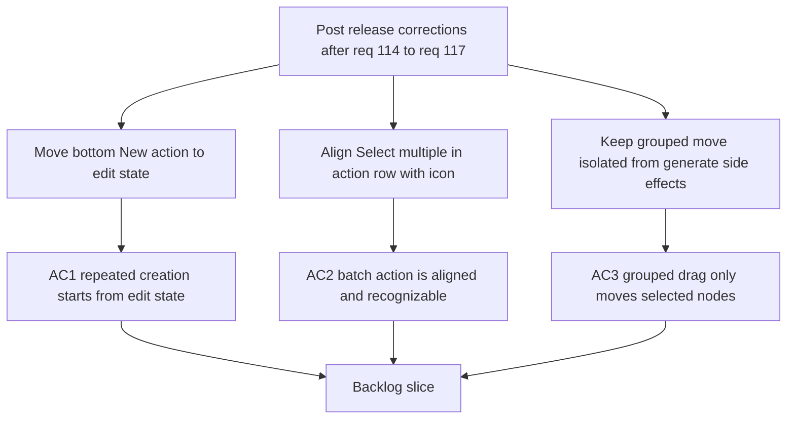

## req_118_post_release_ux_and_grouped_move_corrections_after_req_114_to_req_117 - Post-release UX and grouped-move corrections after req 114 to req 117
> From version: 1.4.4
> Schema version: 1.0
> Status: Ready
> Understanding: 97%
> Confidence: 95%
> Complexity: Medium
> Theme: UI
> Reminder: Update status/understanding/confidence and references when you edit this doc.

# Needs
- Correct the placement of the bottom `New` action so it supports repeated creation from the post-create edit state instead of duplicating the create-mode footer.
- Align the `Select multiple` action with the existing table action bar layout and make the affordance more discoverable with an icon.
- Preserve a clean separation between grouped movement and generation logic on the 2D modeling canvas so `Shift+click` multi-selection only moves the selected nodes.
- Capture these fixes as post-release corrections to the delivered bundle from `req_114` to `req_117`, without expanding scope to new unrelated features.

# Context
The bundle shipped through `req_114` to `req_117` improved repeated creation, destructive workflows, table batch delete, and canvas multi-selection. The operator has now identified four post-release issues in the delivered UX and behavior:

- The bottom `New` button was added in create mode, but the intended acceleration point is the edit mode reached immediately after a successful creation. In its current placement, it duplicates an action already available from the top-level create flow instead of helping chained creation.
- The `Select multiple` button is visually detached from the rest of the table actions. It should live on the same horizontal action row as `New`, `Edit`, and `Delete`, for example between `Edit` and `Delete`.
- The `Select multiple` button currently lacks an icon, which makes the action less scannable than adjacent controls.
- `Shift+click` grouped move on the canvas appears to trigger a generate/recompute after drag, and that recomputation changes the overall plan instead of only persisting the moved selected nodes.

This request is intentionally a post-release correction bundle for the features delivered by:

- [req_114_connector_and_splice_catalog_labels_show_names_and_create_forms_support_chained_new_action.md](/Users/alexandreagostini/Documents/electrical-plan-editor/logics/request/req_114_connector_and_splice_catalog_labels_show_names_and_create_forms_support_chained_new_action.md)
- [req_116_batch_delete_mode_for_modeling_tables_with_explicit_multi_selection_and_mixed_impact_handling.md](/Users/alexandreagostini/Documents/electrical-plan-editor/logics/request/req_116_batch_delete_mode_for_modeling_tables_with_explicit_multi_selection_and_mixed_impact_handling.md)
- [req_117_shift_click_multi_selection_and_grouped_move_on_the_2d_modeling_canvas.md](/Users/alexandreagostini/Documents/electrical-plan-editor/logics/request/req_117_shift_click_multi_selection_and_grouped_move_on_the_2d_modeling_canvas.md)
- [task_092_super_orchestration_delivery_execution_for_req_114_to_req_117_with_validation_gates_and_staged_checkpoints.md](/Users/alexandreagostini/Documents/electrical-plan-editor/logics/tasks/task_092_super_orchestration_delivery_execution_for_req_114_to_req_117_with_validation_gates_and_staged_checkpoints.md)

Scope boundaries:

- In scope: placement and affordance corrections for already-shipped actions, and bug fixing for grouped move persistence/generation interaction.
- Out of scope: redesigning the full Modeling action bar, adding new canvas selection gestures beyond the current `Shift+click` contract, or changing the batch delete rules introduced by `req_116`.

# Clarifications
- The bottom `New` action is intended for the post-create edit state reached immediately after a successful creation. It is not a generic action added to every pre-existing edit state.
- Clicking `New` from that post-create edit state resets toward a fresh empty creation form in V1. No duplication or field prefill is expected.
- The button label stays `Select multiple`. This correction changes placement and affordance, not vocabulary.
- The `Select multiple` action should use an explicit multi-selection icon, preferably a checked-boxes style icon rather than a generic batch-action metaphor.
- The target order is consistent across Modeling screens, with `Select multiple` placed on the same action row as the other controls and logically between `Edit` and `Delete`. On smaller layouts the visual wrapping may change, but the action order should remain the same.
- For grouped move on the canvas, the intended V1 contract is strict: no automatic generate/recompute should run as part of the grouped drag flow.
- If a grouped drag would require a broader recomposition than the selected nodes, the operation should be blocked or constrained rather than mutating unrelated parts of the plan.

# Acceptance criteria
- AC1: After a successful creation in Modeling, the bottom `New` action is available from the resulting edit state so the operator can immediately start a fresh creation without scrolling back to the top. The button is not duplicated as a create-mode-only footer action.
- AC2: On the Modeling table screens, `Select multiple` is rendered on the same horizontal action row as the other primary actions, with a dedicated icon and a stable placement consistent across the supported tables. A suggested placement is between `Edit` and `Delete`.
- AC3: Entering multi-selection on the 2D canvas and dragging a selected node only applies the grouped move to the selected nodes. It must not trigger an automatic generate/recompute as part of the drag flow, and it must not materially change unrelated parts of the plan.
- AC4: The post-release corrections preserve the intended behaviors introduced by the original bundle: chained creation remains fast, batch delete still requires explicit entry into selection mode, and `Shift+click` remains the gesture for canvas multi-selection.

# Definition of Ready (DoR)
- [x] Problem statement is explicit and user impact is clear.
- [x] Scope boundaries (in/out) are explicit.
- [x] Acceptance criteria are testable.
- [x] Dependencies and known risks are listed.

# Companion docs
- Product brief(s): (none yet)
- Architecture decision(s): (none yet)

# AI Context
- Summary: Post-release UX and grouped-move corrections after req 114 to req 117
- Keywords: post-release, and, grouped-move, corrections, req
- Use when: Use when framing scope, context, and acceptance checks for Post-release UX and grouped-move corrections after req 114 to req 117.
- Skip when: Skip when the work targets another feature, repository, or workflow stage.

# Backlog
- `item_579_post_release_ux_and_grouped_move_corrections_after_req_114_to_req_117`
- `item_580_post_create_edit_state_new_action_correction_for_modeling_forms`
- `item_581_select_multiple_action_row_placement_and_icon_alignment_across_modeling_tables`
- `item_582_canvas_grouped_drag_generate_isolation_and_localized_move_persistence_correction`
- `item_583_regression_coverage_and_closure_for_post_release_ux_and_grouped_move_corrections`
