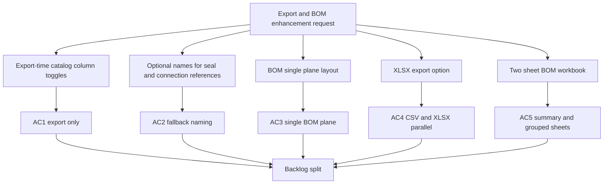

## req_119_bom_and_catalog_export_enhancements - BOM and catalog export enhancements
> From version: 1.4.4
> Schema version: 1.0
> Status: Done
> Understanding: 100%
> Confidence: 100%
> Complexity: High
> Theme: UI
> Non-semantic edit: closed DoR checklist after delivery
> Reminder: Update status/understanding/confidence and linked backlog/task references when you edit this doc.

# Needs
- Add export-time catalog column toggles so selected catalog columns can be omitted from exports only, without changing the on-screen catalog view.
- Let seal and connection references carry an optional human name, with fallback reuse of an already-known name when the same reference is entered again.
- Rework BOM output so connector, seal, and connection references are represented on a single flat plane instead of split into separate sections.
- Provide optional XLSX exports for BOM and wire-by-wire outputs in parallel with the existing CSV flow.
- Add a two-sheet BOM XLSX export with a global summary sheet and a connector-grouped sheet using merged cells for connector identity.

# Context
- The catalog already stores manufacturer reference, connection count, name, unit price, and URL, and the current catalog list shows those fields in the UI.
- The current BOM export is built as a CSV-oriented structure in `src/app/lib/networkSummaryBomCsv.ts` and is triggered from `src/app/AppController.tsx`.
- Wire termination references are already tracked on wires through connection and seal reference fields, but they are currently exported as a separate wire terminations block.
- The project currently depends on CSV export helpers, but does not yet declare an XLSX library in `package.json`, so the XLSX path will require a new dependency and a defined formatting contract.
- The new export behavior should stay additive: CSV remains available, and XLSX becomes an opt-in parallel format controlled by a user action.
- The BOM connector-grouped sheet needs to group seals under the connector they belong to, count quantities correctly, and avoid including splices in that grouped view.
- The connector-grouped sheet should merge the connector ID and name cells across the rows belonging to that connector group, while keeping the grouped rows ordered consistently.
- This request is intentionally broad and should be split into several backlog items after grooming, but it should remain one request record for now.

# Acceptance criteria
- AC1: Users can hide selected catalog columns only when exporting, without affecting the catalog table shown in the UI.
- AC2: Seal and connection references can each store an optional name, and a previously entered name is reused as a fallback when the same reference is typed again.
- AC3: BOM export no longer splits connector, seal, and connection reference data into separate sections; they appear on one common structure with consistent columns.
- AC4: BOM export and wire-by-wire export can be produced as CSV or XLSX in parallel, with XLSX chosen through an explicit option.
- AC5: The BOM XLSX export contains two sheets, one global summary sheet and one connector-grouped sheet with merged connector ID and name cells, correct quantities, and connector-order grouping.

# Definition of Ready (DoR)
- [x] Problem statement is explicit and user impact is clear.
- [x] Scope boundaries are explicit, including what stays CSV-only and what becomes optional XLSX.
- [x] Acceptance criteria are testable and can later be split into bounded backlog items.
- [x] Dependencies, especially the XLSX library choice and workbook formatting rules, are listed.

# Companion docs
- Product brief(s): (none yet)
- Architecture decision(s): (none yet)

# AI Context
- Summary: Add export-time catalog column controls, reference naming fallback, and CSV/XLSX BOM improvements.
- Keywords: catalog, bom, csv, xlsx, seal, connection, connector, export, workbook, merged cells
- Use when: Use when grooming the export and BOM enhancement request into smaller backlog slices.
- Skip when: Skip when the work targets unrelated modeling, routing, or canvas behavior.

# Backlog
- `item_584_catalog_export_column_toggles`
- `item_585_reference_naming_fallback_for_wire_terminations`
- `item_586_flatten_bom_export_into_a_single_plane`
- `item_587_parallel_csv_and_xlsx_export_options`
- `item_588_grouped_bom_workbook_with_merged_connector_rows`
