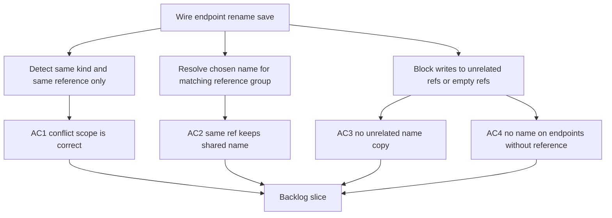

## req_120_wire_endpoint_reference_rename_conflict_scoping_and_cross_reference_contamination_fixes - Wire endpoint reference rename conflict scoping and cross-reference contamination fixes
> From version: 1.4.4
> Schema version: 1.0
> Status: Done
> Understanding: 97%
> Confidence: 95%
> Complexity: High
> Theme: UI
> Reminder: Update status/understanding/confidence and linked backlog/task references when you edit this doc.

# Needs
- Correct the save-time conflict detection for `connection` and `seal` reference naming so a wire endpoint only compares names that belong to the same normalized reference and same reference kind.
- Stop cross-endpoint contamination where the name of one wire endpoint can trigger a conflict dialog for the other endpoint even when the references are different.
- Stop cross-reference contamination where saving one wire can copy a chosen or existing name onto unrelated references, including endpoints that have no corresponding reference at all.
- Preserve the intended fallback behavior: identical references should share the same optional name, but only within the same reference kind and normalized reference key.

# Context
The wire endpoint reference naming flow introduced for `connection` and `seal` references is currently over-applying its synchronization and conflict-resolution logic.

Two concrete bug families have been observed:

- When a wire endpoint uses a reference that already exists multiple times in the database, saving a wire can incorrectly ask the operator to choose between the name of that reference and the name from the other endpoint of the same wire, even when the other endpoint uses a different reference.
- During save-time name resolution, the chosen or existing name can leak to other references. In the reported example, wire A and wire B share `CON_01` with the name `NOM_01`; saving wire A with `NOM_01` still triggers an overwrite prompt, and wire B can end up with a `seal` name even though it has no `seal reference`, which is invalid behavior.

The expected model is narrower:

- conflict detection is scoped by `(kind, normalized reference)` only;
- a `connection` decision must never inspect or mutate `seal` data;
- one endpoint must never inherit candidate names from the opposite endpoint when the reference key differs;
- endpoints with an empty or missing reference must never receive a propagated name.

This request is a targeted bug-fix follow-up to the wire termination naming work delivered after:

- `req_119_bom_and_catalog_export_enhancements`

Scope boundaries:

- In scope: save-time conflict detection, candidate-name collection, overwrite dialog triggering, and name propagation safety for wire endpoint references.
- Out of scope: redesigning the dialog UI, changing the overall fallback concept for identical references, or expanding BOM/catalog export behavior.

# Clarifications
- The conflict dialog must only appear when at least two distinct candidate names exist for the exact same `(reference kind, normalized reference)` group.
- If endpoint A uses reference `CON_01` and endpoint B uses reference `CON_02`, the save flow must not mix their names in one overwrite decision.
- If two wire endpoints share `CON_01` and all known names for `CON_01` normalize to the same value, no overwrite dialog should appear.
- A `connection` rename flow must not inspect, compare, or update any `seal` field, and the inverse is also true.
- An endpoint that has no `connection reference` or no `seal reference` must keep the corresponding name empty; propagation to empty-reference endpoints is always invalid.
- The save flow must remain atomic: cancelling or discarding a conflict choice must leave all wire endpoint names unchanged.

# Acceptance criteria
- AC1: Save-time conflict detection only compares candidate names within the exact same normalized reference and exact same reference kind (`connection` vs `seal`). Different references on the opposite endpoint of the same wire do not participate in the same conflict.
- AC2: When multiple wires share the same normalized reference and all effective names normalize to a single value, saving a wire with that same value does not trigger an overwrite dialog.
- AC3: Resolving or confirming a name for one normalized reference only updates endpoints that carry that exact normalized reference and matching reference kind. No other reference receives that name.
- AC4: Endpoints without a corresponding reference never receive a propagated name during save, including cases where another wire sharing a different reference is updated in the same operation.
- AC5: If the operator cancels or discards a conflict choice, no partial rename is applied anywhere in the dataset.

# Definition of Ready (DoR)
- [x] Problem statement is explicit and tied to reproduced operator-facing bugs.
- [x] Scope boundaries separate rename-conflict bug fixing from unrelated export work.
- [x] Acceptance criteria are testable through save-time scenarios involving repeated references and mixed endpoint data.
- [x] Data-safety expectations are explicit, especially for empty-reference endpoints and atomic cancellation.

# Companion docs
- Product brief(s): (none yet)
- Architecture decision(s): (none yet)

# AI Context
- Summary: Fix save-time wire endpoint reference rename conflict scoping and stop unrelated name propagation.
- Keywords: wire, endpoint, connection, seal, reference, rename, conflict, overwrite, propagation, atomicity
- Use when: Use when grooming or implementing bug fixes around wire endpoint reference naming and conflict resolution.
- Skip when: Skip when the work targets BOM layout, XLSX export, or unrelated modeling workflows.

# Backlog
- `item_589_wire_endpoint_reference_rename_conflict_scoping_and_cross_reference_contamination_fixes`

# Tasks
- `task_103_wire_endpoint_reference_rename_conflict_scoping_and_cross_reference_contamination_fixes`
