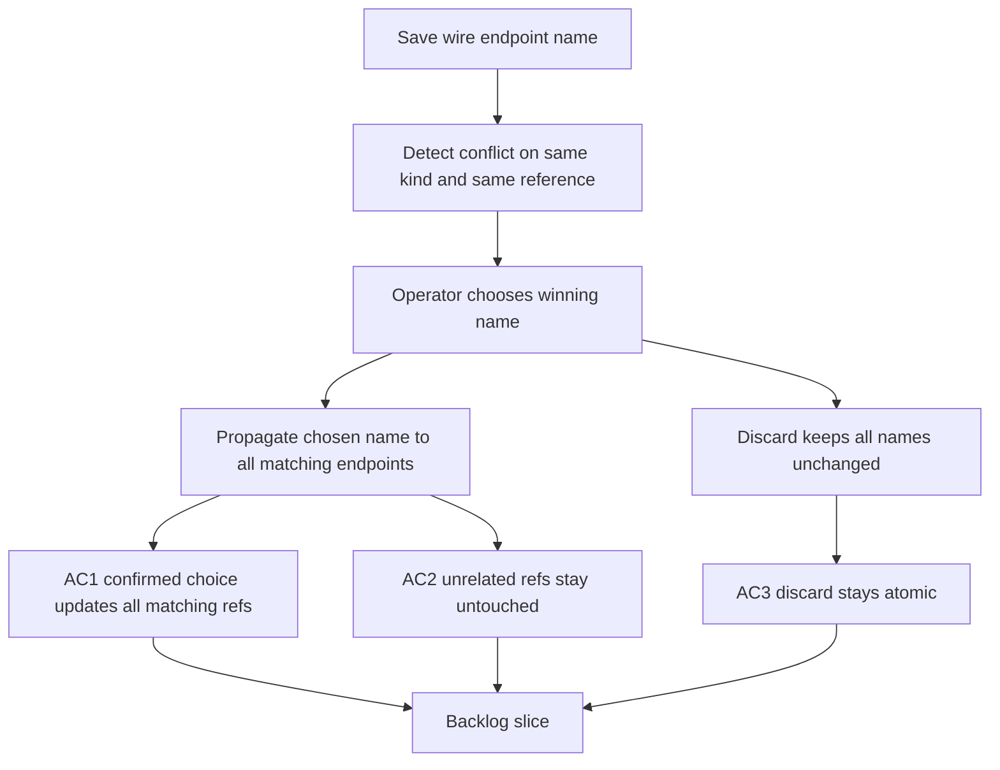

## req_121_global_reference_name_propagation_for_wire_endpoint_renames - Global reference name propagation for wire endpoint renames
> From version: 1.4.4
> Schema version: 1.0
> Status: Done
> Understanding: 98%
> Confidence: 96%
> Complexity: Medium
> Theme: UI
> Non-semantic edit: linked adr_006_global_reference_name_propagation_for_wire_endpoint_renames
> Reminder: Update status/understanding/confidence and linked backlog/task references when you edit this doc.

# Needs
- Restore the intended global naming model for wire endpoint references: one normalized `connection` reference or one normalized `seal` reference must map to one shared name across all wires that carry that same reference.
- When the operator chooses to overwrite a reference name after a detected conflict, apply that chosen name to every wire endpoint that carries the same normalized reference and same reference kind, not only to the endpoint currently being edited.
- Preserve the safeguards introduced by the previous bug fix: no cross-kind contamination, no cross-reference contamination, and no propagation to endpoints that have no corresponding reference.
- Keep the save flow atomic: if the operator cancels or discards the conflict choice, no rename should be applied anywhere.

# Context
The previous correction tightened the rename flow so it no longer mixes names from unrelated references or writes names onto empty-reference endpoints. That safety fix resolved the random-name contamination bug, but it also narrowed propagation too far.

Current observed regression:

- when the operator resolves a naming conflict for a given reference, the chosen name only updates the currently edited wire endpoint instead of all wire endpoints that carry that same reference;
- this breaks the expected product rule that a reference behaves like a shared dictionary key with exactly one effective name per `(kind, normalized reference)`.

Expected model:

- `connection` reference `CON_01` has one effective shared name across the dataset;
- `seal` reference `SEAL_01` has one effective shared name across the dataset;
- if a different name is entered for an already-known reference, the operator should choose which name wins;
- once the choice is confirmed, every endpoint carrying that exact `(kind, normalized reference)` must be updated to the chosen name;
- endpoints carrying another reference, another kind, or no reference must remain untouched.

This request is a focused follow-up to:

- `req_120_wire_endpoint_reference_rename_conflict_scoping_and_cross_reference_contamination_fixes`

Scope boundaries:

- In scope: restoring dataset-wide propagation for identical references after a confirmed overwrite choice, while preserving the isolation guards from the previous fix.
- Out of scope: redesigning the choice dialog, changing how references are normalized, or changing BOM/catalog export behavior.

# Clarifications
- The uniqueness rule is per `(reference kind, normalized reference)`, not per wire endpoint.
- If wire A and wire B both carry `connection` reference `CON_01`, they must end up with the same chosen `connection name` after a confirmed overwrite.
- If one wire carries `CON_01` on endpoint A and another carries `CON_01` on endpoint B, both matching endpoints must be updated.
- If a wire carries `CON_01` on one endpoint and `CON_02` on the other, confirming the name for `CON_01` must not affect `CON_02`.
- `connection` and `seal` remain fully isolated namespaces even if their reference text is identical.
- Endpoints without a corresponding reference remain ineligible for propagation.

# Acceptance criteria
- AC1: When the operator confirms a name choice for a given normalized `connection` reference, every wire endpoint carrying that same normalized `connection` reference is updated to the chosen name across the dataset.
- AC2: When the operator confirms a name choice for a given normalized `seal` reference, every wire endpoint carrying that same normalized `seal` reference is updated to the chosen name across the dataset.
- AC3: Confirming a name choice for one `(kind, normalized reference)` never updates another reference, another kind, or an endpoint whose corresponding reference is empty or undefined.
- AC4: If all known names for a given `(kind, normalized reference)` already normalize to the same value, saving that same value does not trigger an unnecessary overwrite dialog.
- AC5: If the operator cancels or discards the overwrite choice, no rename is applied anywhere in the dataset.

# Definition of Ready (DoR)
- [x] Problem statement clearly identifies the regression introduced after the previous safety fix.
- [x] The intended business rule is explicit: one shared name per normalized reference and kind.
- [x] Acceptance criteria separate global propagation from contamination safeguards.
- [x] The request remains scoped to rename behavior and does not widen into unrelated export or modeling work.

# Companion docs
- Product brief(s): (none yet)
- Architecture decision(s): `adr_006_global_reference_name_propagation_for_wire_endpoint_renames`

# AI Context
- Summary: Restore dataset-wide shared-name propagation for identical wire endpoint references after a confirmed overwrite choice.
- Keywords: wire, endpoint, connection, seal, reference, shared name, overwrite, propagation, global sync, atomicity
- Use when: Use when grooming or implementing the follow-up correction that restores global rename propagation for identical references.
- Skip when: Skip when the work targets unrelated contamination bugs that are already fixed, or non-rename features.

# Backlog
- `item_590_global_reference_name_propagation_for_wire_endpoint_renames`

# Tasks
- `task_104_global_reference_name_propagation_for_wire_endpoint_renames`
