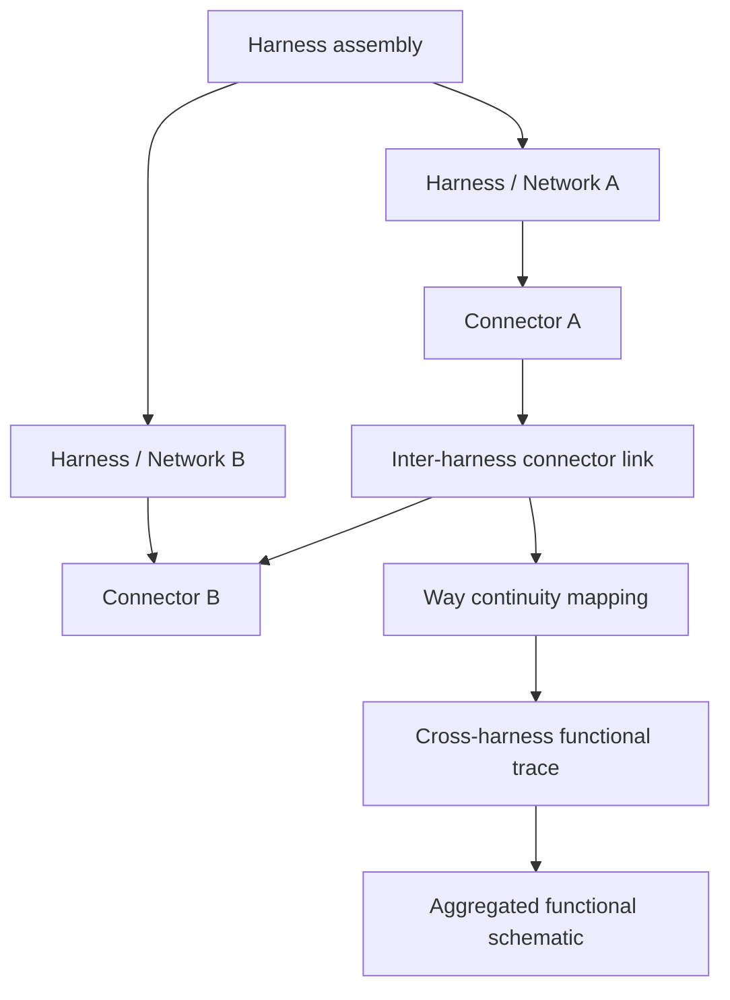

## req_122_multi_harness_super_category_and_cross_harness_functional_schematic - Multi-Harness Super Category and Cross-Harness Functional Schematic
> From version: 1.6.4
> Schema version: 1.0
> Status: Done
> Understanding: 99%
> Confidence: 97%
> Complexity: Large
> Theme: Multi-Harness Modeling and Functional Traceability
> Reminder: Update status/understanding/confidence and linked backlog/task references when you edit this doc.

# Needs
- Add a new modeling level above an individual harness/network so several harnesses can be grouped into one higher-level assembly.
- Allow two connectors belonging to two different harnesses to be linked together as a physical-only inter-harness connection.
- Let wire continuity, signal continuity, and command continuity traverse those connector-to-connector links across multiple harnesses.
- Extend the functional schematic view so it can display the functional trace of the whole higher-level assembly, not only one isolated harness.
- Preserve existing single-harness workflows and existing functional schematic behavior when no multi-harness grouping is used.

# Context
The current model can represent a harness/network with connectors, splices, wires, segments, and a read-only functional schematic derived from the network model. This is useful for reviewing continuity inside one harness, but it does not yet model a larger system composed of several harnesses connected together.

The requested feature introduces a super-category above the harness level. This higher-level entity would group multiple harnesses and define explicit inter-harness links between connectors. Once connector A from harness 1 is linked to connector B from harness 2, the application should treat compatible wires/signals/commands as continuous across that boundary for functional tracing.

Example target scenario:

- harness `H1` contains connector `C_H1_OUT`;
- harness `H2` contains connector `C_H2_IN`;
- the operator declares that `C_H1_OUT` and `C_H2_IN` are mated or connected;
- signal `SIG_IGNITION` starts in `H1`, passes through the connector link, and continues through wires in `H2`;
- the functional schematic for the super-category shows the complete trace across `H1` and `H2`.

This request should be treated as a product/modeling capability first. The exact UI name is still open: possible names include `Harness assembly`, `Harness group`, `System`, `Installation`, or `Vehicle architecture`.

# Functional Scope
## A. Super-category above harness/network
- Introduce a first-class entity that can contain or reference several harnesses/networks.
- The entity must have a user-visible name and a stable technical ID.
- The operator can add/remove harnesses from this group without deleting the harness data itself.
- The existing single-harness data model must remain valid for users who do not need the higher-level grouping.

## B. Inter-harness connector link model
- Add a way to define a link between two connectors that belong to two different harnesses.
- The link should represent a mated connector pair, jumper, interface, or equivalent continuity bridge.
- At minimum, the link must identify:
  - source harness and connector;
  - target harness and connector;
  - optional direction/role labels if needed later;
  - optional status such as draft/validated if validation requires it.
- The model must prevent invalid links such as connector-to-self, missing connector references, or links across deleted harnesses.

## C. Pin/way continuity across linked connectors
- Define how individual connector ways/cavities are mapped across the linked connectors.
- Suggested default: use same way number on both connectors when both connectors have matching way counts.
- Allow explicit overrides when way numbers do not match or when a harness adapter swaps pins.
- Functional continuity must not assume full connector continuity unless the mapping rule says it is valid.

## D. Cross-harness functional trace derivation
- Extend the functional schematic graph derivation so traversal can cross from one harness to another through declared connector links.
- Preserve current filters such as signal, power, ground, 48V, and CAN where applicable.
- The derived trace should identify which harness each node/wire belongs to so the UI can visually separate or label boundaries.
- The graph derivation must guard against cycles created by inter-harness links.

## E. Functional schematic UI for the whole assembly
- Add a way to open the functional schematic at the super-category level.
- The view should show traces from all harnesses included in the group, crossing connector links when continuity is defined.
- The UI should make harness boundaries visible without making the trace unreadable.
- Existing export behavior should remain available for the aggregated functional schematic if technically feasible.

## F. Validation, migration, and compatibility
- Existing saved data must load unchanged.
- New schema fields must be versioned and migration-safe.
- Import/export must preserve the new super-category and connector-link data.
- Validation should surface broken inter-harness links, missing connectors, incompatible way mappings, and ambiguous continuity.

# Clarification Questions With Suggested Defaults
- Q1: What should the higher-level entity be called in the UI?
  - Answer: use `Harness assembly`.
- Q2: Should the current `Network` entity be considered equivalent to one harness?
  - Answer: yes. A `Network` is a harness in this model.
- Q3: When two connectors are linked, should continuity map by same way number automatically?
  - Answer: yes. Pins/ways are referenced symmetrically across both sides: way `1` maps to way `1`, way `2` maps to way `2`, and so on.
- Q4: Can one connector be linked to more than one connector in another harness?
  - Answer: no for the first version. One connector link represents one paired interconnector relation.
- Q5: Should cross-harness functional schematic traversal be global by default or scoped to selected root connectors/signals?
  - Answer: use a pre-filtered view first so the trace stays readable.
- Q6: Should the aggregated functional view show harness boundaries as swimlanes, grouped columns, color bands, or simple labels?
  - Answer: the trace starts from the configured master connector and continues through connected wires until the final connector. When the trace crosses an interconnector, that crossing is represented by a dedicated block. Each wire is rendered in the color assigned to its harness so the operator can immediately see which harness each part of the trace belongs to.
- Q7: Should connector links be physical-only, or can they also represent logical command/signal continuity?
  - Answer: physical-only. Signal/command continuity is derived from wires and symmetric way mappings, not manually declared on the connector link.

# Clarified Behavior
- `Harness assembly` is the user-facing name for the new super-category.
- A current `Network` is treated as one harness.
- Inter-harness connector links use symmetric way continuity in the first version: `1 -> 1`, `2 -> 2`, `3 -> 3`, and so on.
- A connector can participate in only one inter-harness connector link in the first version.
- The aggregated functional schematic is filtered before rendering; it should not default to an unrestricted full-assembly graph.
- The functional trace starts at the configured master connector and continues wire-by-wire until the final connector.
- Interconnector crossings are rendered as dedicated blocks in the trace.
- Wires are colored by harness membership so the operator can distinguish which harness owns each trace segment.
- Multiple master connectors can be configured for one `Harness assembly`.
- Before rendering the aggregated functional schematic, the operator can select one or more master connectors as trace roots.
- The trace stops when there is no further wire/interconnector continuity, or when it reaches a connector marked as terminal.
- Harness colors are generated automatically by default and can be manually adjusted in the `Harness assembly` properties.
- If two linked connectors do not expose the same number of pins/ways, the link remains allowed but validation reports a warning; the functional trace only crosses symmetric pin pairs that are valid on both sides.
- Clicking an interconnector block opens a detail panel with navigation access to both linked connectors and both related harnesses.

# Additional Clarifications
- Master connector selection: several master connectors may exist in the same `Harness assembly`; the functional view should let the operator choose one or more roots before generating the trace.
- Trace termination: the trace should naturally stop at continuity boundaries, and connector metadata may explicitly mark a connector as terminal for clearer end-of-line behavior.
- Harness color ownership: each harness gets an automatic display color in the assembly view, with manual override support for readability.
- Incomplete interconnector mappings: mismatched connector way counts are warnings, not hard blockers. The application should only trace ways that exist symmetrically on both connectors.
- Interconnector navigation: the interconnector block is an interactive trace element that can open linked connector and harness details.

# Q7 Decision
An inter-harness connector link is physical-only in the first version.

Physical-only means: the operator says "connector A is plugged into connector B", then the application derives signal or command continuity from the wires, connector ways, and symmetric way mapping. In this mode, the connector link does not manually say "this is signal X" or "this command continues here"; it only creates the bridge that lets the trace continue through the existing wire data.

Logical continuity means: the connector link itself could declare that a signal, command, or function continues across the boundary even if the detailed wire/way data is incomplete or different.

Decision: use physical-only connector links. This keeps the source of truth technical and deterministic: wires plus way mapping define continuity, and the functional schematic only derives from that model.

# Acceptance Criteria
- AC1: The application can create and persist a higher-level harness assembly that references multiple existing harnesses/networks.
- AC2: The operator can define a valid inter-harness connector link between two connectors from different harnesses.
- AC3: The connector link supports deterministic way continuity, including automatic same-way mapping and explicit mapping overrides where needed.
- AC4: Functional schematic traversal can cross a valid connector link and continue through wires in another harness.
- AC5: The aggregated functional schematic clearly indicates harness boundaries and connector-link crossing points.
- AC6: Existing single-harness functional schematic behavior remains unchanged when no harness assembly or connector link is used.
- AC7: Import/export and persistence preserve harness assemblies, linked harness references, connector links, and way mappings.
- AC8: Validation reports broken or ambiguous cross-harness links without corrupting existing harness data.
- AC9: The aggregated functional schematic can be generated from one or more selected master connectors within a harness assembly.
- AC10: The trace stops at natural continuity boundaries or at connectors explicitly marked as terminal.
- AC11: Each harness in the aggregated functional trace has an automatic display color that can be manually overridden in assembly properties.
- AC12: Linked connectors with mismatched pin/way counts are allowed with validation warnings, and tracing only crosses symmetric pin pairs valid on both sides.
- AC13: Clicking an interconnector block opens a detail/navigation surface for both linked connectors and their harnesses.

# Out of Scope
- Full 3D harness routing or physical packaging constraints.
- Automatic electrical compatibility checks beyond declared way continuity and existing wire/signal metadata.
- Automatic discovery of connector links without user modeling input.
- Full vehicle architecture management if the first version only needs one assembly level above harnesses.
- Changing the existing single-harness functional schematic UX unless required for shared components.

# Definition of Ready (DoR)
- [x] User problem identifies the need to group multiple harnesses and trace continuity across them.
- [x] The first modeling boundary is explicit: add one super-category above harness/network.
- [x] The core continuity mechanism is explicit: link two connectors from different harnesses and derive continuity through mapped ways.
- [x] UI naming for the super-category is confirmed.
- [x] First-version connector-link cardinality is confirmed.
- [x] Functional schematic boundary rendering style is confirmed.
- [x] Physical-only versus logical connector-link semantics are confirmed.
- [x] Multiple master connector roots are confirmed.
- [x] Trace termination behavior is confirmed.
- [x] Harness color behavior is confirmed.
- [x] Incomplete interconnector validation behavior is confirmed.
- [x] Interconnector block navigation behavior is confirmed.

# Companion Docs
- Product brief(s): `logics/product/prod_001_multi_harness_assembly_traceability.md`
- Architecture decision(s): `logics/architecture/adr_007_harness_assembly_and_physical_interconnector_contract.md`

# AI Context
- Summary: Add a harness assembly level above individual harnesses/networks and support functional schematic tracing across multiple harnesses through linked connectors and mapped ways.
- Keywords: harness, network, harness assembly, connector link, mated connectors, way mapping, cross-harness continuity, functional schematic, signal trace, command trace
- Use when: Use when grooming or implementing multi-harness grouping, connector-to-connector links across harnesses, or aggregated functional schematic traversal.
- Skip when: Skip when the work only changes single-harness rendering, catalog metadata, or unrelated connector form ergonomics.

# Backlog
- `item_591_harness_assembly_data_model_persistence_and_migration`
- `item_592_inter_harness_connector_links_and_symmetric_pin_continuity`
- `item_593_cross_harness_functional_trace_derivation_from_master_connectors`
- `item_594_aggregated_functional_schematic_ui_interconnector_blocks_and_harness_coloring`
- `item_595_multi_harness_validation_import_export_and_regression_coverage`

# Tasks
- `task_105_multi_harness_assembly_and_cross_harness_functional_schematic_orchestration`

# Delivery status
- Core assembly model, persistence, import/export, validation, and cross-harness trace derivation are implemented.
- The Network Scope view now includes an operator panel to create/edit harness assemblies, choose member harnesses, assign colors, select master connector roots, and add/remove physical interconnector links.
- Aggregated functional schematic rendering shows interconnector blocks, harness-colored edges, and an interconnector detail surface with navigation to both linked connectors.
