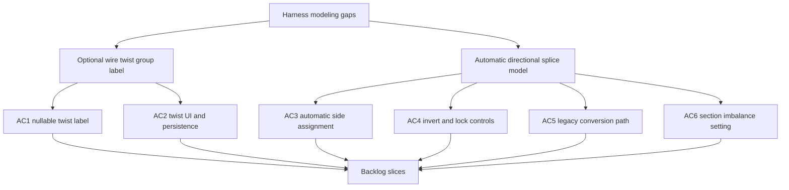

## req_122_wire_twist_groups_and_left_right_splice_pin_mode - Wire twist groups and left right splice pin mode
> From version: 1.6.2
> Schema version: 1.0
> Status: Done
> Understanding: 96%
> Confidence: 96%
> Complexity: High
> Theme: Modeling
> Reminder: Update status/understanding/confidence and linked backlog/task references when you edit this doc.

# Needs
- Add an optional twist group label on each wire so operators can mark wires that must be twisted together, for example CAN pairs or other twisted harness groups.
- Keep the default wire twist value empty/null so existing projects and simple wires are not affected.
- Replace the splice behavior so a splice no longer behaves like a connector with numbered ports, but like a physical fusion point that records whether each connected wire arrives from the left or from the right.
- Preserve compatibility with existing splice-based projects by proposing a conversion path for old numeric-port networks.

# Context
Two modeling gaps are becoming visible in harness-oriented workflows.

First, some wires belong to a twist group. The application currently models wires as independent routed entities, but it has no explicit field to express that wires should be twisted together. A nullable twist label would let the operator assign the same value, such as `CAN 1`, to wires that must be treated as one twisted group without forcing every wire to carry a value.

Second, the current splice model behaves like a multi-port connector: a splice has a port count and each wire endpoint selects a numbered port. This is useful for generic graph modeling, but it does not match the physical interpretation of an electrical splice. In practice, a splice is a fusion point where the important information is the side from which the wire arrives. For that workflow, each splice endpoint should be assigned to `L` for left or `R` for right rather than to an arbitrary numeric port.

The `L` / `R` assignment should be automatic by default. The app should infer the side from routing and from the visual disposition of nodes and segments: wires that arrive from the same side of the splice node receive the same side assignment. Operators still need control tools for edge cases: they must be able to invert all ports on a splice (`L` becomes `R`, `R` becomes `L`) and to force and lock a specific side assignment when the automatic interpretation is not what they want.

Expected product direction:

- Wires can optionally carry a twist group label.
- Twist group values may be human-readable labels, for example `CAN 1`; they should not be limited to strict integers.
- Empty twist group remains the default and means "not assigned to a twist group".
- Splices use a left/right pin model with exactly two endpoint values: `L` and `R`.
- The creation flow no longer offers bounded or unbounded numeric splice port modes for new splices.
- Existing projects using numbered splice ports must be offered a conversion path instead of silently losing data.
- New directional splice side assignment is automatic from routing and the visible node/segment layout.
- If routing or geometry is ambiguous, the fallback assignment is arbitrary but deterministic: `R` is assigned to the side where fewer connectors in the harness stand.
- Operators can invert every side assignment on a splice when the automatic orientation is reversed.
- Operators can force and lock a side assignment for cases where the automatic routing-based side is not appropriate; the override is stored per wire endpoint near the existing way/port index data.
- Directional splice mode allows multiple wires on each side with no maximum count per side.
- Directional splice validation warns when the total wire section differs too much between the `L` and `R` sides.
- The section imbalance threshold is configurable in Settings and defaults to `300%`.
- The comparison is based on total section ratio: with a `200%` limit, `2 mm2` on one side and `4 mm2` on the other reaches the limit.
- Existing projects using numbered splice ports must continue to load safely.
- The UI, validation, import/export, BOM-adjacent summaries, and persistence layers must stay coherent with the chosen data model.

Implementation framing:

- Treat directional `L` / `R` behavior as the new splice model for creation and editing.
- Prompt legacy numeric splice conversion at import/load time, with an explicit option to keep the old design for that network.
- Do not continue exposing numeric splice mode as a normal creation option for new splices.
- Store enough metadata to distinguish automatic side assignment, inverted orientation, and forced/locked side overrides, with locked overrides attached to the wire endpoint.
- Treat the total-section mismatch warning as configurable validation, not as a hard blocking save rule.

# Acceptance criteria
- AC1: A wire can store an optional twist group label; the default value for existing and newly created wires is empty/null.
- AC2: The wire create/edit UI lets the operator enter labels such as `CAN 1`, clear them, and later modify them without affecting routing or endpoint assignment.
- AC3: The wire list, wire analysis, and relevant exports expose the twist group label where wire identification data is already shown.
- AC4: Newly created splices use the directional model and no longer ask the operator to choose bounded or unbounded numeric port behavior.
- AC5: Wire endpoints connected to a directional splice are assigned to `L` or `R` automatically from routing and from the visible disposition of nodes and segments.
- AC6: Wires arriving from the same side of the splice node receive the same automatic side assignment.
- AC7: If routing or visual geometry is ambiguous, the fallback side assignment remains deterministic and assigns `R` to the side where fewer connectors in the harness stand.
- AC8: The operator can invert all side assignments on a splice so every `L` becomes `R` and every `R` becomes `L`.
- AC9: The operator can force and lock a side assignment per wire endpoint when the automatic routing-based side must be overridden, with the control placed near the existing way/port index area.
- AC10: Directional splice mode allows multiple wires on `L` and multiple wires on `R`, with no maximum count per side.
- AC11: Validation and occupancy logic remain coherent for multiple wires per side and do not reject valid physical fusion cases.
- AC12: Settings expose a configurable section imbalance threshold expressed as a percentage ratio, with a default value of `300%`.
- AC13: The section imbalance warning compares total section per side; for example, with a `200%` threshold, `2 mm2` on one side and `4 mm2` on the other reaches the warning threshold.
- AC14: Section imbalance warnings are visible validation issues but do not block save.
- AC15: Existing saved projects with bounded or unbounded numeric splice ports trigger an import/load conversion prompt that offers conversion to directional splices or keeping the old design.
- AC16: Import/export and persistence schemas document the new wire twist label, directional splice side assignment, fallback rule, inversion state, per-endpoint locked overrides, and section imbalance setting so future migrations remain explicit.

# Definition of Ready (DoR)
- [x] Problem statement is explicit and user impact is clear.
- [x] Scope boundaries are identified at request level.
- [x] Acceptance criteria are testable at product behavior level.
- [x] Twist group accepts human-readable labels, not only numbers.
- [x] Directional splice replaces normal creation of bounded and unbounded numeric splice port modes.
- [x] Directional splice allows multiple wires per side with no maximum count.
- [x] Section mismatch warning threshold is configurable in Settings.
- [x] Default section mismatch threshold is `300%`.
- [x] Directional side assignment is automatic from routing and visual layout.
- [x] Operator controls include invert all sides and force/lock side assignment.
- [x] Existing numeric splice conversion is prompted at import/load time with an option to keep the old design.
- [x] Ambiguous automatic assignment uses an arbitrary deterministic fallback where `R` is the side with fewer connectors in the harness.
- [x] Forced/locked side overrides are stored per wire endpoint near the way/port index data.

# Scope boundaries
- In scope: wire twist group label storage, wire UI exposure, directional splice replacement behavior, automatic `L` / `R` assignment, invert and lock controls, multiple wires per side, configurable section imbalance warnings, persistence, and import/export compatibility.
- Out of scope: automatic twisted-pair routing, automatic physical bundle layout, CAN-specific electrical validation, and BOM pricing changes unless later backlog grooming makes them explicit.

# Resolved decisions
- Legacy numeric splice conversion is prompted during import/load, and the operator can keep the old design for that network.
- Ambiguous automatic side assignment uses a deterministic arbitrary fallback: `R` is assigned to the side where fewer connectors in the harness stand.
- Forced and locked side overrides are stored per wire endpoint near the existing way/port index data.

# Companion docs
- Product brief(s): (none yet)
- Architecture decision(s): (none yet)

# AI Context
- Summary: Add nullable wire twist group labels and replace numeric splice ports with automatic directional left/right splice modeling.
- Keywords: wire, twist group, twisted pair, CAN, splice, left, right, automatic side, invert, lock, section warning, migration, persistence
- Use when: Use when grooming or implementing harness modeling improvements for twisted wires and directional splice endpoints.
- Skip when: Skip when the work only targets connector cavities, BOM pricing, or unrelated wire reference naming behavior.
# Backlog
- `item_591_wire_twist_groups_and_left_right_splice_pin_mode`

# Tasks
- `task_105_wire_twist_groups_and_left_right_splice_pin_mode`
