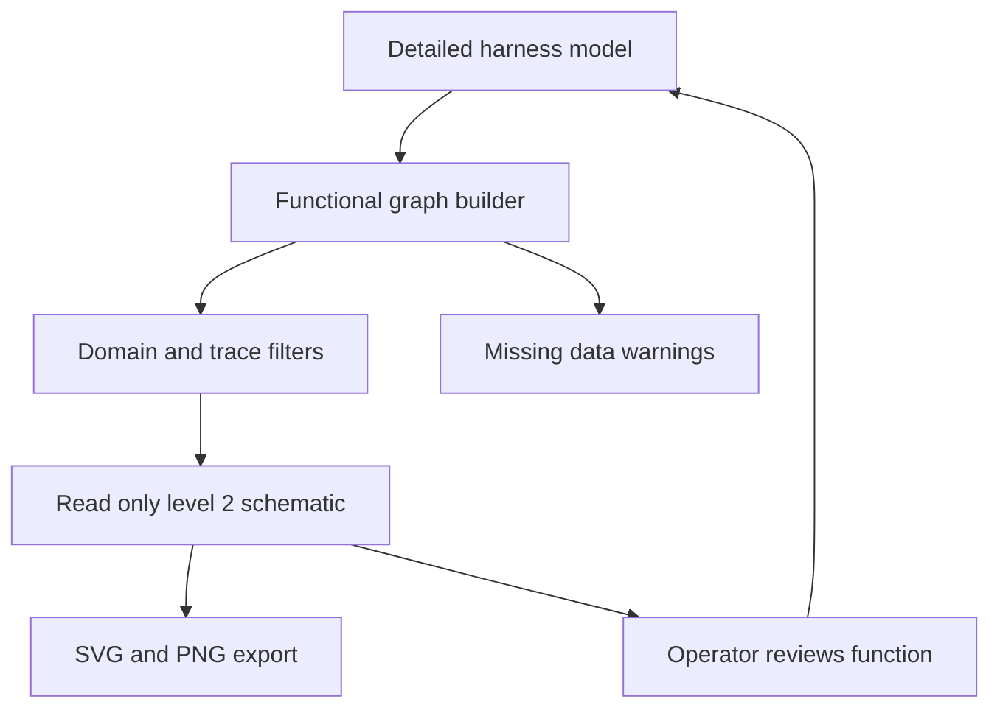

## req_123_mvp_read_only_functional_derived_views - MVP read-only functional derived views
> From version: 1.6.3
> Schema version: 1.0
> Status: Done
> Understanding: 94%
> Confidence: 88%
> Complexity: High
> Theme: Visualization
> Reminder: Update status/understanding/confidence and linked backlog/task references when you edit this doc.

# Needs
- Add a read-only MVP view that generates a simplified functional schematic from the existing detailed harness model.
- Keep the detailed modeling view as the only source of truth; generated views must not be edited independently or persisted as separate authoritative data.
- Let an operator generate a functional trace from an existing wire, splice, connector, or component-like endpoint and follow the electrical chain without physical routing noise.
- Reuse the existing network summary/export foundations where possible so the MVP remains bounded.

# Context
The current application primarily models the detailed physical harness: wires, connector endpoints, splice endpoints, nodes, segments, lengths, routing, and inline protections. That model is accurate for detailed authoring, but it is too dense when the operator needs to understand a function such as:

`BCM C1 pin 12 -> fuse F12 -> splice S08 -> actuator pin 2`

The MVP should derive a simplified level 2 functional schematic from the detailed model. It should preserve meaningful electrical elements and IDs, while hiding physical routing details such as intermediate nodes, segments, branch geometry, and wire lengths.

Level 1 architecture synopsis is intentionally deferred. It needs stronger semantic metadata for blocks such as BCM, PCU, BMS, DCDC, doors, HVAC, lighting, telematics, battery, and fuse box. The MVP should not attempt broad vehicle-level architecture aggregation with fragile naming heuristics.

# Acceptance criteria
- AC1: The application provides a read-only derived functional schematic view generated from the existing detailed model.
- AC2: The generated view cannot be edited independently; any correction must be made in the detailed model and then regenerated.
- AC3: The MVP supports generating a trace from at least one selected wire.
- AC4: The MVP supports generating a trace from connector and splice selections when enough endpoint data is available.
- AC5: The functional trace keeps significant elements: connector, pin/cavity, splice, inline fuse/protection, source endpoint, destination endpoint, ground-like endpoint, and power-like endpoint when those can be inferred from existing data.
- AC6: The functional trace hides physical-only elements: routing nodes, path segments, branch geometry, wire lengths, and intermediate passage points.
- AC7: The generated view preserves source IDs for wires, connectors, pins/cavities, splices, fuses/protections, and inferred endpoints so the operator can relate the schematic back to the detailed model.
- AC8: The MVP exposes simple filters for `12 V`, `48 V`, `CAN`, and existing subnetwork/domain tags when those values are available in the current data.
- AC9: If classification data is missing, the view still generates the trace and reports a non-blocking warning instead of failing silently.
- AC10: Warnings cover at minimum missing endpoint references, unresolved connector or splice references, missing fuse/protection labels, ambiguous domain classification, and disconnected trace paths.
- AC11: The MVP can export the generated functional view to SVG and PNG through the existing export pipeline or a compatible local extension of it.
- AC12: PDF export is out of scope for the MVP unless it is already directly supported by the existing export pipeline without adding a new dependency.
- AC13: The generated view is recomputed from the current network state and is not stored as an independent editable graph in the saved project file.
- AC14: No mandatory save-file schema migration is required for the MVP unless implementation discovers that a small optional UI preference must be persisted.
- AC15: Automated tests cover functional graph derivation, trace generation from a wire, hiding of physical-only nodes, ID preservation, warnings for incomplete data, and export action availability.

# Definition of Ready (DoR)
- [x] Problem statement is explicit and user impact is clear.
- [x] Scope is limited to a level 2 functional schematic MVP.
- [x] Level 1 architecture synopsis is explicitly out of scope for this request.
- [x] The detailed model remains the only source of truth.
- [x] Generated views are read-only.
- [x] Acceptance criteria are testable.
- [x] Dependencies and known risks are listed.

# Scope boundaries
- In scope: level 2 functional trace generation, read-only schematic rendering, trace entry from wire/connector/splice where available, simple domain filters, ID preservation, warnings, SVG/PNG export, and targeted automated tests.
- Out of scope: editable generated schematics, level 1 architecture synopsis, automatic semantic classification of vehicle blocks, new component taxonomy, PDF export requiring a new dependency, new relay/sensor/actuator entity modeling, and manual layout authoring for generated views.

# Implementation notes
- Prefer a derived graph pipeline under `src/core` or a similar existing domain boundary instead of storing a second graph in application state as authoritative data.
- Candidate modules to inspect or extend include `src/core/entities.ts`, `src/core/graph.ts`, `src/core/pathfinding.ts`, `src/store/selectors.ts`, `src/app/components/NetworkSummaryPanel.tsx`, and `src/app/components/network-summary/export/useNetworkSummaryExportActions.ts`.
- The functional graph should collapse physical routing nodes and segments while retaining significant electrical nodes and source IDs.
- Inline fuse/protection data may need to be represented as virtual read-only graph nodes derived from wire data.
- The UI should make regeneration implicit from the current network state, not a separate saved artifact.

# Risks and constraints
- Existing data may not reliably distinguish ECU, actuator, sensor, power, and ground roles; the MVP should warn rather than overclaim semantic certainty.
- Some traces may be electrically ambiguous when endpoint references, splice data, or continuity information is incomplete.
- Reusing the network summary renderer may expose assumptions tied to physical topology; the derived graph should have its own model boundary if those assumptions become brittle.
- Export should not introduce a heavyweight PDF dependency in the MVP.

# Companion docs
- Product brief(s): (none yet)
- Architecture decision(s): (recommended before implementation if the derived graph boundary becomes non-trivial)

# References
- `src/core/entities.ts`
- `src/core/graph.ts`
- `src/core/pathfinding.ts`
- `src/store/selectors.ts`
- `src/app/components/NetworkSummaryPanel.tsx`
- `src/app/components/network-summary/export/useNetworkSummaryExportActions.ts`
- `src/app/hooks/validation/buildValidationIssues.ts`

# AI Context
- Summary: Add a read-only MVP level 2 functional schematic generated from the detailed harness model, with trace generation, simple filters, warnings, ID preservation, and SVG/PNG export.
- Keywords: functional schematic, derived view, read only, trace, wire, connector, splice, fuse, export, SVG, PNG, warnings, source of truth
- Use when: Grooming or implementing simplified generated views derived from the detailed electrical harness model.
- Skip when: The work targets level 1 vehicle architecture synopsis, editable diagram authoring, physical routing improvements, or a new semantic component taxonomy.

# Backlog
- none
- `item_592_mvp_read_only_functional_derived_views`
