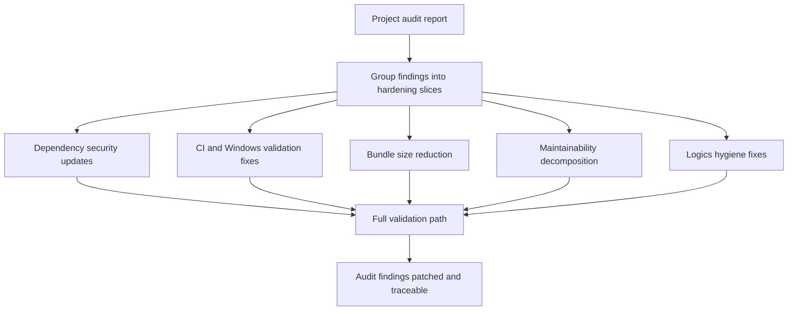

## req_124_audit_hardening_security_ci_bundle_and_maintainability_follow_ups - Audit hardening security ci bundle and maintainability follow ups
> From version: 1.6.5
> Schema version: 1.0
> Status: Done
> Understanding: 96%
> Confidence: 96%
> Complexity: High
> Theme: Quality
> Reminder: Update status/understanding/confidence and linked backlog/task references when you edit this doc.
> Non-semantic edit: Removed references to a deleted root-level audit report file.

# Needs
- Turn the May 12 project audit findings into a coordinated hardening effort instead of leaving them as disconnected maintenance notes.
- Restore a trustworthy local and CI validation path by fixing the PowerShell-incompatible E2E script and the UI Vitest lane that exits with an unhandled worker timeout after assertions pass.
- Reduce release risk by resolving audited dependency vulnerabilities and refreshing vulnerable or outdated build/test dependencies without regressing the production build, PWA artifacts, or test lanes.
- Reduce user-facing load cost and deploy risk by shrinking the oversized main bundle and keeping bundle metrics visible.
- Reduce future change risk by planning focused decomposition of the largest high-risk modules called out by the audit.
- Bring Logics hygiene back to a coherent state by fixing the workflow audit failure and cleaning the audit-identified placeholder/documentation noise.

# Context
The May 12 local project audit found that the application code is broadly healthy: lint, typecheck, build, PWA quality checks, fast Vitest lane, and direct Playwright E2E all pass. The risks are concentrated around release safety, dependency security, CI reliability, bundle size, maintainability, and Logics workflow hygiene.

Audit findings to patch:

- `npm audit --audit-level=moderate` reports 14 vulnerabilities, including 11 high severity advisories.
- `npm run test:e2e` is not portable in the local PowerShell environment because it uses `env -u NO_COLOR`.
- `npm run test:ci:ui` runs 39 UI spec files and 278 passing tests, but exits failed because Vitest catches an unhandled `Timeout calling "onTaskUpdate"` error.
- The production bundle emits a large-chunk warning; the main JS chunk is roughly 1537.94 KiB raw / 419.15 KiB gzip and total JS gzip is roughly 605.72 KiB.
- The likely bundle contributors include eager changelog imports in `src/app/lib/changelogFeed.ts`, markdown dependencies in `src/app/components/workspace/HomeWorkspaceContent.tsx`, and static `exceljs` loading through `src/app/lib/tabularExport.ts`.
- Several high-risk files remain very large: `src/app/hooks/useWireHandlers.ts`, `src/app/AppController.tsx`, `src/adapters/persistence/migrations.ts`, `src/app/components/network-summary/FunctionalSchematicPanel.tsx`, `src/app/components/NetworkSummaryPanel.tsx`, and `src/core/functionalSchematic.ts`.
- Logics lint passes with warnings, but workflow audit fails on `logics/tasks/task_105_wire_twist_groups_and_left_right_splice_pin_mode.md` because the DoD checklist is missing.
- The Logics global review reports 15 backlog docs with template placeholders and many missing Mermaid overview warnings.

This request should be split into bounded backlog slices. The work spans dependency/security updates, CI/test reliability, bundle optimization, code maintainability, and Logics documentation hygiene, so a single implementation task would be too broad.

Scope boundaries:

- In scope: patching the concrete audit findings, adding or updating validation commands, keeping the local PowerShell workflow functional, and updating Logics docs that are directly part of the audit findings.
- In scope: dependency updates needed to resolve `npm audit` findings, as long as they preserve the existing React/Vite application architecture and PWA behavior.
- In scope: bundle improvements that preserve current user-visible behavior while changing loading strategy or chunking.
- In scope: targeted decomposition plans or first extraction slices for the largest risky modules, with tests protecting behavior.
- Out of scope: unrelated feature work, visual redesign, schema redesign not required by dependency updates, and broad rewrites of the Logics workflow.
- Out of scope: deleting or reverting unrelated dirty Logics edits that are not part of the audit follow-up.

# Clarifications
- The request is intentionally broad because it tracks the full audit follow-up, but delivery should be split into smaller backlog items.
- The first release-safety priorities are security dependencies, cross-platform validation, and UI lane reliability.
- Bundle work should prioritize behavioral equivalence and measurable size reduction over cosmetic refactors.
- Maintainability work should avoid large rewrites; prefer one cohesive extraction at a time with tests.
- Logics cleanup should repair the failing audit and high-signal placeholders first; missing Mermaid warnings may be handled either by generation or by adjusting the standard if the warning is too noisy.

# Acceptance criteria
- AC1: Dependency security findings from `npm audit --audit-level=moderate` are resolved or explicitly documented with a justified temporary exception, and the lockfile changes are validated.
- AC2: The E2E script is cross-platform and works from PowerShell using `npm run test:e2e`, while preserving the Linux CI behavior.
- AC3: The UI Vitest lane no longer exits with the unhandled `Timeout calling "onTaskUpdate"` worker error, or the lane is safely segmented so the blocking CI path is reliable.
- AC4: The production build no longer relies on avoidable eager loading for changelog markdown, markdown rendering, or XLSX export dependencies; bundle metrics show a measurable reduction in main chunk size or total JS gzip.
- AC5: PWA build artifacts remain valid after dependency and bundle changes.
- AC6: A focused maintainability slice is defined for the largest risky modules, and any implemented extraction keeps existing behavior covered by targeted tests.
- AC7: `logics/tasks/task_105_wire_twist_groups_and_left_right_splice_pin_mode.md` has the required DoD checklist, and workflow audit no longer fails on that missing checklist.
- AC8: The 15 audit-identified Logics placeholder docs are either cleaned or tracked through explicit follow-up backlog items.
- AC9: Validation evidence includes at minimum lint, typecheck, build, PWA quality, fast tests, UI tests or their segmented replacement, E2E, `npm audit --audit-level=moderate`, and relevant Logics audit/lint commands.

# Definition of Ready (DoR)
- [x] Problem statement is explicit and directly tied to the local project audit.
- [x] Scope boundaries separate audit patching from unrelated feature work.
- [x] Acceptance criteria are testable through concrete commands and measurable outputs.
- [x] Risks are identified across dependencies, CI, bundle size, code structure, and Logics hygiene.
- [x] The request is ready to split into multiple backlog items rather than one oversized task.

# Companion docs
- Product brief(s): (none yet)
- Architecture decision(s): `adr_008_audit_hardening_delivery_strategy_for_security_ci_bundle_and_maintainability`
- Source audit: historical May 12 project audit summary, removed from the repository.

# AI Context
- Summary: Patch all high-signal findings from the May 12 project audit across security dependencies, CI reliability, bundle size, maintainability, and Logics hygiene.
- Keywords: audit, hardening, npm audit, security, PowerShell, E2E, Vitest, onTaskUpdate, bundle, lazy loading, changelog, exceljs, Logics, DoD, placeholders, maintainability
- Use when: Use when grooming, splitting, or implementing the May 12 audit follow-up work.
- Skip when: Skip when the work targets unrelated product features, visual redesign, or broad rewrites not required by the audit findings.

# Backlog
- `item_596_audit_hardening_security_ci_bundle_and_maintainability_follow_ups`

# Report
- Completed through `item_596_audit_hardening_security_ci_bundle_and_maintainability_follow_ups` and `task_107_audit_hardening_security_ci_bundle_and_maintainability_follow_ups`.
- The audit findings are patched or documented with validation evidence in the task report.
