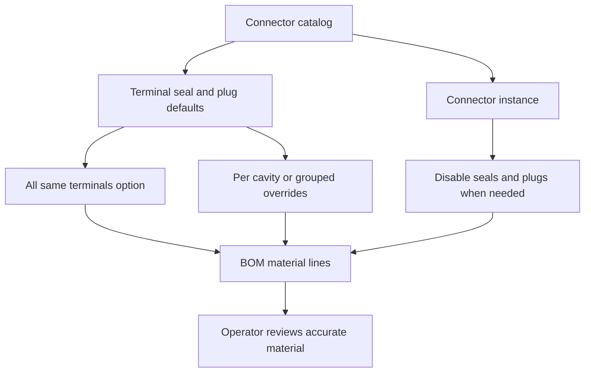

## req_125_connector_catalog_terminal_seal_and_plug_defaults - Connector catalog terminal seal and plug defaults
> From version: 1.6.5
> Schema version: 1.0
> Status: Done
> Understanding: 94%
> Confidence: 88%
> Complexity: Medium
> Theme: Catalog
> Reminder: Update status/understanding/confidence and linked backlog/task references when you edit this doc.

# Needs
- Extend connector catalog data so connector terminal, seal, and cavity plug defaults can be defined once and reused consistently during BOM generation.
- Add an `all same terminals` catalog option for connectors whose cavities all use the same terminal reference and seal reference by default.
- Add catalog-level plug defaults for connectors so unused cavities can be automatically filled with the configured plug references and included in the BOM.
- Support connectors that do not use the same terminal or plug setup for every cavity by allowing explicit overrides of the default terminal, seal, and plug choices.
- Let the operator disable plug and seal application for a specific connector instance even when the catalog says that connector can use plugs or seals.

# Context
The current connector catalog needs richer defaults for terminal, seal, and plug material so the operator does not have to repeatedly define the same references on every connector instance or every cavity. This is especially important for BOM accuracy: unused connector cavities may require plugs in wet or sealed zones, and those plugs must be counted as material.

The catalog should cover the simple case where every cavity on a connector uses the same terminal and seal references, while still allowing more complex connectors to specify different terminal, seal, or plug references per cavity or per group.

The operator also needs an instance-level opt-out because the same connector reference can be used in different environmental contexts. Example: two identical connectors are used in two different zones; the wet-zone connector needs seals and plugs, while the dry-zone connector does not need those extra parts even though the catalog contains seal and plug defaults.

For this request, seals and plugs are distinct material concepts:

- A seal is associated only with a terminal on a used connector cavity.
- A plug is associated with an unused connector cavity.
- Unused cavity quantity is calculated from the connector instance by counting cavities that have no assigned wire or connection.
- Multiple plug references can be defined with quantities only; the MVP does not need plug-to-cavity assignment.

# Acceptance criteria
- AC1: The connector catalog supports an `all same terminals` option for connector references whose cavities all share the same default terminal reference and default seal reference.
- AC2: When `all same terminals` is enabled, newly placed or refreshed connector instances use the configured default terminal and seal references for every applicable cavity unless overridden.
- AC3: The connector catalog supports one or more plug references for unused cavities, with quantity per plug reference and no required plug-to-cavity assignment.
- AC4: Unused connector cavities are calculated from the instance cavity usage, filled with the catalog-defined plug quantities by default, and included in the BOM.
- AC5: Connectors that do not use the same terminal or seal on every cavity can override the default terminal and seal selection at cavity level or another explicit grouping level.
- AC6: Connectors can define more than one plug type and define how many of each plug type is used when unused cavities are populated, without requiring the operator to assign those plugs to specific cavities.
- AC7: Connector instance settings include an option to disable automatic plug application for that specific instance even when the catalog defines plug defaults.
- AC8: Connector instance settings include an option to disable automatic seal application for that specific instance when the connector is used in a context where seals are not needed.
- AC9: The plug and seal opt-out controls are separate instance-level settings so an operator can disable plugs without disabling terminal seals, or disable seals without disabling plugs.
- AC10: BOM generation respects catalog defaults, per-connector overrides, unused-cavity plug quantities, and instance-level opt-out settings.
- AC11: Existing projects and catalog entries without terminal, seal, or plug defaults continue to load without a mandatory breaking migration.
- AC12: Existing connector instances refresh from updated catalog defaults when the catalog entry gains terminal, seal, or plug defaults, unless an instance has an explicit override or opt-out that must remain authoritative.
- AC13: The BOM UI can show whether a BOM line comes from catalog defaults, an instance override, or a manual operator entry.
- AC14: Application settings include an option to hide BOM traceability labels when the operator wants a cleaner BOM view; hiding labels does not change BOM quantities, exports, defaults, overrides, warnings, or material calculation.
- AC15: Ambiguous plug, seal, or terminal configurations produce non-blocking warnings instead of hard failures.
- AC16: Automated tests cover catalog defaults, mixed-terminal overrides, multiple plug types with quantities, unused-cavity BOM inclusion, existing-instance refresh, BOM traceability visibility settings, non-blocking warnings, and instance-level opt-out behavior.

# Definition of Ready (DoR)
- [x] Problem statement is explicit and user impact is clear.
- [x] Scope boundaries separate catalog defaults from connector instance overrides.
- [x] Acceptance criteria are testable through UI behavior, project data, and BOM output.
- [x] Compatibility risk for existing saved projects is identified.
- [x] The wet-zone versus dry-zone connector example is captured as an instance-level opt-out requirement.

# Clarifications
- `All same terminals` applies the same terminal reference and seal reference to used cavities by default. Unused cavities do not receive terminals.
- A seal is linked only to a terminal on a used cavity. A plug is linked to an unused cavity. Plugs should not be counted as seals.
- Multiple plug types are configured as `plug reference + quantity`; assigning a plug type to a precise cavity is out of scope for the MVP.
- Unused cavities are calculated from the connector instance by counting cavities without an assigned wire or connection.
- Plug and seal application must be controlled by two separate instance options.
- BOM origin labels should be treated as traceability, not as extra material behavior. `catalog default` means the line was auto-derived from catalog defaults, `instance override` means the connector instance changed the default, and `manual` means the operator entered the material explicitly. This helps explain why a BOM line exists and what will be recalculated if the catalog changes.
- The application settings should include a display option to hide BOM traceability labels for a cleaner view. This setting only affects display; it must not change BOM calculation or exported material quantities.
- Existing connector instances should refresh from catalog defaults when those defaults are later added or edited, while preserving explicit instance overrides and opt-outs.
- Ambiguous configurations should create non-blocking warnings.

# Scope boundaries
- In scope: connector catalog fields for default terminal references, default seal references, plug references, plug quantities, all-same-terminal behavior, per-cavity or grouped overrides, instance-level opt-out, BOM integration, persistence compatibility, and tests.
- In scope: preserving existing connector behavior when no new catalog defaults are configured.
- In scope: refreshing existing connector instances from updated catalog defaults while preserving explicit instance overrides and opt-outs.
- Out of scope: redesigning the whole catalog data model beyond what terminal, seal, and plug defaults require.
- Out of scope: automatic environmental classification of wet or dry zones unless an existing zone metadata field already supports it safely.
- Out of scope: automatic detection of connector sealing requirements from naming heuristics.
- Out of scope: assigning each plug reference to a specific unused cavity for the MVP.

# Implementation notes
- Treat catalog data as the source of defaults and connector instance data as the place for explicit overrides or opt-out decisions.
- Prefer non-breaking optional fields so existing saved projects and catalog fixtures remain valid.
- BOM generation should make default-applied material deterministic: terminal and seal quantities should follow populated cavities, while plug quantities should follow unused cavities and the configured plug distribution.
- If mixed plug definitions cannot be reconciled with the number of unused cavities, surface a non-blocking validation warning and require an explicit quantity override instead of silently guessing.

# Risks and constraints
- Some connector references may need cavity-specific terminal or seal compatibility that cannot be represented by a single default.
- Multiple plug types can become ambiguous if the configured quantities do not match the number of unused cavities.
- Automatically adding plugs to the BOM can change material totals for existing projects after catalog enrichment, so the UI should make the behavior visible.
- Instance-level opt-out must be persisted clearly so wet-zone and dry-zone uses of the same connector reference do not overwrite each other.

# Companion docs
- Product brief(s): (none yet)
- Architecture decision(s): (recommended if the saved project/catalog schema needs a non-trivial migration)

# References
- `src/core/entities.ts`
- `src/adapters/persistence/migrations.ts`
- `src/app/components`
- `src/store`
- `src/tests`

# AI Context
- Summary: Add connector catalog defaults for terminals, seals, and plugs, with all-same-terminal shortcuts, mixed connector overrides, automatic unused-cavity plug BOM lines, existing-instance refresh, non-blocking warnings, and separate instance-level seal and plug opt-outs.
- Keywords: connector catalog, all same terminals, terminal reference, seal reference, plug reference, unused cavities, BOM, override, wet zone, dry zone, connector instance opt-out
- Use when: Grooming or implementing connector catalog defaults, connector instance overrides, and BOM material generation for terminals, seals, and plugs.
- Skip when: The work only changes unrelated connector drawing behavior, wire routing, or BOM export formatting without changing connector material defaults.

# Backlog
- none
- `item_597_connector_catalog_terminal_seal_and_plug_defaults`
