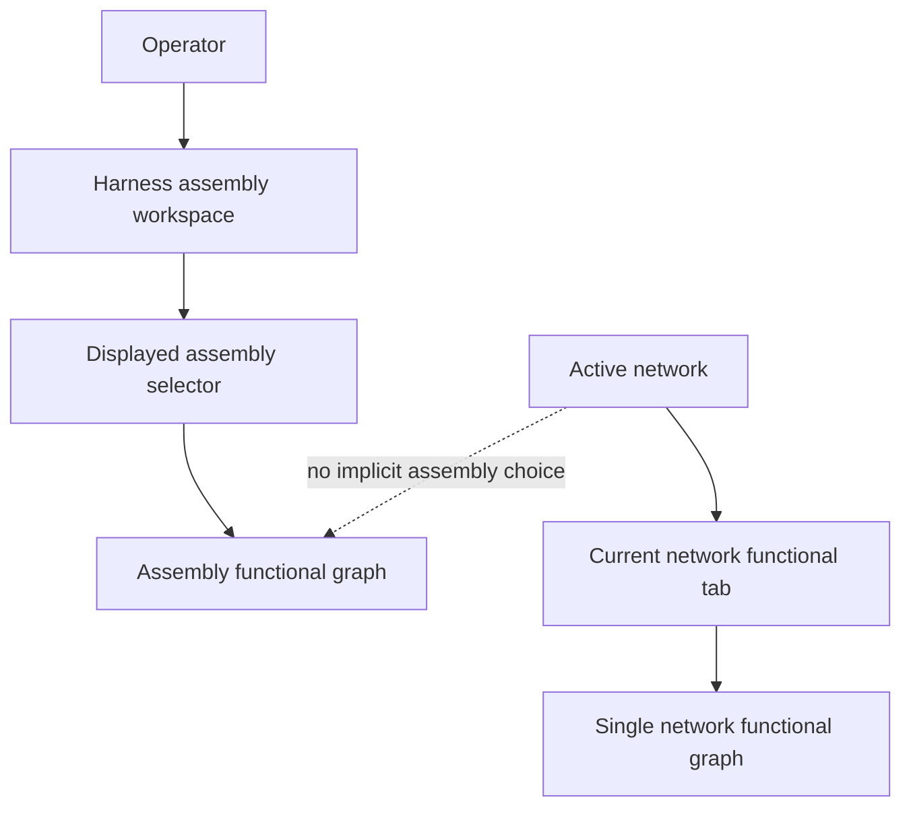

## req_126_explicit_harness_assembly_display_selection_and_current_network_functional_tab - Explicit Harness Assembly Display Selection and Current Network Functional Tab
> From version: 1.6.6
> Schema version: 1.0
> Status: Done
> Understanding: 96%
> Confidence: 94%
> Complexity: Medium
> Theme: UI
> Reminder: Update status/understanding/confidence and linked backlog/task references when you edit this doc.

# Needs
- Let the operator explicitly choose which `Harness assembly` functional schematic is displayed.
- Remove the current dependency where the active network implicitly selects the displayed harness assembly.
- Keep the `Harness assembly` workspace focused on assembly-level data and assembly-level functional tracing.
- Provide a separate tab for viewing the functional graph of the current active network only.
- Make the displayed graph predictable: assembly view shows the selected assembly, while current-network view shows the active network.

# Context
The current `Harness assembly` workspace mixes two selection models:

- the manager dropdown selects the assembly being edited;
- the active network selects the assembly whose graph is displayed.

This creates surprising behavior. Selecting assembly B in the manager can still display assembly A if the active network belongs to assembly A. Opening or navigating to a connector can also change the active network and therefore unexpectedly change the displayed assembly graph.

The operator expectation is different: when they are in the `Harness assembly` workspace, they want to choose the harness assembly and see that assembly, independently from the active network. The active network should not override the selected assembly once assembly-level data already exists.

A separate tab is the preferred solution for the current-network functional graph. This keeps the single-network derived functional schematic available without polluting the harness assembly workflow.

# Functional Scope
## A. Explicit displayed assembly selection
- Add an explicit state for the harness assembly currently displayed in the functional schematic.
- The displayed assembly state must be controlled by an operator-visible selector.
- The displayed assembly selector must not be implicitly overwritten by active network changes.
- If no assembly is selected, show an empty state that asks the operator to select a harness assembly.
- The graph title, export metadata, and visible badges should use assembly metadata when an assembly graph is displayed.

## B. Decouple harness assembly graph from active network
- Stop deriving `activeHarnessAssembly` from `activeNetworkId` for the assembly workspace graph.
- The assembly graph should be derived from the selected assembly members, master connector roots, connector links, filters, and stored assembly data.
- Active network navigation may still be useful elsewhere in the application, but it must not choose or switch the displayed assembly graph.
- Opening interconnector details or navigating to a connector must not unexpectedly replace the displayed assembly.

## C. Current network functional graph tab
- Add a separate tab dedicated to the current active network functional schematic.
- This tab should show the existing single-network functional graph for the active network.
- If there is no active network, the tab should show an empty state.
- This tab is the preferred place for current-network-only functional review.
- The tab name should make the scope clear to the operator.

## D. Editing versus displaying
- Use one selector for the first version: the selected assembly is both the assembly being edited and the assembly being displayed.
- Changing the selected assembly changes both the form draft target and the displayed graph target.
- Unsaved form changes must not affect the graph until the operator saves the assembly.
- Show a small warning near the modified controls when draft changes are not yet reflected in the visualization.
- The warning should make the relationship explicit: save is required before the functional graph updates.

## E. Compatibility and migration
- Existing saved projects should load without migration risk.
- Existing harness assemblies should appear in the new displayed assembly selector.
- Existing single-network functional schematic behavior should remain available in the new current-network tab.
- Import/export should not lose harness assembly data.

# Clarification Questions With Confirmed Answers
- Q1: Should the manager dropdown and displayed graph selector be the same control?
  - Answer: yes. Use one selector for the first version because it is simpler and clearer.
- Q2: Should the selected displayed assembly persist across app reloads?
  - Answer: start from an explicit empty state, then persist the operator selection after they choose an assembly.
- Q3: What should happen when the selected assembly is deleted?
  - Answer: clear the displayed assembly selection and show the empty state.
- Q4: What should happen when the selected assembly has unsaved edits?
  - Answer: the graph continues to show the last saved assembly data. A small warning near the modified controls indicates that the changes have not been added to the visualization and that save is required.
- Q5: Should the assembly graph ever auto-select based on the active network?
  - Answer: no. Active network must not choose or suggest the displayed assembly graph.
- Q6: Where should the current-network functional graph tab live?
  - Answer: add a separate tab named `Current network functional`.
- Q7: What should the current-network tab display when a harness assembly is also selected?
  - Answer: ignore the assembly selection and display only the active network graph.
- Q8: Should export from the harness assembly graph use assembly metadata instead of active network metadata?
  - Answer: yes. Assembly graph exports should use assembly name/technical ID; current-network tab exports should keep network metadata.

# Clarified Behavior
- One selector controls both the assembly being edited and the assembly being displayed.
- The assembly workspace starts with no displayed assembly selected when no persisted selection exists.
- Once the operator selects an assembly, that selection should persist across reloads.
- The active network has no influence on the selected or displayed harness assembly.
- The `Current network functional` tab is the only place where the active network drives the displayed functional graph.
- Draft changes in member networks, master connector roots, connector links, or harness colors do not update the visualization until `Save assembly`.
- When draft changes exist, a small warning is shown near the modified controls to explain that the visualization still reflects saved data.
- Assembly graph export uses selected assembly metadata.
- Current-network functional graph export uses active network metadata.

# Acceptance Criteria
- AC1: The `Harness assembly` functional graph is selected by an explicit displayed assembly state, not by `activeNetworkId`.
- AC2: Changing the active network does not change the displayed harness assembly graph.
- AC3: The operator can select which saved harness assembly is displayed and edited through one shared selector.
- AC4: If no harness assembly is selected, the assembly workspace shows a clear empty state instead of falling back to the active network graph.
- AC5: The UI clearly shows which harness assembly currently drives the displayed assembly graph.
- AC6: The shared assembly selector controls both the edited assembly form and the displayed assembly graph.
- AC7: Unsaved member/root/link/color changes are visible before save, and a small warning near the modified controls explains that the visualization has not been updated yet.
- AC8: A separate tab lets the operator view the functional graph of the current active network only.
- AC9: The current-network functional tab changes when the active network changes, but the harness assembly graph does not.
- AC10: Existing single-network functional graph behavior remains available through the new current-network tab.
- AC11: Assembly graph export metadata uses selected assembly metadata where available.
- AC12: Current-network graph export metadata continues to use active network metadata.
- AC13: Existing saved harness assemblies load and remain selectable without data loss.
- AC14: Automated tests cover assembly selection, active-network decoupling, empty state behavior, and current-network tab behavior.
- AC15: The displayed assembly selection persists after the operator chooses an assembly and reloads the app.

# Out of Scope
- Changing the physical-only interconnector link model.
- Changing symmetric pin mapping semantics.
- Reworking cross-harness trace derivation beyond the selection source needed for this UX change.
- Persisting a new editable generated functional graph as source-of-truth data.
- Adding multi-assembly comparison or side-by-side graph views.

# Definition of Ready (DoR)
- [x] User problem identifies the unwanted dependency on active network selection.
- [x] Desired direction is explicit: assembly view should show the selected harness assembly.
- [x] Preferred solution for the active network functional graph is explicit: a separate tab.
- [x] Selector behavior is clarified: one shared edit/display selector.
- [x] Default selection behavior is clarified: empty until the operator selects an assembly, then persisted.
- [x] Unsaved draft behavior is clarified: graph uses saved data and a nearby warning explains pending visualization changes.
- [x] Export metadata behavior is confirmed.

# Implementation Notes
- Candidate files to inspect or change:
  - `src/app/components/network-summary/HarnessAssemblyManagerPanel.tsx`
  - `src/app/hooks/controller/useAppControllerNetworkSummaryPanelDomain.tsx`
  - `src/app/components/network-summary/FunctionalSchematicPanel.tsx`
  - `src/core/functionalSchematic.ts`
  - `src/store/reducer/harnessAssemblyReducer.ts`
- The current code path computes assembly graph selection from active network membership. Replace that behavior with explicit selected assembly state for the assembly workspace.
- Persist the displayed assembly selection after the operator chooses an assembly; do not auto-fill it from `activeNetworkId`.
- Add an empty assembly state for the first visit or when the persisted selection is invalid.
- Add unsaved-change detection close to the member/root/link/color controls so draft edits can show the visualization warning locally.
- Preserve the current single-network graph path, but move or expose it through the new current-network functional tab.

# References
- `HARNESS_ASSEMBLY_USAGE_REPORT_2026-05-13.md`
- `logics/request/req_122_multi_harness_super_category_and_cross_harness_functional_schematic.md`
- `src/app/components/network-summary/HarnessAssemblyManagerPanel.tsx`
- `src/app/hooks/controller/useAppControllerNetworkSummaryPanelDomain.tsx`
- `src/app/components/network-summary/FunctionalSchematicPanel.tsx`

# AI Context
- Summary: Decouple harness assembly graph display from active network selection, add an explicit displayed assembly selector, and provide a separate tab for the current active network functional graph.
- Keywords: harness assembly, displayed assembly, active network, functional schematic, current network tab, UI selection, unsaved changes, export metadata
- Use when: Grooming or implementing UX changes around harness assembly graph selection and single-network functional graph placement.
- Skip when: The work targets connector continuity semantics, pin mapping, import/export persistence only, or unrelated network editing.

# Backlog
- `logics/backlog/item_598_explicit_harness_assembly_display_selection_and_current_network_functional_tab.md`

# Tasks
- `logics/tasks/task_109_explicit_harness_assembly_display_selection_and_current_network_functional_tab.md`

# Delivery status
- Done via `logics/backlog/item_598_explicit_harness_assembly_display_selection_and_current_network_functional_tab.md` and `logics/tasks/task_109_explicit_harness_assembly_display_selection_and_current_network_functional_tab.md`.
- Implemented explicit persisted harness assembly display selection.
- Removed active-network influence from harness assembly graph selection.
- Added the `Current network functional` tab for active-network-only review.
- Added unsaved visualization warnings for draft assembly edits.
- Updated export metadata routing for assembly versus current-network graphs.
