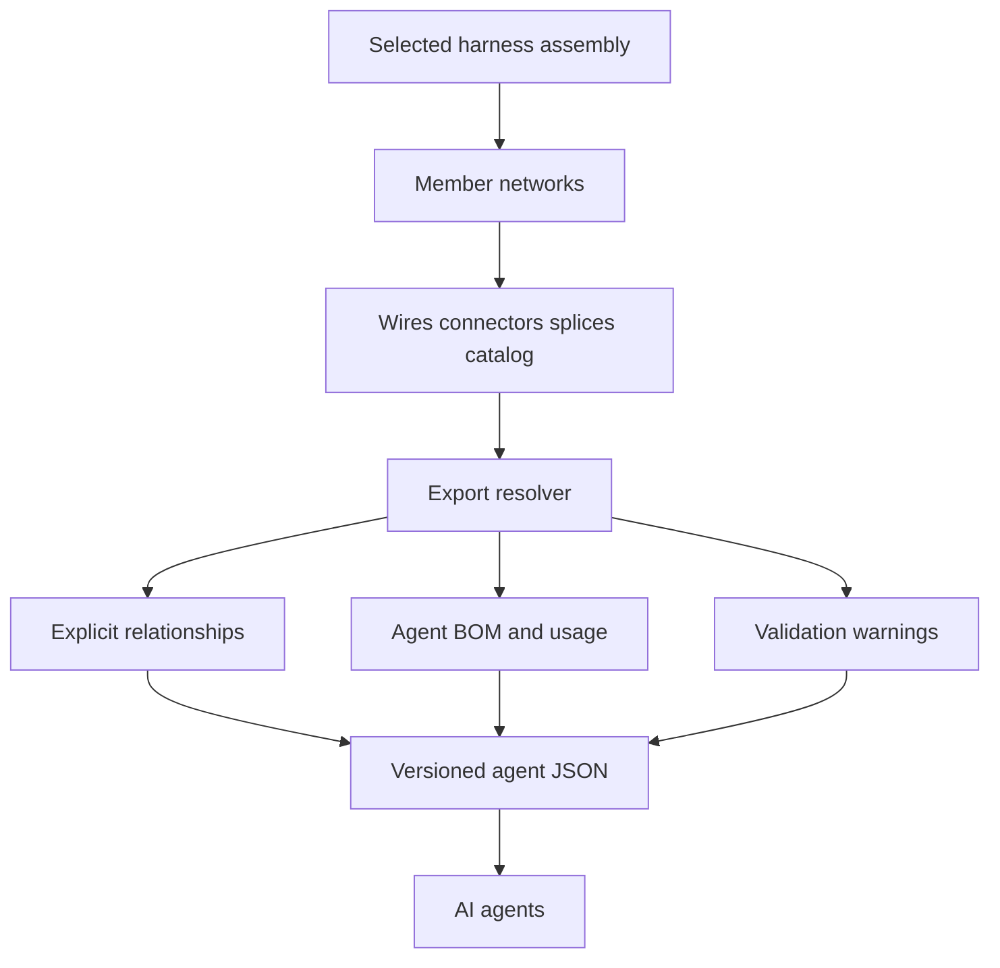

## req_127_selected_harness_agent_json_export - Selected Harness Agent JSON Export
> From version: 1.7.0
> Schema version: 1.0
> Status: Done
> Understanding: 99%
> Confidence: 97%
> Complexity: Medium
> Theme: Export
> Reminder: Update status/understanding/confidence and linked backlog/task references when you edit this doc.

# Needs
- Export the currently selected `Harness assembly` as a machine-oriented JSON context for AI agents.
- Include nearly all useful harness data needed by agents: wires, connectors, splices, terminals, seals, plugs, catalog-backed parts, BOM-like quantities, relationships, and validation warnings.
- Keep the first version deliberately narrow: selected harness only, JSON only, agent consumption only.
- Avoid human-readable export options, Markdown reports, CSV bundles, or multi-harness exports in this request.
- Make the exported JSON stable, versioned, explicit, and easy for agents to parse without relying on UI labels or implicit app state.

# Context
Operators want to hand harness information to AI agents so the agents can inspect, audit, compare, explain, or generate downstream work from the harness. The current app already stores most of the necessary information, but it is distributed across harness assemblies, member networks, wires, connectors, splices, catalog items, connector material defaults, wire endpoint references, and BOM export helpers.

The export should consolidate that data into one selected-harness JSON document. The document is not meant for human reading. It should prioritize stable IDs, explicit relationships, traceability, and warnings over visual formatting.

Most required fields already exist or can be derived:

- harness identity, members, master connector refs, and inter-harness connector links from `HarnessAssembly`;
- wire identity, section, material, color, current, endpoints, route, and length from `Wire`;
- connector identity, cavity count, catalog reference, material application flags, and terminal overrides from `Connector`;
- terminal and seal data from wire-side manual references or resolved connector catalog defaults;
- plug data from connector catalog defaults for unused cavities;
- part references from `CatalogItem.manufacturerReference` and related catalog metadata;
- BOM and usage rows from existing BOM export logic, plus new selected-harness scoping.

Some fields should be computed at export time rather than added to the stored data model, especially `usedBy`, relationship rows, BOM quantities, and validation warnings.

# Functional Scope
## A. Export trigger and scope
- Add one action for exporting the selected harness assembly as agent JSON.
- The action must only export the selected saved harness assembly.
- If no harness assembly is selected, the action should be disabled or show a clear error state.
- The export must not switch scope based on `activeNetworkId`.
- The export must not offer format choices in the first version.

## B. JSON envelope
- Emit a single JSON object with a stable top-level envelope.
- Include `schemaVersion`, `exportKind`, `exportedAt`, app version, and selected harness identity.
- Use a dedicated kind such as `selected-harness-agent-context`.
- Include enough metadata for future schema evolution without breaking agents.

## C. Harness graph data
- Include selected harness fields: `id`, `technicalId`, `name`, `members`, `masterConnectorRefs`, `connectorLinks`, `createdAt`, and `updatedAt`.
- Include all member networks referenced by the selected harness.
- Include only entities that belong to those member networks unless they are referenced catalog parts required for resolution.
- Preserve stable internal IDs so agents can reference exact entities.

## D. Wires and endpoints
- Export wires with IDs, names, technical IDs, section, material, current, color state, twist group, functional domain, route segment IDs, route lock state, length, protection, and endpoints.
- For connector endpoints, include `networkId`, `connectorId`, `cavityIndex`, resolved connector labels, and resolved terminal/seal material when available.
- For splice endpoints, include `networkId`, `spliceId`, `portIndex`, side override, and side lock state when available.
- Preserve manual connection and seal references and names from each wire side.

## E. Connectors, cavities, terminals, seals, and plugs
- Export connectors with ID, name, technical ID, cavity count, catalog item ID, manufacturer reference, material application flags, terminal overrides, and cavity occupancy.
- For each connector cavity, include occupancy status and the wire endpoint that uses it when present.
- Resolve terminal and seal material per cavity using the same precedence as the BOM/export logic: manual wire-side reference first where applicable, connector override next, then catalog default when applicable.
- Export unused-cavity plug requirements from connector catalog defaults when plug application is enabled and the connector has unused cavities.
- Include origin labels such as `manual`, `connector override`, `catalog default`, or `computed` where they can be determined.

## F. Parts and usage
- Export catalog-backed parts that are used by connectors, splices, fuses, terminals, seals, plugs, or wire endpoint references.
- Use `manufacturerReference` as the current part reference field.
- Include available catalog metadata: `catalogItemId`, `name`, `connectionCount`, `unitPriceExclTax`, and `url`.
- Compute `usedBy` references so agents can see which connectors, splices, wires, cavities, or endpoints use each part.
- Compute BOM-like quantities for connectors, splices, terminals, seals, plugs, and protections.

## G. Relationships and validation warnings
- Export explicit relationship records for:
  - harness to member networks;
  - harness connector links;
  - wire to endpoint entities;
  - connector cavities to wire endpoints;
  - wire endpoints to resolved terminals and seals;
  - connectors to plugs for unused cavities;
  - entities to catalog parts.
- Include validation warnings for missing catalog items, unresolved connector references, unresolved terminal/seal/plug references, invalid harness member references, invalid connector links, and export-time assumptions.
- Warnings should be structured with `code`, `severity`, `message`, and related entity references.

# Clarified Behavior
- The export is always JSON.
- The export is always for the selected harness assembly.
- The export is always meant for AI agents and machine processing, not human reading.
- No Markdown, CSV, XLSX, or multi-format option is required.
- No multi-harness export is required.
- `manufacturerReference` is the current equivalent of `partNumber`; adding a separate `partNumber` field is not required for V1.
- `manufacturerName`, explicit `partType`, and cavity-level plug assignment are useful future improvements, but they do not block V1.
- `usedBy`, relationships, BOM quantities, and validation warnings should be derived during export rather than stored as new source-of-truth fields.

# Acceptance Criteria
- AC1: A selected harness assembly can be exported as a single JSON file or downloaded JSON payload.
- AC2: The export action is scoped only to the selected harness assembly and is not affected by `activeNetworkId`.
- AC3: The JSON includes a versioned envelope with `schemaVersion`, `exportKind`, `exportedAt`, app version, and selected harness identity.
- AC4: The JSON includes selected harness members, master connector refs, and inter-harness connector links.
- AC5: The JSON includes member networks and their relevant wires, connectors, splices, segments, and catalog references.
- AC6: Wire exports include complete endpoint data and preserve wire-side connection and seal references and names.
- AC7: Connector exports include cavity count, cavity occupancy, catalog item reference, manufacturer reference, material flags, terminal overrides, and resolved per-cavity material where available.
- AC8: Terminal and seal resolution follows existing app precedence and exposes an origin label.
- AC9: Plug requirements for unused cavities are included when configured through connector catalog defaults.
- AC10: Catalog-backed parts include available metadata and computed `usedBy` references.
- AC11: The export includes BOM-like quantities for connectors, splices, terminals, seals, plugs, and protected wire components.
- AC12: The export includes explicit relationship rows so agents do not need to infer joins from labels.
- AC13: The export includes structured validation warnings for missing or unresolved harness, network, connector, catalog, terminal, seal, plug, and relationship data.
- AC14: If no harness assembly is selected, the export action does not produce a misleading fallback export.
- AC15: Automated tests cover selected-harness scoping, active-network decoupling, terminal/seal/plug resolution, `usedBy` derivation, and warning generation.

# Out of Scope
- Human-readable Markdown reports.
- CSV, XLSX, or table-oriented exports.
- Exporting all harness assemblies at once.
- Exporting the current active network when no harness is selected.
- Adding required new UI fields before the export can exist.
- Changing the stored harness assembly data model unless a small compatibility field is proven necessary.
- Building an import path for this JSON format.
- Guaranteeing exact cavity-level plug assignment when the current data only provides plug quantities for unused cavities.

# Definition of Ready (DoR)
- [x] Scope is fixed to selected harness only.
- [x] Format is fixed to JSON only.
- [x] Target consumer is fixed to agents and machine processing.
- [x] Existing data sources are identified.
- [x] Derived fields are separated from source-of-truth fields.
- [x] Initial non-goals are explicit.
- [x] Acceptance criteria are testable.

# Implementation Notes
- Candidate files to inspect or change:
  - `src/core/entities.ts`
  - `src/core/connectorCatalogMaterials.ts`
  - `src/core/functionalSchematic.ts`
  - `src/app/lib/networkSummaryBomCsv.ts`
  - `src/app/components/network-summary/HarnessAssemblyManagerPanel.tsx`
  - `src/app/hooks/controller/useAppControllerNetworkSummaryPanelDomain.tsx`
  - `src/app/hooks/controller/useAppControllerBomExportHandlers.ts`
- Prefer adding a pure export builder such as `src/app/lib/selectedHarnessAgentJson.ts` or `src/core/harnessAgentExport.ts`.
- Keep the export schema independent from UI text and localized labels.
- Reuse existing terminal, seal, plug, and BOM resolution helpers instead of reimplementing precedence rules.
- Keep missing or ambiguous data visible through `warnings` rather than silently dropping it.
- Add tests close to existing BOM, functional schematic, and harness assembly tests.

# References
- `logics/request/req_119_bom_and_catalog_export_enhancements.md`
- `logics/request/req_125_connector_catalog_terminal_seal_and_plug_defaults.md`
- `logics/request/req_126_explicit_harness_assembly_display_selection_and_current_network_functional_tab.md`
- `src/core/entities.ts`
- `src/core/connectorCatalogMaterials.ts`
- `src/app/lib/networkSummaryBomCsv.ts`

# AI Context
- Summary: Add a selected-harness-only JSON export that consolidates harness assembly, member network, wire, connector, terminal, seal, plug, catalog part, BOM usage, relationship, and validation warning data for AI agents.
- Keywords: selected harness, agent JSON, harness export, wires, connectors, terminals, seals, plugs, catalog parts, BOM, relationships, validation warnings
- Use when: Grooming or implementing machine-oriented harness export for AI or agent workflows.
- Skip when: The work targets human-readable reports, CSV/XLSX exports, all-harness exports, import support, or current-network-only export.

# Backlog
- `logics/backlog/item_599_selected_harness_agent_json_export.md`

# Delivery outcome
- Status: Delivered by `logics/tasks/task_110_selected_harness_agent_json_export.md`.
- The selected-harness-only agent JSON export is implemented with a versioned envelope, selected harness scope, member-network entity data, material resolution, catalog usage, BOM-like quantities, explicit relationships, and structured warnings.
- The Harness Assembly manager exposes a disabled/enabled `Agent JSON` export action based on saved selected assembly state.
- Validation passed: targeted tests, typecheck, lint, and production build.
