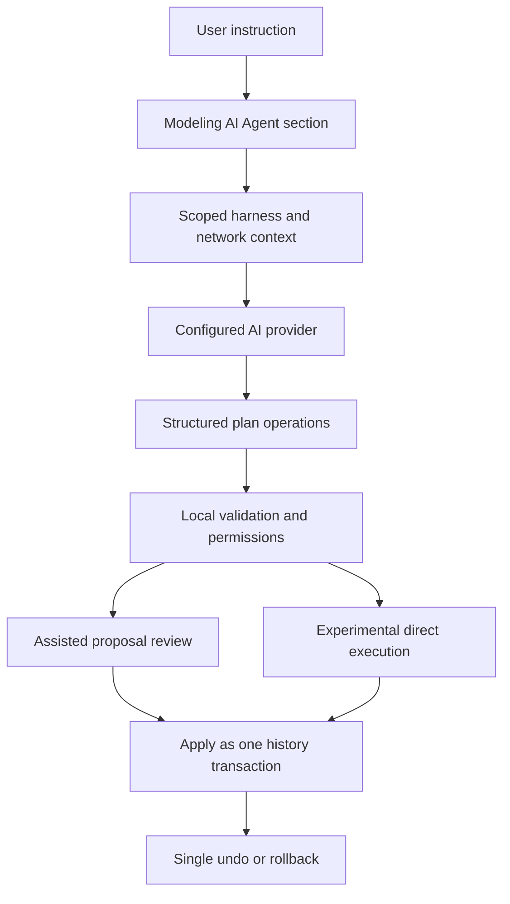

## req_128_ai_agent_modeling_workspace - AI Agent Modeling Workspace
> From version: 1.10.3
> Schema version: 1.0
> Status: Draft
> Understanding: 95%
> Confidence: 90%
> Complexity: High
> Theme: AI
> Reminder: Update status/understanding/confidence and linked backlog/task references when you edit this doc.

# Needs
- Add a new `AI Agent` section inside Modeling that can assist with harness and network modifications.
- Add an AI settings area where users can configure the provider, model, credentials, endpoint, and safety options.
- Support a default assisted mode where the agent proposes structured plan operations for user review before application.
- Support a clearly gated experimental mode where the agent can apply validated operations directly.
- Make every AI session reversible through a single grouped undo or rollback action.
- Keep the agent bounded by the same domain rules as the editor: connectors, splices, wires, routes, catalogs, harness assemblies, validation, and history.

# Context
The application already contains machine-oriented harness context through the selected-harness agent JSON export (`req_127`). That export is useful for external agents, but it is read-only. The next product step is an in-app AI agent workspace that can use similar structured context to help users modify the active modeling state.

The feature should not be a generic chatbot. It should be an operational Modeling surface where the user selects a target scope, describes the intended change, chooses the execution mode, grants explicit permissions, and reviews or rolls back the resulting modifications.

The agent must not write arbitrary raw application state. It should produce or call a bounded set of plan operations that are validated locally before they mutate the store.

# Functional Scope
## A. AI settings
- Add a dedicated AI settings area.
- Let users select a provider such as OpenAI, Anthropic, local, or custom endpoint.
- Store provider configuration consistently with the app's existing preference and settings patterns.
- Include model, API key or credential reference, endpoint, timeout, and strict mode controls where applicable.
- Include a connection test action.
- Include an explicit setting that enables or disables experimental direct execution.

## B. Modeling AI Agent section
- Add a new Modeling section named `AI Agent`.
- The section should act as the control surface for AI-assisted modeling, not as a generic chat page.
- Let the user choose an action type, target scope, execution mode, and free-form instruction.
- Target scope candidates include current selection, active network, selected harness assembly, and possibly all visible modeling data in later versions.
- Display permissions before execution, including at least add, move, update, route, circuit/domain-like assignment where applicable, and delete.
- Keep delete disabled by default unless explicitly enabled by the user.

## C. Assisted mode
- Assisted mode is the default.
- The agent returns a structured operation list.
- The app validates the operation list before presenting it.
- The user can review a summary and details before applying or rejecting.
- Applying the proposal records one grouped history transaction.

## D. Experimental direct mode
- Experimental mode is opt-in and visibly marked as higher risk.
- The agent can apply valid operations directly without per-operation user confirmation.
- The agent still operates only through local, bounded tools or operation handlers.
- A snapshot must be created before execution.
- The completed session must show a summary and offer one-click rollback.

## E. Operation contract
- Define a first operation vocabulary for AI-driven changes.
- Candidate operations include:
  - add connector, splice, node, segment, or wire;
  - move connector, splice, node, or selected canvas entities;
  - update labels, technical IDs, sections, materials, colors, references, or route locks;
  - assign or change catalog-backed parts where supported;
  - assign wire endpoint references;
  - trigger route regeneration or preserve forced routes;
  - delete only when explicitly permitted.
- Every operation must be validated against current domain rules before mutation.

## F. Undo, rollback, and auditability
- Every AI run must be grouped into a single AI session.
- The app must create a snapshot before execution.
- The user must be able to undo the full AI session with one action.
- The result view must show what was added, moved, updated, deleted, routed, or rejected.
- Validation failures must be visible instead of silently ignored.

# Clarified Behavior
- The AI Agent section belongs in Modeling.
- AI provider configuration belongs in Settings, not inside the Modeling panel.
- Assisted mode is the safe default.
- Experimental direct execution is allowed only when explicitly enabled.
- AI-generated changes are not trusted until local validation accepts them.
- The agent should receive structured, scoped context instead of a full raw application dump.
- The first implementation should prefer a narrow, reliable operation vocabulary over broad free-form mutation.

# Acceptance Criteria
- AC1: Settings includes an AI configuration area with provider, model, credential or endpoint configuration, timeout or strictness options, and a connection test.
- AC2: Modeling includes a visible `AI Agent` section.
- AC3: The AI Agent section lets the user provide an instruction, choose a target scope, choose assisted or experimental mode, and review permissions.
- AC4: Assisted mode is the default mode.
- AC5: Assisted mode receives AI output as structured operations and validates those operations before user review.
- AC6: The user can apply or reject an assisted proposal.
- AC7: Applied assisted proposals are committed as one grouped history transaction.
- AC8: Experimental mode is disabled unless explicitly enabled in AI settings.
- AC9: Experimental mode creates a pre-run snapshot and applies only locally validated operations.
- AC10: A completed experimental session can be rolled back in one user action.
- AC11: AI operations cannot bypass existing domain validation, dependency guards, or destructive-action permissions.
- AC12: Delete operations are blocked by default and require explicit permission.
- AC13: The result view summarizes added, moved, updated, deleted, routed, accepted, and rejected operations.
- AC14: Validation errors and rejected operations are exposed to the user with actionable context.
- AC15: Tests cover operation validation, assisted apply/reject, experimental rollback, delete permission gating, and grouped undo behavior.

# Out of Scope
- Fully autonomous background optimization without user-triggered execution.
- Unbounded raw store mutation by an AI provider.
- Multi-agent collaboration or persistent agent memory.
- Provider-specific UI branching beyond configuration and capability reporting.
- Replacing existing manual Modeling tools.
- Building a human-readable AI report export.
- Implementing every possible modeling operation in the first version.

# Definition of Ready (DoR)
- [x] Problem statement is explicit and user impact is clear.
- [x] Scope boundaries are explicit.
- [x] Assisted and experimental modes are separated.
- [x] Undo and rollback behavior is mandatory.
- [x] Acceptance criteria are testable.
- [x] Known architectural dependencies are listed.

# Companion docs
- Product brief(s): `logics/product/prod_004_ai_agent_modeling_workspace.md`
- Architecture decision(s): TBD

# References
- `logics/request/req_127_selected_harness_agent_json_export.md`
- `logics/product/prod_000_modeling_productivity_and_repeated_action_ergonomics.md`
- `logics/architecture/adr_003_modeling_create_flow_reset_and_canvas_group_movement_interaction_contracts.md`
- `logics/architecture/adr_008_audit_hardening_delivery_strategy_for_security_ci_bundle_and_maintainability.md`

# AI Context
- Summary: Add a Modeling AI Agent workspace with provider settings, assisted proposals, experimental direct execution, bounded operation validation, and single-action rollback for AI-made changes.
- Keywords: AI Agent, Modeling, provider settings, structured operations, assisted mode, experimental mode, snapshot, rollback, undo, harness, network, connectors, splices, wires, routing
- Use when: Designing or implementing AI-assisted in-app modeling changes.
- Skip when: The work only exports read-only agent context, targets human reports, or modifies providers without an in-app Modeling agent.

# Backlog
- none
