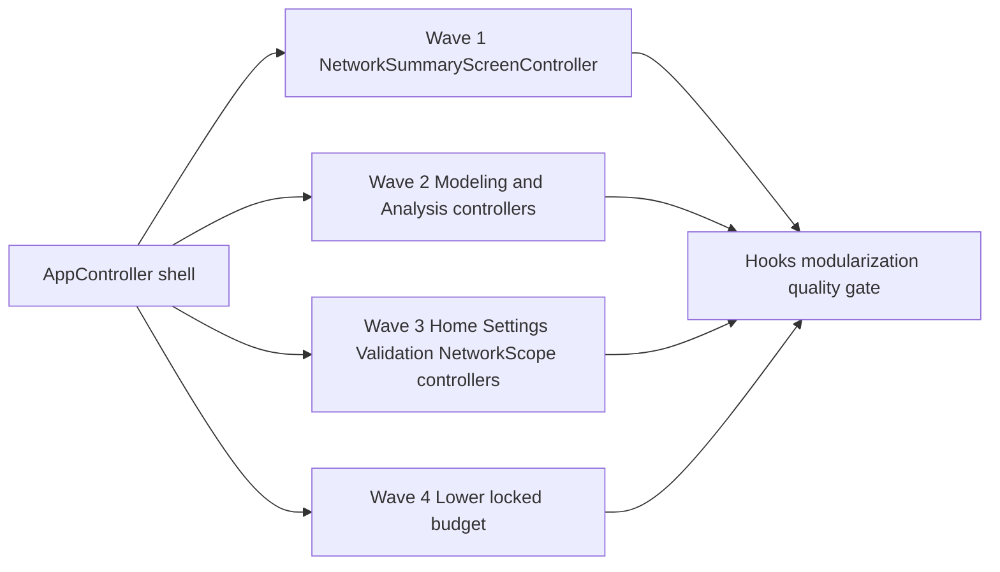

## req_129_app_controller_decomposition_plan - AppController decomposition plan

> From version: 1.15.0
> Schema version: 1.0
> Status: Archived
> Understanding: 100%
> Confidence: 93% (initial shell-runtime wave delivered; remaining hook-impl follow-up removed from the active corpus on 2026-06-16)
> Complexity: High
> Theme: Architecture
> Reminder: Update status/understanding/confidence and linked backlog/task references when you edit this doc.

# Needs
- Decompose `src/app/AppController.tsx` from a single 1000+ line orchestrator into a thin shell that wires per-screen controllers.
- Retire the largest controller hooks currently documented in `quality:hooks-modularization` (`useAppControllerScreenContentSlices`, `useAppControllerModelingAnalysisScreenDomains`, `useAppControllerNetworkSummaryPanelDomain`, `useAppControllerModelingHandlersOrchestrator`).
- Preserve the existing public component contract `<AppController store={...} />` and the existing dual-state invariant in `appReducer`.

# Context
- The May 2026 project review (v1.10.3) flagged `AppController.tsx` as the highest single-file complexity hotspot (62 imports, ~50 hooks, 11 entity-snapshot slices, locked budget 1100 lines).
- The v1.10.4 release introduced `quality:hooks-modularization` which documents 12 oversized controller hooks as allow-listed exceptions, each with an explicit retirement plan pointing at this initiative.
- The decomposition is intentionally non-trivial: it touches selection routing, history dispatch, persistence health, onboarding, toasts, and per-screen state assembly. A single big-bang refactor would risk regressions across the entire workspace surface.
- The accompanying ADR (`adr_009_app_controller_decomposition_plan`) lays out an incremental 4-wave plan with explicit target line counts and per-wave validation evidence.

# Acceptance criteria
- AC1: Each wave defined in ADR-009 has a corresponding task or follow-up doc when work starts.
- AC2: After each wave, the retired controller hook(s) are removed from `ALLOWED_HOOKS_OVERSIZE` and the gate still passes.
- AC3: After each wave, the corresponding `app.ui.*` Vitest specs stay green and at least one controller-boundary spec is added or extended.
- AC4: After Wave 4, the locked budget for `src/app/AppController.tsx` in `LOCKED_LINE_BUDGETS` is lowered to the new ceiling (rounded up to the next 50-line boundary).
- AC5: The dual-state invariant (`networkStates[activeNetworkId]` synchronized with root slices) remains covered by `store.reducer.sync-invariant.spec.ts` and continues to pass.

# Definition of Ready (DoR)
- [x] Problem statement is explicit and user impact is clear (maintainability + screen-level testability).
- [x] Scope boundaries (in/out) are explicit (no reducer/persistence/external-API change).
- [x] Acceptance criteria are testable.
- [x] Dependencies and known risks are listed (Modeling/Analysis are the most coupled pair).

# Out of scope
- Any change to `appReducer` shape or the dual-state invariant.
- Any change to workspace persistence schema or network export file schema.
- New external dependencies. The plan stays inside React + existing hook patterns.
- Splitting unrelated oversize files (`i18n.ts`, `migrations.ts`).

# Companion docs
- Product brief(s): (none — internal maintainability initiative, no user-facing behavior change)
- Architecture decision(s): `logics/architecture/adr_009_app_controller_decomposition_plan.md`

# References
- `src/app/AppController.tsx`
- `scripts/quality/ui-modularization-gate-core.mjs` (LOCKED_LINE_BUDGETS)
- `scripts/quality/hooks-modularization-gate-core.mjs` (ALLOWED_HOOKS_OVERSIZE)
- `src/store/reducer.ts` (dual-state invariant contract)
- `src/tests/store.reducer.sync-invariant.spec.ts`

# AI Context
- Summary: Plan an incremental, screen-scoped decomposition of `AppController.tsx` and the largest controller hooks, preserving the public component contract and the dual-state reducer invariant.
- Keywords: AppController, decomposition, screen controller, modularization, controller hook, locked budget, dual-state invariant, quality gate
- Use when: Designing or scheduling refactor waves for `src/app/AppController.tsx` or any of the allow-listed oversize controller hooks.
- Skip when: The work targets reducer or persistence changes, or adds new product features that do not touch the controller surface.

# Backlog
- `item_600_appcontroller_decomposition_plan`
- `item_626_appcontroller_hook_impl_decomposition_followup`

# Delivery Status
- First delivery wave shipped on 2026-06-09 in `task_111_appcontroller_decomposition_plan`.
- Evidence checked: `src/app/AppController.tsx` shrank from the audited 1089 lines to 1077 lines by extracting `useAppControllerWorkspaceRuntime`, preserving the public `<AppController store={...} />` contract.
- Evidence checked: controller-boundary coverage was added in `src/tests/app-controller-workspace-runtime.hook.spec.tsx`; affected UI tests and modularization gates passed.
- Evidence checked: `quality:hooks-modularization` still passes. `quality:ui-modularization` now records explicit exceptions for two pre-existing oversize UI files while keeping the AppController locked budget unchanged at 1100.
- Second-wave task prepared on 2026-06-09 in `task_136_appcontroller_hook_impl_decomposition_follow_up`. The task records current line counts and recommends `useAppControllerModelingAnalysisScreenDomains.tsx` as the next extraction target.
- Archived on 2026-06-16 to close the active Logics corpus without claiming unimplemented follow-up work as delivered.
- Remaining hook-impl decomposition work under `src/app/hook-impl/controller/` is not active. Reopen it through a fresh request/backlog/task chain if that refactor becomes a priority again.
