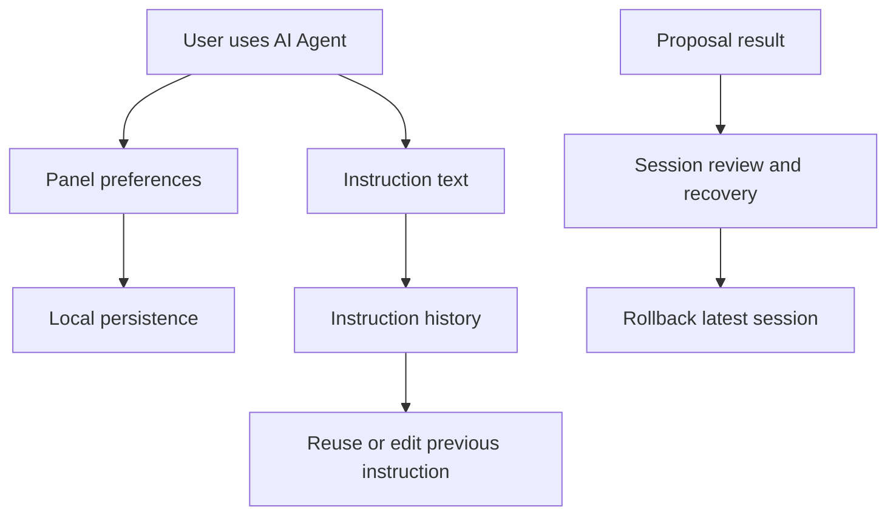

## req_130_ai_agent_follow_up_memory_persistence_and_workflow_polish - AI Agent Follow-up Memory, Persistence, and Workflow Polish
> From version: 1.11.0
> Schema version: 1.0
> Status: Draft
> Understanding: 90%
> Confidence: 86%
> Complexity: Medium
> Theme: AI
> Reminder: Update status/understanding/confidence and linked backlog/task references when you edit this doc.

# Needs
- Capture the post-`1.11.0` AI Agent follow-ups that improve repeated use without expanding the first release scope retroactively.
- Persist the AI Agent panel preferences so users do not reselect the same target scope, mode, and permissions every session.
- Add a local instruction history so users can reuse or adapt previous AI modeling instructions.
- Improve AI session review, discoverability, and recovery ergonomics after assisted proposals are applied, rejected, or rolled back.
- Keep all persistence local, explicit, and redaction-safe.

# Context
`req_128_ai_agent_modeling_workspace` delivered the first in-app Modeling AI Agent workflow in `1.11.0`: provider settings, scoped context, assisted proposals, local validation, apply/reject controls, and rollback of the latest AI session.

That first release intentionally focused on safe execution. It does not yet optimize repeated daily use of the AI Agent panel. Users who repeatedly work with the same scope or permission choices must reconfigure the panel, and useful instructions are not available for quick reuse. This request collects those follow-ups in one place so future backlog items can be sliced from a single product intent.

# Functional Scope
## A. AI Agent panel preference persistence
- Persist the last selected target scope.
- Persist the last selected agent mode, while still respecting the experimental-mode gate from Settings.
- Persist permission toggles for add, move, update, route, catalog, connector layout, terminal material, batch movement, route lock, and delete.
- Keep delete disabled by default for new installs and after storage reset.
- Restore persisted panel choices when returning to the Modeling AI Agent section.
- Store these preferences using the app's existing local settings or UI preference patterns.

## B. Instruction history
- Save submitted AI instructions locally after a proposal request is prepared.
- Keep a bounded recent-history list so local storage cannot grow without limit.
- Let users select a previous instruction and load it into the instruction field for editing.
- Let users clear the instruction history.
- Avoid storing empty, duplicate, or whitespace-only instructions.
- Keep instruction history local to the browser and avoid exporting it in network/modeling data files.

## C. Prompt and workflow ergonomics
- Preserve the current unsent instruction draft when users navigate away from and back to the AI Agent section during the same app session.
- Consider optional pinned/favorite instructions if repeated instructions become common.
- Add concise timestamps or relative labels for previous instructions if the history list is long enough to need disambiguation.
- Keep the primary action row compact and consistent with the 1.11.x `Prepare`, `Apply`, `Reject`, `Rollback` controls.

## D. Session review and recovery polish
- Preserve the last proposal/session summary long enough for the user to inspect what happened after apply or reject.
- Clarify when rollback is available and what it will affect.
- Consider a small local list of recent AI sessions with status, summary, timestamp, and rollback availability, without implying multi-step undo beyond the supported history contract.
- Keep raw provider responses hidden by default and redaction-aware.

## E. Persistence and privacy safeguards
- Do not persist API keys in the same structure as instruction history or panel preferences.
- Do not include API keys, raw provider responses, or instruction history in network exports.
- Provide a clear reset path for AI Agent local data.
- Treat persisted AI Agent state as user preference data, not project domain data.

# Acceptance Criteria
- AC1: The AI Agent panel persists and restores target scope, agent mode, and permission toggles across navigation and page reloads.
- AC2: Persisted experimental mode is ignored or downgraded when the Settings experimental gate is disabled.
- AC3: Delete permission remains opt-in and does not become enabled by default for fresh users or reset local storage.
- AC4: Submitted non-empty instructions are saved to a bounded local history after a proposal preparation attempt.
- AC5: Duplicate instruction history entries are de-duplicated or moved to the top instead of stored repeatedly.
- AC6: Users can load a previous instruction into the instruction field and edit it before preparing a new proposal.
- AC7: Users can clear AI instruction history without affecting provider configuration or project data.
- AC8: An unsent instruction draft survives switching away from and back to the AI Agent section during the same app session.
- AC9: AI Agent local persistence is excluded from network import/export payloads.
- AC10: Tests cover preference persistence, experimental-gate fallback, instruction history save/load/clear, duplicate handling, and reset behavior.

# Out of Scope
- Cloud synchronization of AI instructions or session history.
- Cross-device AI memory.
- Provider-side conversation memory.
- Autonomous background execution.
- True no-confirmation direct execution; that remains separate from this persistence and ergonomics request.
- Persisting raw provider responses by default.
- Exporting AI instruction history as part of the project model.

# Definition of Ready (DoR)
- [x] Follow-up problem statement is explicit.
- [x] Scope is separated from the already delivered `req_128` first release.
- [x] Persistence boundaries are explicit.
- [x] Privacy and export exclusions are explicit.
- [x] Acceptance criteria are testable.

# Companion Docs
- Source request: `logics/request/req_128_ai_agent_modeling_workspace.md`
- Product brief: `logics/product/prod_004_ai_agent_modeling_workspace.md`
- Architecture decision: `logics/architecture/adr_009_ai_agent_operation_contract_and_reversible_execution.md`
- Release validation: `logics/tasks/task_112_ai_agent_modeling_workspace_release_validation.md`

# Delivery Status
- Not started.
- Intended as a post-`1.11.0` follow-up request.

# References
- `logics/request/req_128_ai_agent_modeling_workspace.md`
- `logics/backlog/item_602_modeling_ai_agent_assisted_proposal_workflow.md`
- `logics/backlog/item_603_ai_agent_experimental_direct_execution_and_rollback.md`

# AI Context
- Summary: Add post-1.11.0 AI Agent follow-ups for persisted panel preferences, local instruction history, reusable instruction workflow, session review polish, and privacy-safe local reset behavior.
- Keywords: AI Agent, follow-up, instruction history, prompt history, persisted preferences, target scope, permissions, experimental mode gate, local storage, session summary, rollback, privacy
- Use when: Planning or implementing repeated-use improvements for the Modeling AI Agent after the 1.11.0 assisted workflow.
- Skip when: Implementing the first AI Agent release, provider connection setup, operation contract validation, or raw modeling operation execution.

# Backlog
- To be created from this request.
